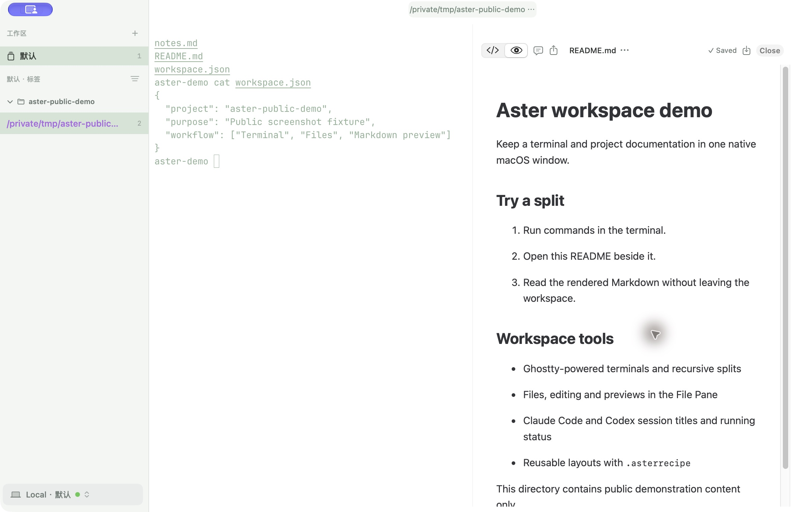
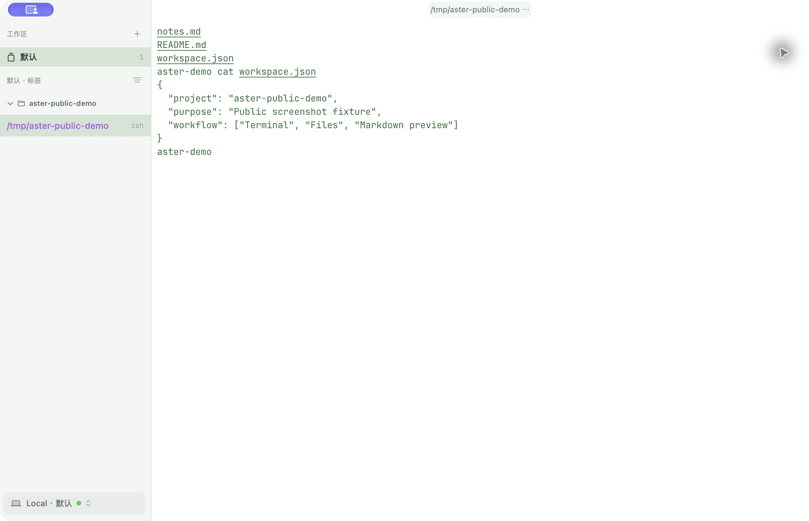

# Aster Terminal

English | [简体中文](README.zh-CN.md)

**One native macOS workspace for your terminal, files, and previews.** Arrange
Ghostty-powered terminals beside a file browser, editor, or preview with recursive
splits. Track Claude Code and Codex session titles, running status, and completion
notifications alongside your work. Aster is built with AppKit; the released DMG
requires macOS 14 or later and an Apple silicon Mac.

[Explore the website](https://aster.foo/en/) · [Download the latest DMG](https://github.com/rambocode/aster/releases/latest) · [Read the user guide](https://aster.foo/docs/en/)

Start with a tab, split it with `⌘D` or `⇧⌘D`, then open a file with `⌘O`.
Save a reusable layout as an `.asterrecipe`, or restore your workspace on launch.
For remote work, open a native SSH tab or use a remote machine workspace backed
by the server-side session service. See the [user guide](https://aster.foo/docs/en/) for setup.



*Actual Aster window showing the public demo fixture. The screenshot UI is in Chinese.*

<details>
<summary>See the terminal-focused layout</summary>



</details>

Aster has its own brand, icon, and workspace implementation. It contains no Otty
brand assets or proprietary code.

## Features

- Full VT100/xterm terminal with ANSI true color, mouse, hyperlinks, and full-screen TUIs
- Multiple tabs with vertical, top, or bottom tab layouts
- Recursive horizontal/vertical splits, mixing terminals, file browsers, editors, and previews
- Strict resource-scoped Files menu and a unified File Pane: source code, Markdown/RST, images, PDF, Quick Look, diff, hex, and Agent transcripts
- Terminal buffer search, command palette, details panel, and keyboard shortcuts
- `.asterrecipe` workspace import/export and session restore on launch
- Independent OSC 1/2/0 titles, pinned names / dynamic prefixes, and `⇧⌘T` to reopen recently closed tabs
- zsh/Bash/fish shell integration, command anchor navigation, exit status, and safe selection deletion at the prompt
- Local autocomplete / inline suggestions: 714 full Fig command specs (nested subcommands, options, arguments), file and alias candidates, privacy-aware learning, and `aster learn`
- `TERM=auto`/terminfo safe fallback, Aster environment identification, and DA1/DA2/XTVERSION/DSR replies
- Nine settings categories: General, Shell, Controls, Editor, Agents, Appearance, Recipes, Shortcuts, and Advanced
- 24 built-in themes aligned with Otty 1.3.1, live terminal preview, custom copy/edit, and safe `.astertheme` import
- Main window, settings, menus, splits, theme previews, and every interactive control are native AppKit — no SwiftUI/Hosting bridge layer
- Standalone app icon, signed `.app`, and DMG build
- Built-in software updates via Sparkle 2: background checks, optional silent install, and a preview channel

## Install

Download the latest signed and notarized DMG from the
[releases page](https://github.com/rambocode/aster/releases), open it, and drag
`Aster.app` into `/Applications`. Open Aster from Applications, create a tab with
`⌘T`, split right with `⌘D`, then use `⌘O` to open a README beside the terminal.

Aster updates itself from then on: it checks for a new version once a day in the
background and can download and install it for you. Everything is configurable under
**Settings → General → Update**, and **Aster → Check for Updates…** triggers a check on
demand. Updates are fetched only from the official appcast and must pass both an EdDSA
signature check and macOS notarization before they are installed. Update checks do
not send usage data. Optional crash reporting and CLI Agent memory extraction are
disabled by default; enabling them can send crash information or project summaries.

> Upgrading from 0.4.1 or earlier: those builds shipped without the updater, so they
> cannot update themselves. Download the DMG once by hand — after that updates are
> automatic.

## Build

```bash
brew install zig@0.15
xcodebuild -downloadComponent MetalToolchain
./scripts/setup-ghostty.sh
./scripts/test.sh
./scripts/build-app.sh
./scripts/build-dmg.sh
open dist/Aster.app
```

Requires macOS 14 or later, Swift 6.2, Zig 0.15.2, and the Xcode Metal Toolchain.
`setup-ghostty.sh` generates the local `GhosttyKit.xcframework` and runtime resources
from a pinned revision; `build-app.sh` runs it automatically. See
`Vendor/Ghostty/README.md` for provenance, ABI risk, and the update procedure.
SwiftTerm remains as a local target only for legacy-adapter regression tests during the
migration; it is not part of the product terminal view tree.
The default build uses local ad-hoc signing, suitable for installing on your own
machine; for distribution, provide a Developer ID via
`ASTER_SIGN_IDENTITY="Developer ID Application: ..."` and a notarization profile via
`ASTER_NOTARY_PROFILE`, then cut a release with `./scripts/release.sh`.
Run tests through `./scripts/test.sh`, not bare `swift test`: the test host lives
outside the `.app` layout and needs `DYLD_FRAMEWORK_PATH` to load Sparkle.
Ad-hoc builds have automatic updates disabled — the Update settings appear greyed out.
See `docs/developer/software-update.md` for the signing, appcast, and release details.

## Shortcuts

| Action | Shortcut |
| --- | --- |
| New tab | `⌘T` |
| Open file | `⌘O` |
| Close current pane or last-pane tab | `⌘W` |
| Split right | `⌘D` |
| Split down | `⇧⌘D` |
| Close pane | `⌥⌘W` |
| Find | `⌘F` |
| Command palette | `⇧⌘P` |
| Settings | `⌘,` |

## Documentation

The user guide is available in [English](https://aster.foo/docs/en/) and [Chinese](https://aster.foo/docs/). Developer docs below are in Chinese.

- [Workspace domain and implementation](docs/developer/terminal-domain.md)
- [Ghostty terminal engine](docs/developer/ghostty-terminal-engine.md)
- [AppKit interface architecture](docs/developer/appkit-interface.md)
- [Files, links, and the File Pane domain](docs/developer/files-and-links-domain.md)
- [Theme system domain and implementation](docs/developer/theme-system.md)
- [English user guide source](docs/user/help.en.md)
- [Chinese user help](docs/user/help.md)
- [Third-party licenses](THIRD-PARTY-NOTICES.md)

## License

MIT — see [LICENSE](LICENSE). Vendored components under `Vendor/` keep their own
licenses; see [THIRD-PARTY-NOTICES.md](THIRD-PARTY-NOTICES.md).
