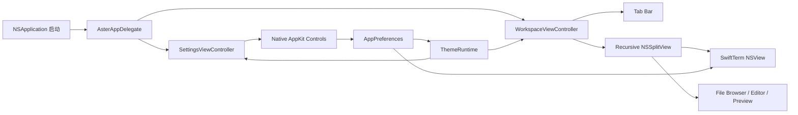

# Aster AppKit 界面架构

## 业务背景

Aster 0.4.1 的主窗口、设置窗口和所有交互控件均使用 AppKit。目标是获得稳定的 macOS 窗口材质、分屏拖动、菜单、键盘焦点和终端视图生命周期，同时继续精确应用 Otty 主题中的窗口、侧栏、标签、容器、阴影和材质令牌。

## 领域概念

- **AsterAppDelegate**：应用生命周期与菜单入口，创建主窗口和设置窗口。
- **WorkspaceViewController**：工作区组合根节点，负责标签布局、Pane 树、详情面板和命令面板。
- **SettingsViewController**：九类设置的原生侧栏和内容区，控件直接写入 `AppPreferences`。
- **WorkspacePaneRuntime**：持有 SwiftTerm 或文档缓冲，独立于 AppKit 视图的重排与刷新。
- **ThemeVisualEffectView**：将主题材质与色彩令牌映射为 `NSVisualEffectView`。
- **SidebarOptionsButton**：`TABS` 右侧的原生菜单入口，管理标签分组、时间排序和手动分隔线。
- **ActionButton / ActionMenuItem**：将局部闭包安全桥接到 AppKit target/action。

## 核心规则

1. `Sources/Aster` 不得导入 SwiftUI，也不得创建 `NSHostingView` 或 `NSHostingController`。
2. 终端运行态由 `WorkspacePaneRuntime` 持有，AppKit 布局重建不得重启 PTY。
3. 递归 Pane 树使用 `NSSplitView` 渲染；仅在用户拖动分隔线时持久化比例。
4. 菜单、搜索、分段控件、颜色选择器和文件列表使用原生 AppKit 控件及标准键盘焦点。
5. 主题令牌通过动态 `NSColor` 和 `ThemeVisualEffectView` 进入所有窗口层级，不在视图中散落固定主题色。
6. 文件与标签的右键菜单在打开时根据当前选择生成，不能保留已经失效的文件 URL 或标签引用。
7. 用户可见交互变化必须同步更新开发文档和用户帮助。
8. 垂直侧栏与设置导航必须显式使用整宽约束；不能依赖 `NSStackView` 的固有宽度推断。
9. 滚动设置内容必须使用翻转坐标系并从 `NSClipView` 顶部开始，短页面也不得垂直下沉。
10. Pane 树所在的容器链在**两个方向**都必须有必需尺寸约束，不能只约束宽度。
11. 切换聚焦 Pane 只做局部更新（焦点指示线 + first responder），不触发工作区整树重建。
12. 每个工作区窗口拥有独立 `AppModel` 和持久化 suite；设置和主题全局共享。附加窗口 suite 只接受 UUID 命名且最多恢复 16 个。
13. 跨窗口标签移动必须转移同一个 `TerminalTabItem`，不得从 snapshot 重建并丢失 PTY、滚动历史或 Agent 状态。
14. 外部拖放先按普通文件、符号链接、URL 和数量上限校验，再进入预览、文件浏览器或粘贴安全链路。

## 业务流程



## 关键实现

`AsterApp.swift` 使用自定义 `@main` 调用 `NSApplication`，由 `AsterAppDelegate` 管理窗口、菜单和退出事务。「显示」菜单集中全部分屏命令：四个方向的拆分、缩放拆分、「调整拆分大小」与「聚焦面板」两个子菜单、关闭当前面板；只在多面板下有意义的项由 `NSMenuItemValidation` 按 `AppModel.selectedTabHasSplits` 置灰。`⌘W` 走 `closeSelectedPaneOrTab()`：还有分屏时只关闭聚焦面板，最后一个面板才关闭标签页（`⇧⌘W` 始终关标签页）。

`AsterAppDelegate` 同时管理主窗口和附加工作区窗口。菜单、命令面板与 CLI `--new-window` 统一经模型回调创建窗口；Pin 只接受工作区窗口，PiP 可固定当前 Pane 或跟随活动 Pane。正常退出保存仍打开的附加 suite，用户主动关闭则删除；关闭确认发生在可取消的 `windowShouldClose`，应用退出由 `WorkspaceTerminationTransaction` 先确认全部模型再统一提交，避免后续窗口取消时前序 PTY 已被终止。crash loop 规则仍由各模型独立执行。Dock 聚合器订阅全部窗口，错误跳转和 Agent 防睡不会漏掉后台窗口。

PiP 与主工作区共享同一个长期 `TerminalSession` 容器。`PanePictureInPictureOwnership` 按对象身份登记唯一展示所有者；所有权存在时工作区渲染占位，刷新不得调用 `removeFromSuperview()` 抢回终端。跟随模式切换 Pane 时先释放旧所有权再接管新会话，关闭 PiP 后通知原工作区恢复同一容器。

`WorkspaceViewController` 使用 `NSStackView` 组合三种标签栏布局，用递归 `PersistedSplitView` 渲染 `PaneLayout`；`ActivePaneHostView` 不再画当前 Pane 的 2 pt 强调色顶边（在聚焦窗口里比终端内容还抢眼），改为给**非**聚焦 Pane 铺整块褪色遮罩（`AsterTheme.paper` 30%，`ClickThroughStripView` 点击穿透，点非活动 Pane 的第一下要能同时激活它并落到终端）。遮罩先于拖动把手安装，把手才浮在其上；切换聚焦只翻转 `isActivePane`（`didSet` 改遮罩可见性），不重建视图树。

**窗口活动状态**：窗口失去 key 状态时叠加 `InactiveWindowOverlayView`（主题 `paper` 色 45% 透明、`hitTest` 返回 nil，失焦窗口的第一次点击照常落到终端）。AppKit 只会自动灰化系统控件，终端网格与自绘视图不受影响，没有这层遮罩时非活动窗口看起来仍然「亮着」。通知按 `notification.object === view.window` 过滤，多窗口互不影响；`refresh()` 会清空子视图，因此刷新末尾要重新安放遮罩。分隔条的强调色在窗口非 key 时也一律退回灰线。窗口活动状态还会下发到所有会话：`AsterTerminalView` 在失焦时把生效样式换成 `preferredCursorStyle.nonBlinking`，终端光标停止闪烁但形状不变——SwiftTerm 的 `caretView.focused` 只切换实心/空心，闪烁完全由 `CursorStyle` 的 blink 变体决定，而窗口失焦并不会触发 `resignFirstResponder`。`preferredCursorStyle` 仍是用户配置的唯一真值，DECSCUSR 拦截按「生效样式」比较。

SwiftTerm 的 overlay `NSScroller` 在 `AsterTerminalView.didAddSubview` 里被隐藏：它是一条 5.5 pt 灰条，随滚动闪现又消失、并盖住右侧文字。SwiftTerm 的 `reservedScrollerWidth` 在 scroller 隐藏时归零，终端网格会自动收回这几个点，不会留白。

**分屏容器的尺寸约束**：`NSSplitView` 的子视图走 autoresizing，它无法反推内容尺寸，于是给每个子视图加 `PreferredSize/FallbackSize`（`height == 0 @250`）回退约束，自身在分隔方向的垂直方向上只剩分隔条厚度的固有尺寸。因此容器链两个方向都必须给必需约束：内容区绑定到外层 stack 的宽/高，`wrapper` 钉到 stack 底边，状态栏钉到 `inner` 底边、Pane 区填充其上剩余空间。只约束宽度时，上下分屏会把整个内容区塌成一条分隔条，两个终端高度都是 0（表现为窗口大面积空白、标题区被挤到垂直中央）。`PersistedSplitView.layout()` 还要等容器给出有效尺寸（>1pt）后才定位分隔条，否则首轮布局会把比例锁死在无效值上。

**分隔条与 Pane 拖放**：`PersistedSplitView` 的 `dividerThickness` 是 6pt 的命中区，`drawDivider(in:)` 只画中间 1pt（悬停 2pt）——默认 `AsterTheme.hairline`，仅在「窗口是 key 且指针压在命中区上」时换成 `AsterTheme.accent`；命中区 `NSTrackingArea` 由两个子视图的间隙算出，并在 `splitViewDidResizeSubviews` 里重建（自身 frame 不变时 AppKit 不会重建它）。移除感应区不会补发 `mouseExited`，指针恰好停在旧感应区里时高亮会卡住，因此每次重建后用 `mouseLocationOutsideOfEventStream` 对齐一次悬停状态。比例一律针对「扣掉分隔条的可用长度」，否则第一块会固定多出一个分隔条厚度。双击分隔条恢复等分。

Pane 顶边的 `PaneDragHandleView` 对应参考应用的 drag handle：`ActivePaneHostView` 用顶部 14pt 的 `NSTrackingArea`（不是覆盖视图——任何实体覆盖层都会吃掉终端在那一条上的点击与拖选）控制淡入，把手自身的 tracking area 负责悬停时加宽到 56pt、换成强调色并 `cursorUpdate` 到 `NSCursor.openHand`；完全透明时 `hitTest` 返回 nil，避免 Pane 顶部中央出现点不到终端的死区。按下把手后由 `NSWindow.trackEvents` 接管事件循环（落点都在本窗口内，不需要 `NSDraggingSession` 的粘贴板协议），`PaneDropOverlayView` 绘制落点：边缘用强调色（插到该侧，`PaneLayout.movingPane`）、中心用绿色（交换，`PaneLayout.swappingPanes`）。落点几何抽成 `PaneDropGeometry.zone(in:at:)` 纯函数单测，方向语义按 AppKit 非翻转坐标（y 小 = 底边）。两种操作都只重排描述符，面板 ID 不变，PTY 与滚动历史不重启。

标签行同样使用阈值拖动。松手点位于另一个工作区窗口时，源/目标 `AppModel` 直接转移已有 `TerminalTabItem`；位于窗口外时创建附加窗口。源窗口被取走最后一个标签会补空 Shell；新窗口创建失败则把原 Tab 放回。Finder/浏览器拖入由 `ActivePaneHostView` 的标准 `NSDraggingDestination` 处理，文本复用 paste protection，目录按内外落区创建终端或文件浏览器，文件创建预览。

**聚焦跟踪**：终端与文本视图自己消费 `mouseDown` 且不向 responder 链上抛，容器视图收不到点击，因此用窗口级 `NSEvent.addLocalMonitorForEvents` 沿 hitTest 结果的 superview 链定位 `ActivePaneHostView`。焦点变化经 `TerminalTabItem.activePaneChanged`（`PassthroughSubject`，不是 `@Published`）发布，控制器只更新指示线与 first responder——若走 `objectWillChange` 会重建整棵视图树，打断终端拖选与 TUI 重绘。视图树重建后只对活动 Pane 调用 `session.focus()`；过去对每个终端都调用，最后渲染的那个会抢走输入焦点，导致「关闭当前面板」关错对象。

垂直侧栏整宽标签行的主文案始终显示 `tab.title`（目录稳定显示名，主目录为 `~`），选中与未选中之间切换不改变名字；行右侧在「有前台命令且近 3 秒内有输出」时显示小型 `NSProgressIndicator`（状态来源是 `TerminalSession.hasRunningCommand`：每秒用 `tcgetpgrp` 比较 PTY 前台进程组与 shell pgid，并以可见屏幕内容哈希作为输出活跃度探针（5 秒静默窗口）——Claude Code 等 TUI 思考时只在原位重绘状态行、光标与滚动位置不变，必须按内容而非光标位置探测；仅状态翻转时发布，等待交互输入的静止界面不会一直转圈），否则选中行显示 shell 名。标签行在 `mouseDown` 立即派发选择而不等 `mouseUp` 的 target/action——整树重建可能在按下与抬起之间销毁按钮；`TerminalSession` 对 OSC 0/1/2 标题与 OSC 7 目录做去重发布，且 Tab 只定向转发 UI 消费的会话字段（isRunning / hasRunningCommand / exitCode / startupError），标题变化不再触发工作区重建。侧栏仍不允许没有业务状态来源的加载指示器。`TABS` 右侧使用 `SidebarOptionsButton` 弹出原生 `NSMenu`：GROUP 支持不分组、按项目和按日期，ORDER 支持按创建时间和更新时间，DIVIDER 在当前标签后插入分隔线或一次清除全部分隔线。分组与排序偏好写入独立 `UserDefaults` 键，分隔线跟随工作区快照恢复；标签快照使用可选时间戳兼容旧数据。默认宽度由旧版 250pt 迁移为 220pt，非旧默认值不改动。鼠标进入侧栏时，header 顶部右侧（与红绿灯同一水平线）淡入「+ 新建标签页 / 折叠标签栏」无边框按钮，离开淡出；折叠后（`appearance.showTabBar = false`）内容区顶部叠加点击穿透的悬停带（`ClickThroughStripView`，`hitTest` 返回 nil 以免拦截终端点击），鼠标进入窗口顶部即淡入「+ / 展开标签栏」按钮——按钮行是悬停带的兄弟视图而非子视图（否则点击穿透会吞掉按钮点击），且 leading 让开红绿灯遮挡区（实测约 103pt，比视觉圆点宽）；「显示」菜单的「显示/隐藏标签栏」与按钮共用同一配置开关。右侧标题区固定为 28pt，显示活动 Pane 的 OSC 2/0 窗口标题，并使用终端最终背景色与画布连续；OSC 1 的短名称只驱动标签文案。每个 Pane 独立保存程序标题，标题变化和 Pane 焦点切换通过专用事件局部更新 `NSWindow.title` 与标题文本，不重建终端视图树。标题区右端有详情面板的悬停切换按钮（`TitlebarHoverRevealView` 自持 tracking area，与侧栏悬停处理互不串扰）：指针进入时 0.15s 淡入、移出淡出；面板展开后标题栏不再渲染该按钮，收起入口在面板 header 右侧。除该按钮外，文件、分屏和命令面板仍通过菜单与快捷键使用，不在标题区重复放置按钮。面板显隐与选中页持久化在独立 `UserDefaults` 键（`aster.inspector.presented.v1` / `aster.inspector.section.v1`），刻意不经 `@Published` 广播——显隐已由 `AppModel.isInspectorPresented` 驱动刷新，选中页由面板本地即时生效，再广播会引发整树重建与检查数据重取的闪烁。

SwiftTerm 通过 OSC 7 上报目录时可能返回 `file://localhost/...`。`TerminalSession` 在更新标题和工作区快照前统一解析为本地绝对路径并进行百分号解码，防止 URL 字符串被误当成目录、污染下一次会话恢复。

SwiftTerm 的 `LocalProcessTerminalView` 直接作为 AppKit 子视图嵌入。文件浏览器使用 `NSTableView`，支持双击、预览、路径复制、终端目录动作、Finder/默认应用和 Send to Chat；详情面板（`WorkspaceDetailsPanel.swift` 的 `DetailsPanelViewController`）以四个 icon chip（Info / Outline / Git / Files）切换页签，未选中项只显示图标、选中项灰底展开文字，header 右侧有收起按钮。四页根视图按数据版本缓存，普通页签切换与同标签收起/重开直接复用已完成布局的视图，不重复创建 Files 页数百个按钮和约束。Info 页显示工作目录与动作链接（复制路径、Finder 显示、按 bundle ID 探测到的已安装编辑器「Open in …」，`WorkspaceEditorLocator`）、子进程（含 `ps etime` 运行时长）与监听端口；检测到后代进程中有 `claude` 时追加 Claude Code 分组（复制会话 ID、查看会话历史、Branch in… 复用 `continueAgentSession` fork）。Outline 页订阅终端 OSC 133 时间线和编辑器内存文本，命令完成或文档编辑后局部失效缓存，点击条目跳到稳定终端绝对行或编辑器行。Git 页显示分支名与 `git diff --shortstat HEAD` 的 +/− 统计（复用主题 accent/warning 色）、按 porcelain v2 XY 状态码分组的 Staged/Unstaged 变更；Commit 与 stage-all 按钮不后台执行 git（避免触发仓库 hook，保持检查服务的只读边界），而是经 `TerminalSession.typeText` 把命令预填到终端输入行，由用户审阅后回车。Files 页提供 Find 过滤与可折叠目录树（chevron 控制折叠，目录点击仍左分屏打开文件浏览器），目录枚举使用独立 utility 任务，不等待 `ps/lsof` 或 Git。Shell 报告 CWD 变化时，`workingDirectoryChanged` 把 willSet 阶段携带的新路径直接传给检查任务；旧树保留到新数据完整返回，再一次性替换。常规工作区刷新复用同一详情控制器，并同步恢复刷新前正在输入的 terminal first responder，避免加载态闪回和按键焦点丢失。Open Quickly 浮层（`OpenQuicklyOverlayViewController`）是顶部 chip 标签条 + 可滚动双行结果列表 + 底部快捷键栏：结果行带 SF Symbol 图标、相对时间（共享 `RelativeTime`）与类型徽章，多类型视图按 `OpenQuicklyIndex.sections` 分组显示小节标题；`OverlaySearchField` 额外截获 `⌘1`–`⌘9` 快速选中与 `⌘K` 操作菜单。「当前」过滤器除 Pane 外还含 `.prompt` 条目：运行中的前台命令名来自 `TerminalSession.foregroundCommandName`（Agent provider 优先，否则已提交命令首 token），提示词取同 provider、`updatedAt` 最新会话的最近 user prompt（pane ↔ session 无可靠映射，属刻意启发式），点击经 `AppModel.insertPromptIntoPane` 以 bracketed paste 写回终端输入行而不自动回车。Open Quickly 和全局查找使用独立 overlay，不改变终端 first responder 之外的运行态。

`SettingsViewController` 使用 `NSSearchField`、`NSPopUpButton`、`NSSwitch`、`NSSlider`、`NSColorWell` 和 `NSGridView`。设置窗口默认 `700 × 460 pt`（宽度下限 700，内容滚动），启用 `fullSizeContentView` 与透明标题栏，侧栏延伸到窗口顶部并以顶部内边距为红绿灯让位；200pt 导航列中，导航行的整宽方角高亮贴到窗口边缘、行内容左侧留 22pt 间隙，搜索框独立留边。右侧内容区以「分组小标题 + 大圆角卡片」组织：滚动文档使用 `FlippedDocumentView`（左上原点）从顶部排列，内容画布保持窗口底色（`AsterTheme.paper`），卡片是 `cornerRadius = SettingsMetrics.cardCornerRadius` 的 `NSStackView`，填充 `AsterTheme.settingsCard`。全量重建 `refresh()` 会按分类保存/恢复滚动偏移。智能体页从 `AgentSetupService` 读取七类 provider 的真实状态，安装/卸载按钮只进入受管配置事务；启动命令按 argv 保存。通用页安装的 `aster` CLI 不是 `open -a` 简单包装，而是带 `0600` token 的私有文件 request/response 客户端；写 Pane 的能力还受 IPC 设置控制。Finder 服务和 `ssh://` 继续只预填安全动作。

主窗口使用配置中的初始尺寸与 AppKit frame autosave。`windowDidEndLiveResize` 只在拖动结束后保存新的内容尺寸，避免 live resize 期间触发工作区重建；设置页可恢复 `1180 × 760 pt` 默认尺寸。

## 失败语义

- 终端或文档视图创建失败：只影响对应 Pane，其它 Pane 与标签保持可用。
- 文件浏览器目录刷新失败：显示空列表，不保留旧目录项引用。
- 主题或配置写入失败：保留当前内存状态并显示错误，不写入部分文件。
- 关闭未保存文档被取消：中止 Pane、标签、窗口或应用关闭事务。
- AppKit 菜单目标已释放：弱引用动作直接返回，不访问悬空运行态。

## 测试与验收

`AppKitMigrationTests` 静态确认主工作区和设置页不包含 SwiftUI Hosting，并检查 `NSSplitView`、九类设置、Glass 原生材质、整宽侧栏行、标签整理菜单、分组/排序/分隔线行为、28pt 标题区与设置页顶部锚定。完整测试还覆盖 24 套主题真值、终端、Recipe、文件安全与进程生命周期。发布前运行：

```bash
swift test --no-parallel
swift build -c release
./scripts/build-app.sh
codesign --verify --deep --strict dist/Aster.app
```

最后启动已打包应用，实测主题切换、左右/上下分屏、文件右键菜单、详情面板和设置窗口，并确认可执行文件没有 SwiftUI 动态链接依赖。
