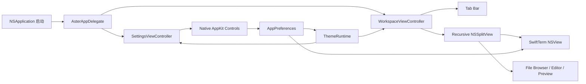

# Aster AppKit 界面架构

## 业务背景

Aster 0.4.1 的主窗口、设置窗口和所有交互控件均使用 AppKit。目标是获得稳定的 macOS 窗口材质、分屏拖动、菜单、键盘焦点和终端视图生命周期，同时继续精确应用 Otty 主题中的窗口、侧栏、标签、容器、阴影和材质令牌。

## 领域概念

- **AsterAppDelegate**：应用生命周期与菜单入口，创建主窗口和设置窗口。
- **WorkspaceViewController**：工作区组合根节点，负责标签布局、Pane 树、详情面板和命令面板。
- **SettingsViewController**：九类设置的原生侧栏和内容区，控件直接写入 `AppPreferences`。
- **WorkspacePaneRuntime**：持有 SwiftTerm 或文档缓冲，独立于 AppKit 视图的重排与刷新。
- **ThemeVisualEffectView**：将主题材质与色彩令牌映射为 `NSVisualEffectView`。
- **SidebarOptionsButton**：`TABS` 右侧的原生菜单入口，管理标签分组、时间排序和手动分隔线。
- **ActionButton / ActionMenuItem**：将局部闭包安全桥接到 AppKit target/action。

## 核心规则

1. `Sources/Aster` 不得导入 SwiftUI，也不得创建 `NSHostingView` 或 `NSHostingController`。
2. 终端运行态由 `WorkspacePaneRuntime` 持有，AppKit 布局重建不得重启 PTY。
3. 递归 Pane 树使用 `NSSplitView` 渲染；仅在用户拖动分隔线时持久化比例。
4. 菜单、搜索、分段控件、颜色选择器和文件列表使用原生 AppKit 控件及标准键盘焦点。
5. 主题令牌通过动态 `NSColor` 和 `ThemeVisualEffectView` 进入所有窗口层级，不在视图中散落固定主题色。
6. 文件与标签的右键菜单在打开时根据当前选择生成，不能保留已经失效的文件 URL 或标签引用。
7. 用户可见交互变化必须同步更新开发文档和用户帮助。
8. 垂直侧栏与设置导航必须显式使用整宽约束；不能依赖 `NSStackView` 的固有宽度推断。
9. 滚动设置内容必须使用翻转坐标系并从 `NSClipView` 顶部开始，短页面也不得垂直下沉。

## 业务流程



## 关键实现

`AsterApp.swift` 使用自定义 `@main` 调用 `NSApplication`，由 `AsterAppDelegate` 管理窗口、菜单和退出事务。`WorkspaceViewController` 使用 `NSStackView` 组合三种标签栏布局，用递归 `PersistedSplitView` 渲染 `PaneLayout`；`ActivePaneHostView` 只在存在多个 Pane 时绘制顶部 2 pt 当前 Pane 指示线。

垂直侧栏整宽标签行的主文案始终显示 `tab.title`（目录稳定显示名，主目录为 `~`），选中与未选中之间切换不改变名字；行右侧在「有前台命令且近 3 秒内有输出」时显示小型 `NSProgressIndicator`（状态来源是 `TerminalSession.hasRunningCommand`：每秒用 `tcgetpgrp` 比较 PTY 前台进程组与 shell pgid，并以可见屏幕内容哈希作为输出活跃度探针（5 秒静默窗口）——Claude Code 等 TUI 思考时只在原位重绘状态行、光标与滚动位置不变，必须按内容而非光标位置探测；仅状态翻转时发布，等待交互输入的静止界面不会一直转圈），否则选中行显示 shell 名。标签行在 `mouseDown` 立即派发选择而不等 `mouseUp` 的 target/action——整树重建可能在按下与抬起之间销毁按钮；`TerminalSession` 对 OSC 0/2 标题与 OSC 7 目录做去重发布，且 Tab 只定向转发 UI 消费的会话字段（isRunning / hasRunningCommand / exitCode / startupError），标题变化不再触发工作区重建。侧栏仍不允许没有业务状态来源的加载指示器。`TABS` 右侧使用 `SidebarOptionsButton` 弹出原生 `NSMenu`：GROUP 支持不分组、按项目和按日期，ORDER 支持按创建时间和更新时间，DIVIDER 在当前标签后插入分隔线或一次清除全部分隔线。分组与排序偏好写入独立 `UserDefaults` 键，分隔线跟随工作区快照恢复；标签快照使用可选时间戳兼容旧数据。默认宽度由旧版 250pt 迁移为 220pt，非旧默认值不改动。右侧标题区固定为 28pt，只居中显示当前目录，并使用终端最终背景色与画布连续；文件、分屏、详情和命令面板仍通过菜单与快捷键使用，不在标题区重复放置按钮。

SwiftTerm 通过 OSC 7 上报目录时可能返回 `file://localhost/...`。`TerminalSession` 在更新标题和工作区快照前统一解析为本地绝对路径并进行百分号解码，防止 URL 字符串被误当成目录、污染下一次会话恢复。

SwiftTerm 的 `LocalProcessTerminalView` 直接作为 AppKit 子视图嵌入。文件浏览器使用 `NSTableView`，支持双击打开与右键打开、预览、Finder 定位；详情面板使用 `NSSegmentedControl` 切换信息、大纲和 Git 说明。标签页右键菜单提供分屏、文件浏览器和关闭操作。

`SettingsViewController` 使用 `NSSearchField`、`NSPopUpButton`、`NSSwitch`、`NSSlider`、`NSColorWell` 和 `NSGridView`。设置窗口默认 `700 × 460 pt`（宽度下限 700，内容滚动），启用 `fullSizeContentView` 与透明标题栏，侧栏延伸到窗口顶部并以顶部内边距为红绿灯让位；200pt 导航列中，导航行的整宽方角高亮贴到窗口边缘、行内容左侧留 22pt 间隙，搜索框独立留边。右侧内容区以「分组小标题 + 大圆角卡片」组织：滚动文档使用 `FlippedDocumentView`（左上原点）从顶部排列，卡片是 `cornerRadius = SettingsMetrics.cardCornerRadius` 的 `NSStackView`，占满扣除 26pt 边距后的可用宽度，行间不画分隔线、靠行内边距留白分隔；间距、字号、圆角常量集中在 `DesignSystem.swift` 的 `SettingsMetrics`。全量重建 `refresh()` 会按分类保存/恢复滚动偏移，控件改动不再跳回页面顶部。通用、Shell、控制、编辑器、智能体、Recipes 页的开关与下拉直接读写 `AsterConfiguration` 对应字段；枚举下拉经 `enumPopupRow` 由 `allCases` 单一来源生成菜单项。通用页的「系统集成」组提供四个动作：注册 ssh:// 默认处理器（`NSWorkspace.setDefaultApplication`，Info.plist 声明 `CFBundleURLTypes`，ssh 链接打开时新建标签并把命令预填到提示符、不自动执行）、安装 `aster` CLI 启动器（`open -a` 包装脚本，优先 /usr/local/bin 退回 ~/.local/bin）、Finder「在 Aster 中打开」服务（Info.plist `NSServices` + `NSApp.servicesProvider`，目录经 `handleOpenURL` 开新标签）与完全磁盘访问设置入口。主题详情展示角色色与 ANSI 16 色，主题编辑器可修改明暗模式、界面窗口、终端/容器/面板、文字、强调色、光标、选区和 ANSI 完整色表。

主窗口使用配置中的初始尺寸与 AppKit frame autosave。`windowDidEndLiveResize` 只在拖动结束后保存新的内容尺寸，避免 live resize 期间触发工作区重建；设置页可恢复 `1180 × 760 pt` 默认尺寸。

## 失败语义

- 终端或文档视图创建失败：只影响对应 Pane，其它 Pane 与标签保持可用。
- 文件浏览器目录刷新失败：显示空列表，不保留旧目录项引用。
- 主题或配置写入失败：保留当前内存状态并显示错误，不写入部分文件。
- 关闭未保存文档被取消：中止 Pane、标签、窗口或应用关闭事务。
- AppKit 菜单目标已释放：弱引用动作直接返回，不访问悬空运行态。

## 测试与验收

`AppKitMigrationTests` 静态确认主工作区和设置页不包含 SwiftUI Hosting，并检查 `NSSplitView`、九类设置、Glass 原生材质、整宽侧栏行、标签整理菜单、分组/排序/分隔线行为、28pt 标题区与设置页顶部锚定。完整测试还覆盖 24 套主题真值、终端、Recipe、文件安全与进程生命周期。发布前运行：

```bash
swift test --no-parallel
swift build -c release
./scripts/build-app.sh
codesign --verify --deep --strict dist/Aster.app
```

最后启动已打包应用，实测主题切换、左右/上下分屏、文件右键菜单、详情面板和设置窗口，并确认可执行文件没有 SwiftUI 动态链接依赖。
