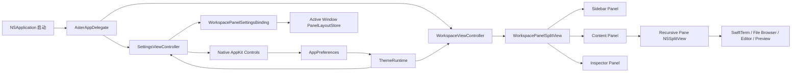

# Aster AppKit 界面架构

## 业务背景

Aster 0.4.1 的工作区、独立设置窗口和所有交互控件均使用 AppKit。目标是获得稳定的 macOS 窗口材质、分屏拖动、菜单、键盘焦点和终端视图生命周期，同时继续精确应用 Otty 主题中的窗口、侧栏、标签、容器、阴影和材质令牌。

## 领域概念

- **AsterAppDelegate**：应用生命周期与菜单入口，创建工作区窗口并复用唯一独立设置窗口。
- **WorkspaceViewController**：工作区组合根节点，把 Sidebar、Content 和 Inspector 内容编排为顶层 Panel。
- **WorkspacePanel / WorkspacePanelSplitView**：窗口第一层的语义区域与唯一横向布局边界；与 Content 内的递归 Pane 树严格区分。
- **WorkspacePanelLayoutStore**：每个工作区窗口独立的左右 Panel 首选宽度与持久化边界。
- **SettingsViewController**：九类设置的原生侧栏和内容区；全局配置写入 `AppPreferences`，Panel 宽度通过活动窗口 binding 写入对应 store。
- **WorkspacePaneRuntime**：持有 SwiftTerm 或文档缓冲，独立于 AppKit 视图的重排与刷新。
- **ThemeVisualEffectView**：将主题材质与色彩令牌映射为 `NSVisualEffectView`。
- **SidebarOptionsButton**：`TABS` 右侧的原生菜单入口，管理标签分组、时间排序和手动分隔线。
- **ActionButton / ActionMenuItem**：将局部闭包安全桥接到 AppKit target/action。

## 核心规则

1. `Sources/Aster` 不得导入 SwiftUI，也不得创建 `NSHostingView` 或 `NSHostingController`。
2. 终端运行态由 `WorkspacePaneRuntime` 持有，AppKit 布局重建不得重启 PTY。
3. 窗口第一层只使用一个 `WorkspacePanelSplitView`；递归 Pane 树只存在于 Content Panel 内。Panel 保存 point 宽度，Pane 保存分屏比例。
4. 菜单、搜索、分段控件、颜色选择器和文件列表使用原生 AppKit 控件及标准键盘焦点。
5. 主题令牌通过动态 `NSColor` 和 `ThemeVisualEffectView` 进入所有窗口层级，不在视图中散落固定主题色。
6. 文件与标签的右键菜单在打开时根据当前选择生成，不能保留已经失效的文件 URL 或标签引用。
7. 用户可见交互变化必须同步更新开发文档和用户帮助。
8. 垂直侧栏与设置导航必须显式使用整宽约束；不能依赖 `NSStackView` 的固有宽度推断。
9. 滚动设置内容必须使用翻转坐标系并从 `NSClipView` 顶部开始，短页面也不得垂直下沉。
10. Pane 树所在的容器链在**两个方向**都必须有必需尺寸约束，不能只约束宽度。
11. 切换聚焦 Pane 只做局部更新（焦点指示线 + first responder），不触发工作区整树重建。
12. 每个工作区窗口拥有独立 `AppModel` 和持久化 suite；设置和主题全局共享。附加窗口 suite 只接受 UUID 命名且最多恢复 16 个。
13. 跨窗口标签移动必须转移同一个 `TerminalTabItem`，不得从 snapshot 重建并丢失 PTY、滚动历史或 Agent 状态。
14. 外部拖放先按普通文件、符号链接、URL 和数量上限校验，再进入预览、文件浏览器或粘贴安全链路。
15. Panel Divider 只调整宽度，不承担显隐；Sidebar 与 Inspector 必须通过各自明确入口显示或收起。

## 业务流程



## 关键实现

`AsterApp.swift` 使用自定义 `@main` 调用 `NSApplication`，由 `AsterAppDelegate` 管理窗口、菜单和退出事务。「显示」菜单集中全部分屏命令：四个方向的拆分、缩放拆分、「调整拆分大小」与「聚焦面板」两个子菜单、关闭当前面板；只在多面板下有意义的项由 `NSMenuItemValidation` 按 `AppModel.selectedTabHasSplits` 置灰。`⌘W` 走 `closeSelectedPaneOrTab()`：还有分屏时只关闭聚焦面板，最后一个面板才关闭标签页（`⇧⌘W` 始终关标签页）。

`AsterAppDelegate` 同时管理主窗口和附加工作区窗口。菜单、命令面板与 CLI `--new-window` 统一经模型回调创建窗口；Pin 只接受工作区窗口，PiP 可固定当前 Pane 或跟随活动 Pane。正常退出保存仍打开的附加 suite，用户主动关闭则删除；关闭确认发生在可取消的 `windowShouldClose`，应用退出由 `WorkspaceTerminationTransaction` 先确认全部模型再统一提交，避免后续窗口取消时前序 PTY 已被终止。crash loop 规则仍由各模型独立执行。Dock 聚合器订阅全部窗口，错误跳转和 Agent 防睡不会漏掉后台窗口。

**顶层 Panel 布局**：`WorkspacePanelSplitView` 是工作区窗口唯一的横向区域容器，按角色而非可见索引管理 Sidebar、Content、Inspector。垂直标签布局显示三者；顶部、底部或隐藏标签布局省略 Sidebar，Content 与 Inspector 仍由同一实现组合。Sidebar 首选范围为 180...360pt（默认 220pt），Inspector 为 240...480pt（默认 278pt），Content 尽量保留至少 320pt。两条 divider 都是 1pt 原生命中宽度，悬停加深为系统灰（不切换主题强调色），双击按外侧角色复位；拖动只改宽度，不能顺带折叠。窄窗口只临时压缩实际 frame，先让 Inspector、再让 Sidebar 接近下限，不覆盖用户保存的首选值。

每个工作区窗口使用与 `AppModel` 相同的 `UserDefaults` suite 创建 `WorkspacePanelLayoutStore`，JSON 键为 `aster.workspace.panel-layout.v1`；附加窗口因此天然隔离，关闭清理 suite 时布局也一起清理。旧 `appearance.sidebarWidth` 仅在该键不存在时作为 Sidebar 迁移种子。设置页的左右 Panel 滑杆经 `WorkspacePanelSettingsBinding` 直接写入当前工作区；设置页不会另建 key window。源码按语义分布在 `Workspace/Panels`、`Workspace/Sidebar`、`Workspace/Panes`、`Workspace/FileBrowser`、`Workspace/Overlays` 与 `Workspace/Components`，组合根不再承载所有辅助控件。

PiP 与主工作区共享同一个长期 `TerminalSession` 容器。`PanePictureInPictureOwnership` 按对象身份登记唯一展示所有者；所有权存在时工作区渲染占位，刷新不得调用 `removeFromSuperview()` 抢回终端。跟随模式切换 Pane 时先释放旧所有权再接管新会话，关闭 PiP 后通知原工作区恢复同一容器。

`WorkspaceViewController` 使用 `NSStackView` 组合三种标签栏布局，用递归 `PersistedSplitView` 渲染 `PaneLayout`；`ActivePaneHostView` 不再画当前 Pane 的 2 pt 强调色顶边（在聚焦窗口里比终端内容还抢眼），改为给**非**聚焦 Pane 铺整块褪色遮罩（`AsterTheme.paper` 30%，`ClickThroughStripView` 点击穿透，点非活动 Pane 的第一下要能同时激活它并落到终端）。遮罩先于拖动把手安装，把手才浮在其上；切换聚焦只翻转 `isActivePane`（`didSet` 改遮罩可见性），不重建视图树。

**窗口与 Pane 活动状态**：窗口失去 key 状态时叠加 `InactiveWindowOverlayView`（主题 `paper` 色 45% 透明、`hitTest` 返回 nil，失焦窗口的第一次点击照常落到终端）。AppKit 只会自动灰化系统控件，终端网格与自绘视图不受影响，没有这层遮罩时非活动窗口看起来仍然「亮着」。通知按 `notification.object === view.window` 过滤，多窗口互不影响；`refresh()` 会清空子视图，因此刷新末尾要重新安放遮罩。分隔条的悬停加深态在窗口非 key 时也一律退回静止灰线。窗口状态下发到全部会话，Pane 状态则由稳定 `activePaneID` 在初次挂载和局部切换时下发。`AsterTerminalView` 关闭 SwiftTerm 的 `caretViewTracksFocus`，避免其把竖线或下划线失焦光标无条件改成空心方块；非活动窗口或 Pane 只把当前样式换成同形状的 `nonBlinking` 变体。用户配置仍是光标几何唯一真值，DECSCUSR 在 Default 模式只贡献 blink 位，Always 模式则连 blink 位也不能覆盖。

SwiftTerm 的 overlay `NSScroller` 在 `AsterTerminalView.didAddSubview` 里被隐藏：它是一条 5.5 pt 灰条，随滚动闪现又消失、并盖住右侧文字。SwiftTerm 的 `reservedScrollerWidth` 在 scroller 隐藏时归零，终端网格会自动收回这几个点，不会留白。

**分屏容器的尺寸约束**：`NSSplitView` 的子视图走 autoresizing，它无法反推内容尺寸，于是给每个子视图加 `PreferredSize/FallbackSize`（`height == 0 @250`）回退约束，自身在分隔方向的垂直方向上只剩分隔条厚度的固有尺寸。因此容器链两个方向都必须给必需约束：内容区绑定到外层 stack 的宽/高，`wrapper` 钉到 stack 底边，无 Composer 时 Pane 区直接钉到 `inner` 底边，有 Composer 时由 Composer 占据底边。只约束宽度时，上下分屏会把整个内容区塌成一条分隔条，两个终端高度都是 0（表现为窗口大面积空白、标题区被挤到垂直中央）。`PersistedSplitView.layout()` 还要等容器给出有效尺寸（>1pt）后才定位分隔条，否则首轮布局会把比例锁死在无效值上。

**分隔条与 Pane 拖放**：`PersistedSplitView` 的 `dividerThickness` 是 6pt 的命中区，`drawDivider(in:)` 只画中间 1pt（悬停 2pt）——默认 `AsterTheme.hairline`，仅在「窗口是 key 且指针压在命中区上」时换成 `AsterTheme.accent`；命中区 `NSTrackingArea` 由两个子视图的间隙算出，并在 `splitViewDidResizeSubviews` 里重建（自身 frame 不变时 AppKit 不会重建它）。移除感应区不会补发 `mouseExited`，指针恰好停在旧感应区里时高亮会卡住，因此每次重建后用 `mouseLocationOutsideOfEventStream` 对齐一次悬停状态。比例一律针对「扣掉分隔条的可用长度」，否则第一块会固定多出一个分隔条厚度。双击分隔条恢复等分。

Pane 顶边的 `PaneDragHandleView` 对应参考应用的 drag handle：`ActivePaneHostView` 用顶部 14pt 的 `NSTrackingArea`（不是覆盖视图——任何实体覆盖层都会吃掉终端在那一条上的点击与拖选）控制淡入，把手自身的 tracking area 负责悬停时加宽到 56pt、灰色加深并 `cursorUpdate` 到 `NSCursor.openHand`；完全透明时 `hitTest` 返回 nil，避免 Pane 顶部中央出现点不到终端的死区。把手与同条右侧的 `PaneCloseButton` 是「主题色只经由 ThemeRuntime 进入视图」的一处明确例外：它们是工作区结构控件而非终端内容，固定用系统灰（`tertiaryLabelColor`，悬停 `secondaryLabelColor`），不跟随终端主题。安装顶条控件时内容整体下移 18pt（`chromeContentInset`），胶囊与按钮不压在终端首行文本上；`PaneCloseButton` 与把手一同淡入，点击走「先 `setActivePane` 再 `closeActivePane`」复用 ⌘W 的关闭确认与最近关闭语义，隐藏时 `hitTest` 返回 nil。按下把手后由 `NSWindow.trackEvents` 接管事件循环（落点都在本窗口内，不需要 `NSDraggingSession` 的粘贴板协议），`PaneDropOverlayView` 绘制落点：边缘用强调色（插到该侧，`PaneLayout.movingPane`）、中心用绿色（交换，`PaneLayout.swappingPanes`）。落点几何抽成 `PaneDropGeometry.zone(in:at:)` 纯函数单测，方向语义按 AppKit 非翻转坐标（y 小 = 底边）。两种操作都只重排描述符，面板 ID 不变，PTY 与滚动历史不重启。

标签行同样使用阈值拖动。松手点位于另一个工作区窗口时，源/目标 `AppModel` 直接转移已有 `TerminalTabItem`；位于窗口外时创建附加窗口。源窗口被取走最后一个标签会补空 Shell；新窗口创建失败则把原 Tab 放回。Finder/浏览器拖入由 `ActivePaneHostView` 的标准 `NSDraggingDestination` 处理，文本复用 paste protection，目录按内外落区创建终端或文件浏览器，文件创建预览。

**聚焦跟踪**：终端与文本视图自己消费 `mouseDown` 且不向 responder 链上抛，容器视图收不到点击，因此用窗口级 `NSEvent.addLocalMonitorForEvents` 沿 hitTest 结果的 superview 链定位 `ActivePaneHostView`。焦点变化经 `TerminalTabItem.activePaneChanged`（`PassthroughSubject`，不是 `@Published`）发布；`activePaneID.didSet` 统一覆盖显式聚焦、拆分、恢复、拖移和关闭后的焦点转换，避免消费者继续观察旧 Pane。控制器只翻转未聚焦 Pane 的内容 alpha 褪色（0.55，朝下层主题材质淡出，不用颜色遮罩——透明主题的 window 色经 `withAlphaComponent` 会变成近黑色块）并移动 first responder——若走 `objectWillChange` 会重建整棵视图树，打断终端拖选与 TUI 重绘。视图树重建后只对活动 Pane 调用 `session.focus()`；过去对每个终端都调用，最后渲染的那个会抢走输入焦点，导致「关闭当前面板」关错对象。

垂直侧栏整宽标签行的主文案始终显示 `tab.title`（目录稳定显示名，主目录为 `~`），选中与未选中之间切换不改变名字；行右侧在「有前台命令且近 3 秒内有输出」时显示小型 `NSProgressIndicator`（状态来源是 `TerminalSession.hasRunningCommand`：每秒用 `tcgetpgrp` 比较 PTY 前台进程组与 shell pgid，并以可见屏幕内容哈希作为输出活跃度探针（5 秒静默窗口）——Claude Code 等 TUI 思考时只在原位重绘状态行、光标与滚动位置不变，必须按内容而非光标位置探测；仅状态翻转时发布，等待交互输入的静止界面不会一直转圈），否则选中行显示 shell 名。两者都放在固定 28pt 右侧槽位；鼠标进入标签行时，槽位切换为无边框 `xmark` 按钮，不改变标题宽度。按钮调用 `AppModel.closeTab(id:)` 直接关闭目标：后台标签不先切换，当前标签仍按相邻顺序接续，未保存文档仍走原有确认。标签行在 `mouseDown` 立即派发选择而不等 `mouseUp` 的 target/action——整树重建可能在按下与抬起之间销毁按钮；`TerminalSession` 对 OSC 0/1/2 标题与 OSC 7 目录做去重发布，且 Tab 只把真正改变 Pane 结构呈现的进程生命周期字段（lifecycleState / isRunning / exitCode / startupError——它们切换「运行中终端 ↔ 已退出占位」形态）转发为 `objectWillChange`；hasRunningCommand 与 activeAgentProvider 每条命令都翻转、重建树中无人消费，只进徽章局部通道，因此一个 Pane 跑命令不会重新安放同标签的其余 Pane。标题变化同样不触发工作区重建：`TerminalTabItem.title` 刻意不是 `@Published`（Agent CLI 每秒多次改标题，走 `objectWillChange` 会按标题频率重建整个工作区，打断其他 Pane 的输入与 IME 组合），标签行文案经 `titleChanged` 局部刷新，快照持久化经 `AppModel.schedulePersistWorkspace()` 以 500ms 窗口合并落盘。状态附件按徽章等价键去重：状态未变时 `refreshActivityBadge()` 直接复用现有附件，running spinner 不会被销毁重建而反复重启动画。侧栏仍不允许没有业务状态来源的加载指示器。`TABS` 右侧使用 `SidebarOptionsButton` 弹出原生 `NSMenu`：GROUP 支持不分组、按项目和按日期，ORDER 支持按创建时间和更新时间，DIVIDER 在当前标签后插入分隔线或一次清除全部分隔线。分组与排序偏好写入独立 `UserDefaults` 键，分隔线跟随工作区快照恢复；标签快照使用可选时间戳兼容旧数据。Sidebar 的窗口级默认宽度为 220pt，可在 180...360pt 内拖动；旧版宽度只在窗口尚无 Panel 布局记录时作为迁移种子。侧栏整行标签渲染成两侧各留 6pt、圆角至少 8pt 的内缩底卡（`TabRowButton` 的独立 `rowBackground` 子视图承载底色/描边/阴影，按钮本体保持透明并维持整行命中宽度，因此指针落在行的任意位置都能点中）；主题给的 `tab.radius` 是「整行铺满」语义下的值（多数为 0），内缩后取 `max(主题值, 8)`，主题更圆时沿用主题值。行文案与右侧槽位按底卡内缘对齐（卡内左右各 10pt / 4pt），`TABS` 与分组标题的 leading 同步改为 16pt 以保持同一条左缘。主题没有给 `hoverBackground` 时用 `AsterTheme.ink` 5% 兜底，鼠标扫过侧栏一定有反馈。header 顶部右侧（与红绿灯同一水平线）的「+ 新建标签页 / 折叠标签栏」两个无边框按钮**触发区域不同**：「+」跟随整个左栏，折叠按钮只跟随红绿灯那一行（header 顶部 30pt 的 `ClickThroughStripView` 标记区）。可见性由 `AsterCore` 的 `SidebarHoverActionVisibility.resolve` 判定，宿主层只把指针与两块区域换算到窗口坐标；两个按钮用固定约束而非 `NSStackView` 排布，隐藏其一不会回收槽位，「+」不会因为折叠按钮出现而横跳。容器 `HoverActionsContainerView` 的 `hitTest` 只返回可见按钮，按钮隐藏时该区域仍可拖动窗口。状态一律由指针实时位置推导而不是记在事件回调里，并在 `viewDidLayout` 与窗口 key 状态变化时重算一次——`refresh()` 整树重建后新的 tracking area 在指针不动时不会补发 `mouseEntered`，沿用事件态会让「点一下标签页」把「+」弄消失；tracking area 因此还需要 `.mouseMoved`，否则指针在侧栏内部跨越红绿灯行边界不会有任何事件。折叠后（`appearance.showTabBar = false`）内容区顶部叠加点击穿透的悬停带（`ClickThroughStripView`，`hitTest` 返回 nil 以免拦截终端点击），鼠标进入窗口顶部即淡入「+ / 展开标签栏」按钮——按钮行是悬停带的兄弟视图而非子视图（否则点击穿透会吞掉按钮点击），且 leading 让开红绿灯遮挡区（实测约 103pt，比视觉圆点宽）；「显示」菜单的「显示/隐藏标签栏」与按钮共用同一配置开关。右侧标题区固定为 28pt，使用 `WorkspaceTitleBarBackgroundView`（普通 `NSView` 子类）直接填充终端最终背景色，不能经过 `NSVisualEffectView`（material 即使叠加相同 tint 仍会产生可见色差）；隐藏原生标题栏后这条 28pt 区域同时手动补回「双击放大/还原窗口」手势（`mouseDown` 里 `clickCount == 2` 时调用 `NSWindow.performZoom`，与「显示」菜单「缩放」项等效），路径胶囊与安全输入指示器等子视图仍优先吃掉命中，双击手势只在空白处生效。`WorkspaceTitleButton` 普通状态显示活动 Pane 的 OSC 2/0 窗口标题，悬停或弹层打开时切换为缩写 CWD + `⋯` 的局部灰色胶囊；OSC 1 的短名称只驱动标签文案。每个 Pane 独立保存程序标题，标题或活动 Pane 的 CWD 通过专用事件局部更新，不重建终端视图树。点击按钮打开 `WorkspaceTitlePopoverViewController`：名称/前缀、目录/Finder/编辑器、Git、通知设置、分屏和四类搜索入口都复用现有 AppModel/详情面板安全边界，Git 写命令只经 `TerminalSession.typeText` 预填。详情面板的显隐由“显示”菜单、命令面板与根视图右上角唯一的 `workspace-inspector-toggle` 共同负责。该按钮使用 `InspectorToggleMetrics`（24pt 按钮、右边距 8pt、距工作区顶边 14pt 的中心线），固定覆盖在根视图上，不参与 Content / Inspector 的宽度求解；Panel header 只预留命中空间，不创建第二颗关闭按钮。Inspector 展开时按钮常显；收起过程仍保持同一实例和窗口坐标，真正解除挂载后重新起算 650ms 停留时间。鼠标不在标题栏时随后淡出，位于标题栏时持续显示。面板 header 行高固定为「中心线 × 2 = 28pt」（分隔线前的 8pt 留白改由 `setCustomSpacing` 提供），用行高而不是内边距对齐，chip 改尺寸也不会破坏这条中心线。显隐切换使用 0.18s ease-out 的 Panel frame 过渡：`WorkspaceEdgePanelHostView` 保持边缘内容宽度与 trailing edge 稳定，只从内侧裁剪 Host；Content 同步接管空间，模型 frame 一次到位，终端不会逐帧收到 `TIOCSWINSZ`。收起动画结束后才解除 arrangedSubview 挂载；中途再次展开从当前 presentation 状态反向播放，transition token 会让过期收尾闭包失效。系统开启「减弱动态效果」时直接落到相同终态。面板显隐与选中页持久化在独立 `UserDefaults` 键（`aster.inspector.presented.v1` / `aster.inspector.section.v1`）；`AppModel.inspectorPresentationChanged` 只在顶层 `WorkspacePanelSplitView` 中增删 Inspector 角色，绝不经过 `objectWillChange`，因此终端、Pane 树、侧栏与 first responder 全程保留。选中页同样由面板本地生效。底部自定义状态栏已移除，Pane 或 docked Composer 直接填充到容器底边；外观设置也不再显示无效的“显示状态栏”开关，配置字段仅保留用于旧文件解码兼容。

**Panel 动画所有权**：若工作区刷新发生在 Inspector 收起动画期间，新 `WorkspacePanelSplitView` 会用新 Host 接管同一内容视图；旧 split 的完成回调只清理仍归自己的 Host，不能把已迁移到新 Host 的内容拆掉。transition token 继续使快速反向切换的过期 completion 失效；“减弱动态效果”直接应用相同终态。

SwiftTerm 通过 OSC 7 上报目录时可能返回 `file://localhost/...`。`TerminalSession` 在更新标题和工作区快照前统一解析为本地绝对路径并进行百分号解码，防止 URL 字符串被误当成目录、污染下一次会话恢复。

SwiftTerm 的 `LocalProcessTerminalView` 直接作为 AppKit 子视图嵌入。统一 `FilePaneViewController` 承载 Source/Preview、锁定、保存、富文件渲染和外部修改冲突；Files 树使用 `NSTableView`，右键资源动作统一路由到 `AppModel.openResource` 与 `WorkspaceFileActionService`；详情面板（`WorkspaceDetailsPanel.swift` 的 `DetailsPanelViewController`）以四个 icon chip（Info / Outline / Git / Files）切换页签，未选中项只显示图标、选中项灰底展开文字，header 右侧有收起按钮。chip 宽度由显式约束驱动：收起态固定 26pt 正方形，四个页签在默认状态下保持统一间距（header stack `spacing = 6`），不随各自标题长度变化；选中态宽度取「收起宽度 + 标题实际测量宽度」，因为按钮内容居中，图标在两种状态下停在同一水平位置，只有文字从右侧长出来（改用固有尺寸展开会把 bezel 内边距算进来，图标会在动画里横向漂移）。点击切换时先把 constant 写成最终值，再在 `NSAnimationContext`（0.18s ease-out、`allowsImplicitAnimation`）里对 superview `layoutSubtreeIfNeeded()` 演出这一轮布局变化——用 `animator()` 代理改 constant 会让模型值滞后于动画，收起/展开状态无法被同步读取或测试。展开先写文字再放宽度以形成揭示效果（`lineBreakMode = .byClipping`，中间态按宽度裁剪而非省略号），收起则把清空文字延后到宽度收完，避免文字先消失、宽度后回缩的两段跳变。未选中 chip 悬停时叠加 0.05 alpha 底色，与选中态 0.08 拉开层次，背景切换走 0.12s `CABasicAnimation`。选中/悬停变化和系统 Reduce Motion 开启时全部降级为直接赋值。四页根视图首次展示后固定挂载到 `contentHost`，切换、活动 Pane 变化与 CWD 更新都只改页内数据或 `isHidden`；同标签收起/重开继续复用控制器、滚动容器、搜索框、表格行池和约束。Info 页显示工作目录、动作链接、子进程和监听端口。Outline、Git、Files 的大列表均使用 `NSTableView` 虚拟化，目录规模或 1,000 条大纲不再转换为等量常驻按钮；Files 目录默认收起，只用 `expandedPaths` 记录用户明确展开的路径，新目录首次展示仅投影顶层行，搜索、排序和折叠只重算轻量行模型，搜索框与滚动位置不因输入而重建。终端 OSC 133 大纲即时刷新，编辑器大纲使用 120ms trailing debounce、后台解析和 revision 校验；外层取消会传递到解析任务，行式解析每 64 行协作检查一次取消，旧文本既不继续消耗整份解析 CPU，也不能覆盖新版本。Git 继续显示分支、diff 统计和 staged/unstaged 分组。写操作全部收敛到 `injectGitCommand(_:)` 这一个出口，仍只经 `TerminalSession.typeText` 预填命令，不执行仓库写操作：Commit 是 `SplitActionButton`；主动作与箭头是独立命中区，但共享一个圆角背景并以细线分隔，分段各自提供悬停、按压和手型指针反馈。下拉含 Push / Pull / Fetch / Merge… / Rebase…，选中项立即预填对应命令，后两者先用 `NSAlert` 收一个分支名。命令文本由 `AsterCore` 的 `GitCommand` 生成并单引号转义，分支名与路径先过 `sanitizedBranch`/`sanitizedPath`（拒空、拒控制字符、拒 `-` 开头）；非法输入不生成命令，绝不注入半条 git 命令。右侧第二个 `SplitActionButton` 用 `WorkspaceEditorLocator` 探测到的编辑器打开当前目录；箭头菜单选择后写入 `aster.inspector.git-editor.v1` 并立即用所选编辑器打开当前目录，不要求用户再点主按钮。编辑器探测与打开动作均可注入，因此测试不依赖本机真实安装，也不会真的启动外部应用。详情面板的三种列表行共用 `HoverHighlightRowView`：悬停时整行铺 `AsterTheme.ink` 6% 的圆角底色（独立子视图而非染 cell 的 layer，行才保留左右 8pt 留白），分组标题这类不可点的行用 `isHoverHighlightEnabled = false` 关掉——复用 cell 时两个方向都要显式设置，否则会继承上一行的状态。可点的无边框图标一律用 `IconHoverButton`（悬停底色 + 图标加深 + 手型指针，隐藏时自行清除悬停态，因为隐藏视图收不到 `mouseExited`），可点的无边框文本用 `PointingHandButton`；Git 与 Files 的文件项再打开 `activatesOnDoubleClickOnly`，在 `sendAction` 里按 `clickCount` 拦掉单击（单击打开会在滚动、选中或想点行尾图标时误开 Pane）。Outline 条目不受此限：它是跳转到行/终端位置，不打开新 Pane。变更行悬停时才在行尾露出暂存/取消暂存、在编辑器中打开、预览三个图标（`fileButton` 的 trailing 在两条约束之间切换——图标常驻会让所有行的路径提前截断），复用 cell 时分组行必须显式清掉这些动作。预览走 `GitDiffPreviewOverlay`：Inspector 默认 278pt 且可调宽，仍不应挤占自身内容来容纳大 diff，浮层挂在窗口 `contentView` 上并自带 scrim，`GitDiffParser` 把只读 `git diff` 分类成增/删/hunk/文件头后按主题色渲染到只读 `NSTextView`（4,000 行上限，超出追加提示行）。气泡本体是 `CalloutPanelView`：右缘贴详情面板左缘（用 `convert` 得到的实际边界，不硬编码 278），箭头对准触发行的垂直中心，行视图通过 `GitChangeRowActions.preview` 的参数上传。圆角矩形与箭头是同一条 `CAShapeLayer` 路径（分开画会在接缝处叠出两层阴影暗边，箭头基线因此嵌入矩形 1pt）。定位用 frame 而非约束——宽高要同时受可用空间、上限与最小可读尺寸约束，纵向还要在贴近窗口边缘时把本体夹回窗口内并让箭头留在原位，这组规则用互相冲突的约束表达并不更清晰；`layout()` 按同一组锚点重算，窗口缩放不会让气泡脱离面板。文件名压在 `DiffPreviewHeaderView` 标题条上：底色按设计稿固定为 `#EFF4FF`、只保留顶部两个圆角（非翻转坐标下是 `layerMinXMaxYCorner`/`layerMaxXMaxYCorner`），底边直接接 diff 文本。这是主题令牌规则的一处明确例外——底色既然不跟随明暗外观，条上的标题与关闭图标也必须一起固定为深色，否则深色主题的浅色前景落在浅蓝底上不可读。标题条、关闭按钮与滚动区的 trailing 都让开箭头宽度，否则它们会压在箭头根部。浮层用 local event monitor 处理 Esc 与浮层外点击（它是普通子视图，终端仍持有 first responder，不能依赖 `cancelOperation(_:)`），关闭时必须注销 monitor；切走 Git 页或收起面板一并关闭。未跟踪文件没有可比对象，`inspectDiff` 回落到 `git diff --no-index -- /dev/null <path>`，仍是只读命令。`WorkspaceInspectionClient` 把 Info、Git、Files 拆成独立懒加载请求：Info 只运行 `ps/lsof`，Git 只运行只读 `git status/diff`，Files 只枚举目录；切页、切 Pane、连续 `cd` 或收起面板会取消失效任务。阻塞命令以 25ms 周期观察 Swift Task cancellation，取消或超时后先 terminate，250ms 后仍未退出再 `SIGKILL`，同时保留固定绝对路径、输出上限和无登录 Shell 安全边界。Open Quickly 浮层（`OpenQuicklyOverlayViewController`）是顶部 chip 标签条 + 可滚动双行结果列表 + 底部快捷键栏：结果行带 SF Symbol 图标、相对时间（共享 `RelativeTime`）与类型徽章，多类型视图按 `OpenQuicklyIndex.sections` 分组显示小节标题；`OverlaySearchField` 额外截获 `⌘1`–`⌘9` 快速选中与 `⌘K` 操作菜单。「当前」过滤器除 Pane 外还含 `.prompt` 条目：运行中的前台命令名来自 `TerminalSession.foregroundCommandName`（Agent provider 优先，否则已提交命令首 token）。有运行中的 Agent 时，提示词取同 provider、`updatedAt` 最新会话的最近 user prompt 并写回对应 Pane；没有 Agent 时则取全部 provider 中最近历史并写入当前可用终端。`AppModel.insertPromptIntoPane` 只预填不自动回车，并根据前台程序实际协商状态选择 bracketed paste 或裸 UTF-8。Open Quickly 和全局查找使用独立 overlay，不改变终端 first responder 之外的运行态。

活动 Pane 切换时，已渲染的 Info、Outline、Git、Files 快照保留到新结果通过 Tab、Pane、目录与 revision 校验后再原子替换。控制器级透明 `DetailsPaneRefreshOverlay` 同步覆盖 `contentHost`，拦截旧行的鼠标与辅助功能动作，但不改变内容的 frame、alpha 或约束；刷新超过 120ms 才显示状态胶囊，快速结果不会闪现 spinner。切页或收起导致任务取消时保留待刷新标记，下次展示该页继续加载。

Files 目录枚举以可取消的 user-initiated 任务运行；快速切换目录会取消旧遍历，防止无效扫描积压并延迟当前结果。默认跳过 `URLResourceKey.isHidden` 项；Find 旁的 `eye` / `eye.slash` 切换 `includeHidden`——开启后是**包含**隐藏项的完整顶层列表（普通项与 `.gitignore` 等一并出现），不是「只显示隐藏文件」；枚举保持深度优先以便树归并，且不深入隐藏目录内容，避免 `.build`/`.git` 占满 500 条预算。带着该标志重新枚举；状态随面板实例与搜索/排序/展开一起在收起后保留。行图标与文件名分离：文件夹与文件图标统一 `#5FABF3`，文件名保持 `AsterTheme.ink`。Files 树挂原生 `NSMenu`：`menuWillOpen` 按命中行生成项；目录只在树内展开/折叠（chevron、双击、右键共用 `toggleDirectoryExpansion`），不 `split` 遗留 `.fileBrowser` Pane；普通文件可打开编辑、预览与 Send to Chat。详情面板收起时同样取消尚未完成的当前页任务，但保留已经完成的快照与 Files 查询/折叠状态。

Open Quickly 使用独立 `openQuicklyPresentationChanged` 事件局部挂载，显隐不会触发 `WorkspaceViewController.refresh()`，关闭后保留控制器供下次复用。搜索框保留原生可编辑 `NSSearchFieldCell`，并在控件外独立布局搜索图标；展示边界先通过 `initialFirstResponder` 与 `makeFirstResponder` 聚焦，再在下一轮主循环重试并调用 `selectText(nil)` 建立 field editor。搜索框、过滤器、结果和底栏统一约束到 700pt 浮层的内容宽度，结果行池只更新图标、文本、徽章和动作，不在每次过滤或输入时重建视图与内部约束。面板使用 CALayer 阴影和独立轻量 scrim 建立浮层深度，搜索框关闭系统 bezel/focus ring 但保留插入光标、IME 与原生文本编辑。`OpenQuicklyPanelView` 只在 36pt 搜索区保留 I-beam，面板其余区域显式注册 arrow cursor rect。浮层展示期间的 local event monitor 在按住 `⌘` 时展开 chip 和前九条结果的键帽提示，并拦截 `⌘0/W/R/Z/S/G/J/E` 切换对应过滤器；鼠标点击以 window content view 的真实命中视图及其祖先链判定内外，并把搜索框共享的 field editor 视为内部，避免 full-size content window 的坐标转换把搜索框点击误判为外部。同一 monitor 处理 `Esc` 和窗口中浮层外部的左/右/其他鼠标点击，`NSApplication.didResignActiveNotification` 处理切换到其他应用时的隐藏；关闭时必须注销 monitor，不影响终端快捷键。Agent 历史扫描通过独立事件局部刷新消费者，不再重建终端工作区。复用行在移出 `resultsStack` 前停用宽度约束，重新加入共同层级后才激活，避免 AppKit `no common ancestor` 异常。

`PaletteOverlayViewController`（命令面板，560×≤480pt）样式直接对齐 Open Quickly（同为 `Workspace/Overlays`）：复用 `OpenQuicklyPanelView` 作为宿主（cornerRadius 16、border 0.90 透明度 hairline、CALayer 直接设置 shadowColor/shadowOpacity 0.22/shadowRadius 24/shadowOffset (0,-10)/masksToBounds=false），复用同一套「借道自绘图标 + `isBezeled=false`/`focusRingType=.none` 的无边框搜索框」而不是原生 bezel；结果区同样用 `FlippedDocumentView` + 显式 `resultsHeightConstraint`（`updateResultsHeight()` 按 `resultsStack.fittingSize` 算高度、封顶 400pt）承载 `NSScrollView`——普通 `documentView` 约束不会把 `NSStackView` 的固有高度传给外层滚动区，这个坑 Open Quickly 已经踩过一次。`PaletteCommandRowView` 换成与 `OpenQuicklyRowView` 同构的 `NSButton`（44pt 行高，10pt 内边距，只是没有图标/副标题），右侧的按键提示胶囊复用同一套 4pt 圆角/`AsterTheme.panel` 底色/0.72 透明度描边样式。`AppModel.paletteCommands` 按 `PaletteCommandScope`（Pane → Window → Application）稳定排序分组，组间插小节标题（10pt/semibold/`tertiaryInk`，与 Open Quickly 小节标题同一套字号与内边距），组内保留过滤后的相关性顺序，取代早期直接把 `[Scope]` 拼进按钮标题的写法。按键提示来自 `PaletteShortcuts.byCommandID`——只覆盖 `AsterApp.swift`「显示」等菜单里已有固定 `keyEquivalent` 的少量常用命令，是纯展示用的静态表，需要与真实菜单快捷键手动保持同步，本身不驱动按键；未收录的命令不显示提示。选中态复用 `AsterTheme.accent` 16% 透明度，与 Open Quickly、全局查找、Agent 历史三个同族浮层的选中配色保持一致；命令面板内容更简单（无分类 chip、无底部快捷键栏），因此不复用 Open Quickly 的 filter chip 与 footer。

命令面板、Open Quickly、全局查找和 Agent 历史统一由 `WorkspaceViewController` 的窗口级 key monitor 兜底处理 `Esc`。监听按事件所属 `NSWindow` 隔离，只在本窗口确有工作区临时浮层时消费按键并调用 `dismissWorkspaceOverlays()`；搜索框失焦到结果按钮、transcript 或后方终端后仍能关闭。没有浮层时事件原样放行，因此终端、Vi/Hint Mode 与 Autocomplete 的既有 `Esc` 语义不变。主题选择器与 Git diff 预览位于独立展示边界，继续使用各自现有的展示期 monitor。

`SettingsViewController` 使用 `NSSearchField`、`NSPopUpButton`、`NSSwitch`、`NSSlider`、`NSColorWell` 和 `NSGridView`，由唯一 `AsterSettingsWindowController` 承载。设置窗口独立于工作区，打开后主窗口及 Pane / PTY 保持原尺寸、原层级和完整可见状态；设置页不提供返回按钮，红灯只关闭设置窗口。内容尺寸默认 `700 × 460 pt`，宽度下限 `700 pt`、高度下限 `460 pt`，宽高上界均放开，保留原生红绿灯位置并禁用 miniaturize。侧栏固定 `200 pt`，右侧滚动宿主、文档和单列顶层区块通过 leading/trailing 约束填满剩余宽度；窗口在 `700 / 940 / 1400 pt` 下都不得出现右侧空白或卡片靠边。超出高度的内容继续由既有滚动区域承载。

设置窗口宽高跨启动记忆：`SettingsWindowGeometry`（AsterCore）提供宽高默认值、下界以及 `clampWidth` / `clampHeight` 纯函数，`AsterSettingsWindowController` 用 `aster.settings.window-width.v1` 和 `aster.settings.window-height.v1` 读写。delegate 只在 `windowDidEndLiveResize` 与 `windowWillClose` 记录一次，避免实时拖动期间逐帧写 UserDefaults；恢复时按 `NSScreen.main.visibleFrame` 钳制，外接屏移除后不会恢复成超过当前屏幕的窗口。尺寸必须在 `contentViewController` 赋值**之后**套用，因为赋值会把窗口收缩回控制器视图默认尺寸。它们属于窗口状态，不进入 `AsterConfiguration`，配置导出不会带走。`AsterSettingsWindowController.present(_:)` 每次显示后调用 `makeFirstResponder(nil)`，设置默认打开时不聚焦搜索框；搜索文字仍由常驻控制器保留，用户点击搜索框后原生输入法、清除按钮与焦点环照常工作。设置窗口设置 `isExcludedFromWindowsMenu`，应用不实现自定义 `applicationDockMenu`，所以 Dock 菜单既没有“打开设置…”也不会列出“Aster 设置”。

主题网格使用 `NSStackView.fillEqually` 四列，卡片宽度随可用空间等分（最小 84pt），长主题名在卡片内换行两行显示。卡片自身铺 5% ink 灰底（选中 9%、悬停 8%，并切手型指针）——缩略图多为浅色，没有底色时卡片会与网格容器糊成一片，看不出一张张卡的边界。

**设置页的视图树分成常驻骨架与可换内容区两层**：`installSkeletonIfNeeded()` 只建一次「侧栏（搜索框 + 九个导航按钮）+ 内容宿主」，`refresh()` 只替换内容宿主里的滚动视图并就地翻转侧栏选中态（`SettingsSidebarButton.setSelected`）。切换分类因此不再重造九个 SF Symbol 按钮与搜索框，搜索框的焦点与输入法状态也不会被打断——旧实现每次刷新都重建整棵树，还要事后异步把 first responder 抢回搜索框。侧栏搜索只调用 `updateSidebar()` 过滤导航，内容区完全不动；只有过滤结果真的变化时才重建按钮。

设置控件采用局部提交：`NSSwitch` 先由 AppKit 就地更新，再同步写入 `AppPreferences`；设置页会识别本页发起的配置广播（`isApplyingLocalControlAction`，`preferences` 与 `panelLayoutBinding` 两条订阅都遵守），不为普通控件重建内容区。开关、滑杆、步进器、文本框一律不刷新——滑杆与步进器的数值标签由控件自己就地更新，重建会把正在被拖的控件销毁重造；下拉、主题卡、布局卡则显式请求一次合并刷新，因为它们会改变同页其它行的可见性或选中描边。“深色模式使用独立主题”等结构性开关同样显式请求刷新。`installedFontFamilies()` / `installedFontStyles()` 的枚举结果按进程缓存（`kCTFontManagerRegisteredFontsChangedNotification` 作废），外观页刷新不再每次遍历上千个字体名并逐个构造 `NSFont`。独立设置窗口展示期间，所有工作区把配置变化即时应用到现存终端；普通结构变更仍合并到关闭设置时执行一次，避免开关动画、JSON 持久化和多 Pane 布局在同一轮主线程竞争。主题选择、主题颜色覆盖及明暗外观属于视觉即时反馈，待 `@Published` 新值落定后立即刷新工作区，不受上述合并策略限制。右侧排版集中由 `SettingsMetrics` 控制：卡片标题 12pt、说明/值 10pt、原生控件 11pt，均低于左侧导航的 13pt；主题卡、布局卡与主题详情不得另行放大正文。

**设置页配色不跟随终端主题**，这是「主题色只经由 `ThemeRuntime` 进入视图」规则的一处明确例外：主题描述的是终端与工作区的样子，把它铺到设置窗口会让调色本身不可用——把 window 改成红色，整个设置窗口连同正在编辑的色板都会变红，用户无法判断某个颜色是主题效果还是设置页自己的底色。`SettingsTheme`（`DesignSystem.swift`）给出一套只随系统明暗外观变化的固定色板：画布 `#FFFFFF`、卡片/主题网格/主题详情整块 `#FAFAFA`、侧栏 `#F5F5F7`；搜索框单独使用浅色 `#E9E9EC` / 深色 `#2C2C2E` 的中性灰，选中态用系统 `controlAccentColor`。`SettingsView.swift` 内不得再出现 `AsterTheme.*`；只有「主题缩略图」与「终端样例」两处例外——它们本来就是在展示那套主题。

主题详情是一块 token 色板：顶部「终端前景/背景两个大块 + ANSI 上下两排」，下面按 `ThemeColorGroup` 排成一行行胶囊（Window / Container / Panel / Sidebar / Titlebar / Tabbar / Tab / Accents / 光标 / 选区）。渲染真值来自 `AsterCore` 的 `TerminalTheme.colorSlots`，界面不另立清单。每个色块的画法由 slot 语义决定：显式声明的实心填充、`kind == .border` 的只描边、**未显式声明（`isDerived`）的画 45° 斜线底**——这类 token 此刻的颜色是从 window 一侧派生的，改 window 会连带变，用户必须一眼看出哪些格子属于这种情况。悬停显示 `前景色 · terminal.foreground = "#2a2b33"`（派生值额外标注来源），点击色块在色块正下方弹出 `InlineColorPickerViewController`（`InlineColorPicker.swift`）：自绘的饱和度/明度色域 + 色相条 + 透明度条（棋盘底）+ 可粘贴的 hex 输入，`behavior: .semitransient` 让拖动色域时不会误关。**不用 `NSColorPanel`**——系统面板带色轮、调色板、图像取样与收藏夹，对「把一个 token 从这种灰改成那种灰」过重，而且它是全局单例、回调不带上下文，还会浮在设置窗口之外。hex 输入框有两条容易互相打架的规则：popover 打开时它就是 first responder，所以同步色号**不能**用 `currentEditor() == nil` 判断「是否在编辑」——那样拖完色号会永远停在初始值；而拖动色域会把焦点从它移走触发 `controlTextDidEndEditing`，此时框里还是拖动前的旧色号，无条件提交会立刻把刚拖出来的颜色改回去。解法是用 `controlTextDidChange` 记一个「用户真的敲过字」标记：只有它为真时结束编辑才提交，程序回写走 `setDisplayedValue` 且在有未提交输入时让位。取色器内部以 HSB 为真值：从 `NSColor` 反推 hue 在灰阶（饱和度 0）时不稳定，每次拖动都重新反推会让色相条自己跳回红色。写回走 `TerminalTheme.applyingColor(_:toSlot:)`，派生位被赋值后即变成显式值，从此不再跟随 window；内置主题在取色**之前**先复制副本，实时预览落在副本上。**改色期间必须挂起整页重建**：`preferences.updateTheme` 会广播 `objectWillChange`，设置页订阅它并 `scheduleRefresh()`，重建会销毁 popover 的锚点视图 → 取色器在用户拖到一半时被关掉 → `themeColorPickTarget` 被清空 → 之后每一次改色都被 guard 丢弃，表现就是「调完颜色关掉，值没设置上」。因此取色期间 `scheduleRefresh()` 只记一个待刷新标记；被点的那一格由 `ThemeColorSwatch.showPickedColor` 就地重绘（并按显式值画，不再是斜线底），popover 关闭后才统一重建，让其余色块的斜线底与 tooltip 跟上新值。`HexColor(nsColor:)` 必须四舍五入取整：颜色在 hex → NSColor → HSB → hex 的往返里会落下浮点误差，截断会把 `#3b82f6` 一路存成 `#3a82f6`。分组胶囊的组名用 10pt（比普通行文案小两号），色块才是这块的主角。Sidebar 一组同时作用于左侧标签栏与右侧详情面板，tooltip 里明确标注「左右两栏」。窗口启用 `fullSizeContentView` 与透明标题栏，侧栏延伸到窗口顶部并以顶部内边距为红绿灯让位；200pt 导航列中，导航行的整宽方角高亮贴到窗口边缘、行内容左侧留 22pt 间隙，搜索框独立留边。右侧内容区以「分组小标题 + 大圆角卡片」组织：滚动文档使用 `FlippedDocumentView`（左上原点）从顶部排列，内容画布保持窗口底色（`AsterTheme.paper`），卡片是 `cornerRadius = SettingsMetrics.cardCornerRadius` 的 `NSStackView`，填充 `AsterTheme.settingsCard`。内容区重建 `refresh()` 会按分类保存/恢复滚动偏移（key 用「当前树实际渲染的分类」而不是 `selection`，否则切换时会把旧页偏移写错桶）。导航行悬停有 4% ink 底色与手型指针，选中为 7%。智能体页从 `AgentSetupService` 读取七类 provider 的真实状态，安装/卸载按钮只进入受管配置事务；启动命令按 argv 保存。通用页安装的 `aster` CLI 不是 `open -a` 简单包装，而是带 `0600` token 的私有文件 request/response 客户端；写 Pane 的能力还受 IPC 设置控制。Finder 服务和 `ssh://` 继续只预填安全动作。

主窗口使用配置中的初始尺寸与 AppKit frame autosave。`windowDidEndLiveResize` 只在拖动结束后保存新的内容尺寸，避免 live resize 期间触发工作区重建；独立设置窗口中的“恢复默认尺寸”可把主窗口恢复为 `1180 × 760 pt`。

## 失败语义

- 终端或文档视图创建失败：只影响对应 Pane，其它 Pane 与标签保持可用。
- 文件浏览器目录刷新失败：显示空列表，不保留旧目录项引用。
- 主题或配置写入失败：保留当前内存状态并显示错误，不写入部分文件。
- 关闭未保存文档被取消：中止 Pane、标签、窗口或应用关闭事务。
- AppKit 菜单目标已释放：弱引用动作直接返回，不访问悬空运行态。
- Panel 布局记录缺失、损坏或越界：按窗口使用迁移种子/默认值并 clamp；窄窗口仅降级当前 frame，不覆盖已保存宽度。

## 测试与验收

`AppKitMigrationTests` 静态确认主工作区和设置页不包含 SwiftUI Hosting，并检查 `NSSplitView`、九类设置、Dock 菜单边界、设置窗口排除标记、Glass 原生材质、整宽侧栏行、标签整理菜单、分组/排序/分隔线行为、28pt 标题区与设置页顶部锚定。`SettingsResponsivenessTests` 锁定设置窗口宽高记忆、默认无搜索焦点、搜索灰底，以及 `700 / 940 / 1400 pt` 下侧栏固定和右侧内容填充；也继续覆盖切换分类后侧栏实例不变、搜索不重建内容区、普通控件不重建内容区。`SettingsWindowGeometryTests`（AsterCoreTests）覆盖 `clampWidth` / `clampHeight` 的下界、屏幕上界与非法值。`WorkspacePanelLayoutTests`、`WorkspacePanelLayoutStoreTests` 与 `WorkspacePanelSplitViewTests` 覆盖纯宽度策略、窗口隔离、活动设置绑定、语义 divider、动态显隐和视图身份。完整测试还覆盖 24 套主题真值、终端、Recipe、文件安全与进程生命周期。发布前运行：

```bash
swift test --no-parallel
swift build -c release
./scripts/build-app.sh
codesign --verify --deep --strict dist/Aster.app
```

最后启动已打包应用，实测主题切换、左右 Panel divider、左右/上下 Pane 分屏、文件右键菜单、详情面板、多窗口设置绑定和独立设置窗口，并确认可执行文件没有 SwiftUI 动态链接依赖。
