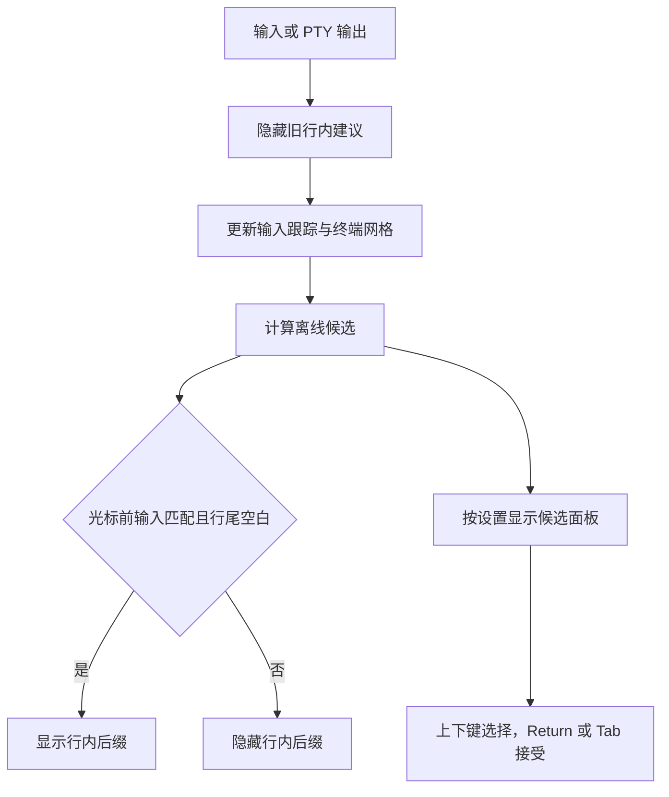

# 自动补全领域

## 背景与规则

对齐 [Otty 自动补全文档](https://docs.otty.sh/terminal-features/autocomplete) 的行内建议与候选面板，
补全来源和本机学习继续复用现有离线规格、目录历史、固定命令、README、文件与纠错服务。
空提示符仅推荐目录相关命令，不枚举所有规格；纯空格不产生候选。失败纠错可在下一条空提示符推荐。

`PromptInputTracker` 表示本地输入意图，终端网格表示已回显事实，两者不能互相替代。
只有可靠输入位于真实光标之前、光标之后没有 Shell 建议，才允许画或接受行内建议。
Ghostty 必须读取实际光标所在行；“可见区域最后一个非空行”可能是旧历史，不能作为证据。
每次 PTY 输出均撤下旧 ghost，并在终端消费分片后复查；光标移位、Shell 异步建议、重绘都会使旧结论失效。

## 流程

## 实现与边界

- `TerminalAutocompleteController` 管理候选、输入生命周期、接受与可见性；两个 terminal adapter 提供网格校验。
- Ghostty `readLine` 可限定包含端点的列范围，用于光标前缀/后缀读取。光标离开可见区或进入备用屏时拒绝行内建议。
- IME x 为单元格中点，width 为预编辑宽度；补全从左缘绘制，保持 IME 原始坐标不变。
- 自动面板初始没有明确选择；唯一候选或用户选中候选后才显示 inline，预览后缀跟随选中项。Esc 关闭后本轮不自动弹回，继续输入重新筛选。
- 面板最多八行；空间不足时减少行数并跟随选中项，完全放不下一行时隐藏。面板宽度不超过 Pane。
- 多物理行输入未能核对完整前缀时保守隐藏行内建议，候选仍可在面板选择；不按字符串长度猜 Unicode 网格列。

## 验证

`./scripts/test.sh --no-parallel --filter 'Autocomplete|autocomplete'` 覆盖领域排序、来源、隐私、面板、
分片回显及真实 Ghostty 光标行读取；`./scripts/test.sh --no-parallel` 为提交前全量验证。

## 候选质量与参数上下文

`AutocompleteArgumentContext` 是规格遍历的共享游标，描述命令路径、当前参数、待填写的选项值、
已用选项以及 `--` 终止状态。静态候选、文件枚举和历史参数学习必须使用同一个游标。
这不是新的顶层模块，仍属于 AppKit 无关的 `AsterCore`；磁盘枚举仍由 `AutocompleteService` 负责。

- 空参数位置同时提供可用子命令与选项；非重复选项在使用后去掉，带参选项优先补值。
- `--name=value` 的替换起点移至等号后，不把值当作选项名。`--` 之后不再解释选项。
- 文件枚举遵守参数模板；`cd`/`pushd` 仅目录。已有规格但当前参数不接收路径时不枚举文件。
- 引号内的空格不结束 token；`AutocompleteShellInsertion` 保留原输入，只编码追加后缀。
  目录保留未闭合引号便于继续补下一层，普通文件和静态值完成时闭合引号。所有路径均不执行展开。
- 历史参数从已脱敏的现有记录按目录、命令路径、参数槽位推导，不新建原始历史副本。
  选项顺序变化不改变位置参数槽位；不同命令/选项值不会混用。最多扫描排名靠前的 256 条，每条 64 个 token。
- 自动面板初始不预览首项；Down/Up 明确选择后，预览与说明同步切换。

## 对照依据

2026-09-05 在本机 Otty 独立窗口中临时排除 zsh-autosuggestions 后观察：`git ` 显示子命令列表；
`git ch` 显示 checkout/cherry-pick 两个候选但没有行内预览；Down 选中后出现对应后缀和右侧说明。
本机设置显示内置库 711 条，而在线文档标注 715 条，说明版本存在差异；Aster 继续使用自己的
714 条 Fig 规格，不复制 Otty 的私有数据库或把条目数相同作为质量依据。

`AutocompleteContextTests` 和服务/控制器回归覆盖参数位置、等号值、选项去重、终止符、引号路径、
历史参数跨选项复用及学习关闭/目录隔离；测试断言候选内容和实际追加字节，不仅检查候选非空。

候选面板可见时，Tab 可直接接受首项；Return 在明确选中候选后接受，未选中时仍交给 Shell。
工具明确给出的失败纠错属于确定建议，即使另有历史候选也可优先显示行内修正。

## 真实输入时序

Ghostty 的 PTY write observer 与 OSC 标记通过同一个 `TerminalOutputMessageBus.enqueueBarrier`
交付。不能为 write 另用 `DispatchQueue.main.async`：它会越过等待 RunLoop idle 的 A/B 标记，
使已经记录的命令前缀被迟到的 `beginPrompt` 清空，表现为输入 `git ch` 却推荐 `hx`/`helm`。

Ctrl-C 后以及 A 到 B 的过渡期保留最多 4096 字节的 typeahead，在 B 到达后仅推进跟踪器一次，
不再次发送给 PTY。超限时本轮补全失效，下个可靠 prompt 恢复；运行中的 TUI 输入不进入缓冲。

2026-09-05 真机复验：连续三次 Ctrl-C 后立即输入 `git ch` 均保留完整上下文；选中
cherry-pick 后预览为 `erry-pick`，Return 仅补入、不执行。`cd ` 不含样例中的 notes.md；
`cd 'my ` 追加 `project/`，`cat 'notes` 追加 `.md'`，已有文本与引号不被重复插入。

## Tab 接受与唯一候选

已显示的 Shell 建议由 adapter 按真实光标拆出后缀，验证光标前输入、可见行范围与控制字符限制。
Tab 接受时只把后缀发给 PTY，不发送 Tab 字节，因此不会进入 zsh 的全部候选确认。
长空白分隔的右侧提示符不作为建议；无可见建议时才走 Aster 多候选面板或原生 Shell 补全。

无论自动还是手动触发，面板只用于两个及以上候选；收窄为一个时收起面板并显示 inline。
2026-09-05 真机验证 `cd ~/so` → Tab → `cd ~/source/project/` 无询问，
`git ch` 面板 → 输入 `ec` → 唯一 inline `kout` → Tab 得到 `git checkout`。
