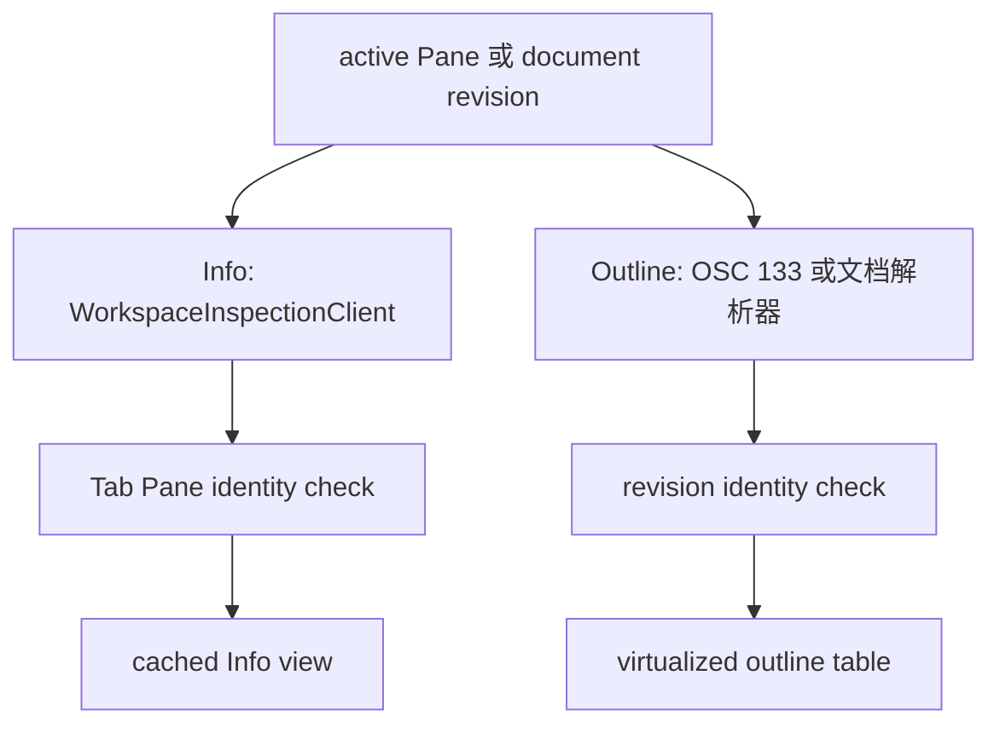

# Inspector Details Panel：Info 与 Outline

## 业务背景

Inspector Panel 是窗口级右侧区域；Info Section 与 Outline Section 都只服务当前聚焦的
Pane，不能用目录、进程名或最近会话推断另一个 Pane 的数据。

## 领域概念

Info 是环境摘要，Outline 是可跳转索引；两者均保留旧快照作为刷新中的不可交互视觉帧。
History 是**跨会话的工程记录**：它读的不是当前 Pane 的运行态，而是 Session Memory
数据库里已经落盘的历史（详见 [Session Memory 与 Context 领域](session-memory-domain.md)）。

## 核心规则

- Info 的结果区分成功（允许空进程或空端口）、不可用和检查失败。终端进程树以该 Pane
  的 shell PID 为根，包含 shell 本身；端口只来自该本地树的 TCP listener，并按 PID 与
  endpoint 去重。
- Info 只在当前可见时每三秒刷新；切换页、切换 Pane 或收起 Inspector 时取消未完成工作。
  所有外部检查固定调用绝对路径的只读工具，带输出上限、超时和 cancellation。
- Agent 行动要求 lifecycle hook 提供的 provider 与 session ID 精确绑定当前 Pane；禁止按
  `claude` 等可执行文件名、工作目录或最近历史猜测。Fork 是否可用由 provider capability
  决定。
- 终端 Outline 只信任 OSC 133 边界：命令在 `C` 后即作为运行中项出现，`D` 到达后更新
  退出状态。没有 Shell Integration 时不得抓取终端文本猜命令。
- 文档 Outline 的每一项必须拥有真实源码行。JSON 按原始文本顺序定位 key；JSONL 复用
  `AgentTranscriptParser` 的 canonical schema，不维护另一份简化 schema。
- History 页按**当前聚焦 Pane 所属项目**列出历史 session，不做跨项目聚合，也不用
  最近会话或目录相似度推测归属。切 Pane 必须连同详情态、展开态与已读全文缓存一起清空
  ——新 Pane 可能属于另一个项目，留着旧缓存就是串项目展示。
- 空状态分三态，因为用户的下一步动作完全不同：**正在读取**（等）、
  **未开启记录**（去设置；`makeReader()` 返回 nil，涵盖库不存在、打不开与 schema 版本不匹配）、
  **确实没有记录**（列表态与详情态各自的文案）。把「未开启」显示成「无记录」是错的，
  未开启是正常状态而不是故障。
- 事件行的展示模型由 `SessionTimelineProjection`（AsterCore 纯函数）产出，视图层只负责
  把行模型摆进表格。来自 provider transcript 的补录事件（`SessionTimelineRow.isTranscriptSourced`）
  必须与终端实测事件可区分：它们可能因格式漂移而缺失，可信度不同。标注用标题右侧的
  文字徽章加整行 tooltip，**不换图标**——图标始终表达事件 kind，不承载来源信息。
- History 的数据读取走独立只读连接（`MemoryStoreAccess.makeReader()`），与记录侧的
  单写者并发安全；`Task.detached` 开连接、用完即弃，主线程只做行模型替换。
  提交结果前必须校验 tab、Pane 与请求参数三重身份，迟到结果一律丢弃。
- History **没有推送通道**（session 可能在别的 Pane 甚至别的窗口结束），因此刷新语义是
  「进入本页时按过期时间重取」加一颗手动刷新按钮，**不接入 `objectWillChange → refresh()` 链**。
- 实现 `tableView(_:heightOfRow:)` 会让 `rowHeight` 对**所有**表失效，因此该方法必须逐表
  返回 Outline / Git / Files 原有的固定行高，不能只顾 History 自己。

## 业务流程

## 关键实现

Content 的标题栏与查找栏位于 Content Panel 内部，Inspector 从同一顶边开始。
右侧页签与窗口右上角切换按钮位于同一标题行，不能把公共标题栏堆在整个横向 split 上方。
面板显隐只插入/移除 Inspector，保留终端与已加载页；切换按钮的提示同步反映展开/收起状态。
Content / Inspector 之间绘制 1pt 分隔线，使用 `interface.border`（含明暗主题对比色回退）。
不能使用 `container.border`：容器外框允许回退到背景色，会让结构分隔线视觉消失。

`DetailsPanelViewController` 持有生命周期、身份校验和缓存；`WorkspaceInspectionService`
只做有界只读 I/O；`AsterCore` 只解析进程、端口、命令时间线和文档结构。视图不得直接
读取进程、扫描会话历史或执行 shell。

## 失败语义

非终端 Pane 显示不可用；找不到 shell 根进程显示可重试的检查失败；成功但没有 listener
显示 “No listening ports”。缺失 Agent 绑定显示集成等待状态，不显示其他 Pane 的历史。
刷新期间旧行对辅助功能和鼠标都不可操作。

## 测试与验收

验收至少覆盖树根/端口去重、运行中命令、真实 JSON 行号、嵌套 transcript prompt、Pane
身份丢弃、Info 定时取消以及终端输入焦点保持。
