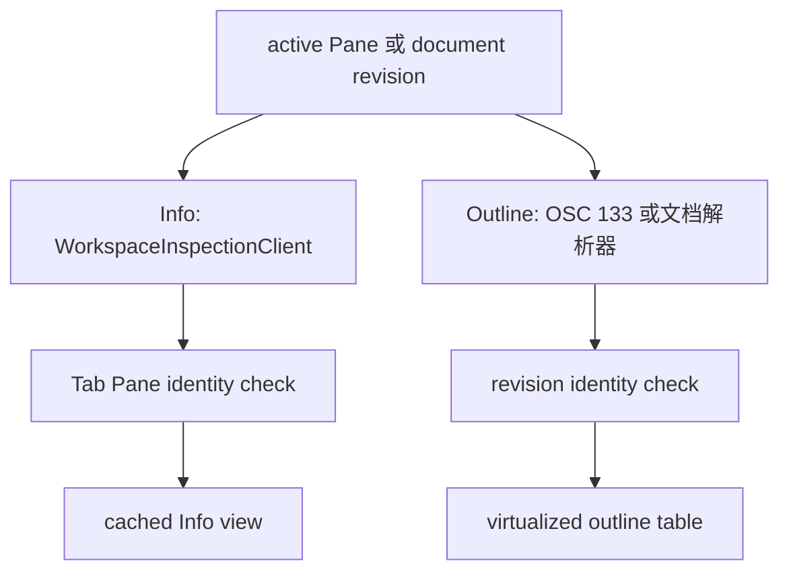

# Inspector Details Panel：Info 与 Outline

## 业务背景

Inspector Panel 是窗口级右侧区域；Info Section 与 Outline Section 都只服务当前聚焦的
Pane，不能用目录、进程名或最近会话推断另一个 Pane 的数据。

## 领域概念

Info 是环境摘要，Outline 是可跳转索引；两者均保留旧快照作为刷新中的不可交互视觉帧。

## 核心规则

- Info 的结果区分成功（允许空进程或空端口）、不可用和检查失败。终端进程树以该 Pane
  的 shell PID 为根，包含 shell 本身；端口只来自该本地树的 TCP listener，并按 PID 与
  endpoint 去重。
- Info 只在当前可见时每三秒刷新；切换页、切换 Pane 或收起 Inspector 时取消未完成工作。
  所有外部检查固定调用绝对路径的只读工具，带输出上限、超时和 cancellation。
- Agent 行动要求 lifecycle hook 提供的 provider 与 session ID 精确绑定当前 Pane；禁止按
  `claude` 等可执行文件名、工作目录或最近历史猜测。Fork 是否可用由 provider capability
  决定。
- 终端 Outline 只信任 OSC 133 边界：命令在 `C` 后即作为运行中项出现，`D` 到达后更新
  退出状态。没有 Shell Integration 时不得抓取终端文本猜命令。
- 文档 Outline 的每一项必须拥有真实源码行。JSON 按原始文本顺序定位 key；JSONL 复用
  `AgentTranscriptParser` 的 canonical schema，不维护另一份简化 schema。

## 业务流程

## 关键实现

`DetailsPanelViewController` 持有生命周期、身份校验和缓存；`WorkspaceInspectionService`
只做有界只读 I/O；`AsterCore` 只解析进程、端口、命令时间线和文档结构。视图不得直接
读取进程、扫描会话历史或执行 shell。

## 失败语义

非终端 Pane 显示不可用；找不到 shell 根进程显示可重试的检查失败；成功但没有 listener
显示 “No listening ports”。缺失 Agent 绑定显示集成等待状态，不显示其他 Pane 的历史。
刷新期间旧行对辅助功能和鼠标都不可操作。

## 测试与验收

验收至少覆盖树根/端口去重、运行中命令、真实 JSON 行号、嵌套 transcript prompt、Pane
身份丢弃、Info 定时取消以及终端输入焦点保持。
