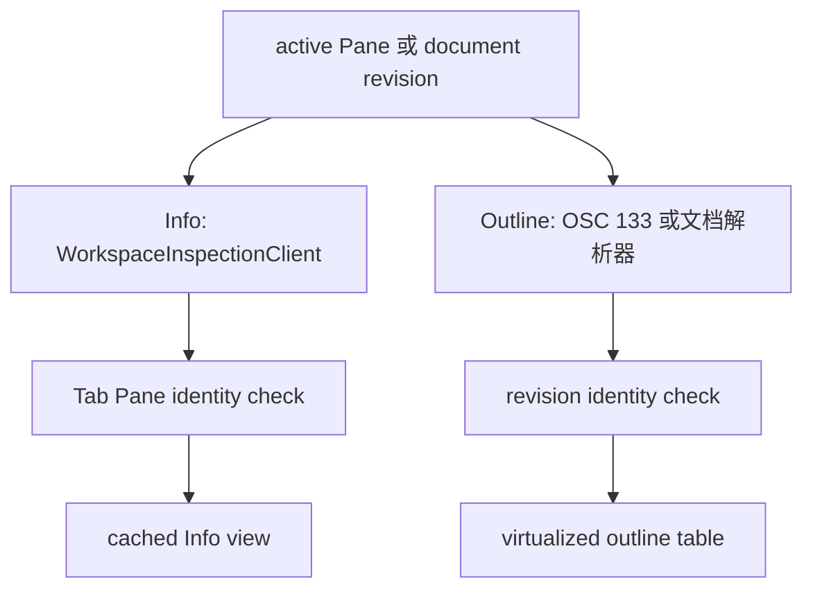

# Inspector Details Panel：Info 与 Outline

## 业务背景

Inspector Panel 是窗口级右侧区域；Info Section 与 Outline Section 都只服务当前聚焦的
Pane，不能用目录、进程名或最近会话推断另一个 Pane 的数据。

## 领域概念

Info 是环境摘要，Outline 是可跳转索引；两者均保留旧快照作为刷新中的不可交互视觉帧。
History 是**跨会话的工程记录**：它读的不是当前 Pane 的运行态，而是 Session Memory
数据库里已经落盘的历史（详见 [Session Memory 与 Context 领域](session-memory-domain.md)）。

## 核心规则

- Info 的结果区分成功（允许空进程或空端口）、不可用和检查失败。终端进程树以该 Pane
  的 shell PID 为根，包含 shell 本身；端口只来自该本地树的 TCP listener，并按 PID 与
  endpoint 去重。
- Info 只在当前可见时每三秒刷新；切换页、切换 Pane 或收起 Inspector 时取消未完成工作。窗口最小化、
  被完全遮住或在其他 Space 时跳过当轮检查；监听端口由 `ListeningPortScanner` 经 libproc 读取，
  不再每轮 fork `lsof`（见 [能耗与后台唤醒](energy-efficiency.md)）。
  所有外部检查固定调用绝对路径的只读工具，带输出上限、超时和 cancellation。
- Agent 行动要求 lifecycle hook 提供的 provider 与 session ID 精确绑定当前 Pane；禁止按
  `claude` 等可执行文件名、工作目录或最近历史猜测。Fork 是否可用由 provider capability
  决定。
- 终端 Outline 只信任 OSC 133 边界：命令在 `C` 后即作为运行中项出现，`D` 到达后更新
  退出状态。没有 Shell Integration 时不得抓取终端文本猜命令。
- 文档 Outline 的每一项必须拥有真实源码行。JSON 按原始文本顺序定位 key；JSONL 复用
  `AgentTranscriptParser` 的 canonical schema，不维护另一份简化 schema。
- History 页按**当前聚焦 Pane 所属项目**列出历史 session，不做跨项目聚合，也不用
  最近会话或目录相似度推测归属。切 Pane 必须连同详情态、展开态与已读全文缓存一起清空
  ——新 Pane 可能属于另一个项目，留着旧缓存就是串项目展示。
- 空状态分三态，因为用户的下一步动作完全不同：**正在读取**（等）、
  **未开启记录**（去设置；`makeReader()` 返回 nil，涵盖库不存在、打不开与 schema 版本不匹配）、
  **确实没有记录**（列表态与详情态各自的文案）。把「未开启」显示成「无记录」是错的，
  未开启是正常状态而不是故障。
- 事件行的展示模型由 `SessionTimelineProjection`（AsterCore 纯函数）产出，视图层只负责
  把行模型摆进表格。来自 provider transcript 的补录事件（`SessionTimelineRow.isTranscriptSourced`）
  必须与终端实测事件可区分：它们可能因格式漂移而缺失，可信度不同。标注用标题右侧的
  文字徽章加整行 tooltip，**不换图标**——图标始终表达事件 kind，不承载来源信息。
- History 的数据读取走独立只读连接（`MemoryStoreAccess.makeReader()`），与记录侧的
  单写者并发安全；`Task.detached` 开连接、用完即弃，主线程只做行模型替换。
  提交结果前必须校验 tab、Pane 与请求参数三重身份，迟到结果一律丢弃。
- History **没有推送通道**（session 可能在别的 Pane 甚至别的窗口结束），因此刷新语义是
  「进入本页时按过期时间重取」加一颗手动刷新按钮，**不接入 `objectWillChange → refresh()` 链**。
- 实现 `tableView(_:heightOfRow:)` 会让 `rowHeight` 对**所有**表失效，因此该方法必须逐表
  返回 Outline / Git / Files 原有的固定行高，不能只顾 History 自己。

## 业务流程

## 关键实现

Content 的标题栏与查找栏位于 Content Panel 内部，Inspector 从同一顶边开始。
右侧页签与窗口右上角切换按钮位于同一标题行，不能把公共标题栏堆在整个横向 split 上方。
面板显隐只插入/移除 Inspector，保留终端与已加载页；切换按钮的提示同步反映展开/收起状态。
Content / Inspector 之间绘制 1pt 分隔线，使用 `interface.border`（含明暗主题对比色回退）。
不能使用 `container.border`：容器外框允许回退到背景色，会让结构分隔线视觉消失。

`DetailsPanelViewController` 持有生命周期、身份校验和缓存；`WorkspaceInspectionService`
只做有界只读 I/O；`AsterCore` 只解析进程、端口、命令时间线和文档结构。视图不得直接
读取进程、扫描会话历史或执行 shell。

## 远端模式：服务器文件与服务器监控

本分支给 Files 与 Info 两页加了远端模式：Pane 连在远端时，Files 列远端当前目录，Info 换成
服务器监控。两页共用同一条旁路通道，其余页不变。

### 模式判定

- 模式的唯一来源是当前聚焦 Pane 的 `TerminalSession.remoteInspectionContext`
  （`AsterCore/RemoteInspection/RemoteInspectionContext.swift`）：`.ssh(invocation, endpoint)`
  表示用户在本地 Pane 手敲 `ssh …`，`.managed(reference, label, pid)` 表示远程工作模式的受管
  远端终端，nil 即本地模式。不按命令行文本、标题或主机名猜测远端。
- 远端目录来自远端 Shell 上报的 OSC 7，由 `RemoteWorkingDirectoryReport.parse` 判成
  `.local` / `.remote` / `.invalid`；只有 `.remote` 写入 `TerminalSession.remoteWorkingDirectory`。
  `.local` 继续走 Ghostty 校验后的 `GHOSTTY_ACTION_PWD`，同一次上报不得投递两次。
- 远端上下文变化走独立的 `TerminalTabItem.remoteContextChanged`，**不复用**
  `workingDirectoryChanged`：后者驱动 Git 与 History 页执行本地 git 与本地 SQLite 查询，把远端
  路径喂给它们等于拿远端路径当本机路径用。Git 页在远端模式显示「远端不支持」占位。

### Files 远端状态机

`awaitingIntegration` → `loading(dir)` → `listed` / `failed(kind)` / `transferring(progress)`。

- `awaitingIntegration`：远端模式但还没收到远端 cwd。给 1.5 秒宽限再显示横幅，避免登录过程中
  闪一下提示。横幅提供「安装远端集成…」「浏览 $HOME」「输入路径…」。
- `loading`：旧列表保留为不可交互视觉帧，与本地 Files 的刷新语义一致。
- `listed`：目录优先 + 名称排序、Find 过滤与隐藏项开关复用本地控件。隐藏项由远端全量下发，
  本地按 `filesShowHidden` 过滤，不为切换开关重跑远端脚本。
- 进入目录只认双击。右键菜单固定为：进入、在终端 cd 过去、下载到…、复制路径、复制相对路径、
  上传到此目录…。
- 名字含非法 UTF-8 的条目（`RemoteDirectoryEntry.nameDecodedLossy`）只展示，不允许进入或下载：
  有损解码后的名字回传远端已经不是原来那个文件。

### Info 远端状态机

`loading` → `snapshot` → `failed(kind)`。快照分段渲染：主机、负载与 CPU、内存 · Swap、磁盘、
进程（按 CPU / 按内存）、监听端口。缺失的段进 `unavailableSections`，按段显示「此平台不提供该项」，
不把缺段画成 0。CPU 百分比由客户端按 `channelKey` 保存上一 tick 的 `/proc/stat` 样本做差分，
**不在远端 sleep**，因此首个 tick 显示「—」。`ss -p` 在非 root 下看不到其他用户的进程，段头
明确提示，不把空进程列解释成没有监听者。

### 旁路通道与连接复用

- `RemoteSideChannel` 是两种场景唯一的调用面（`run` / `download` / `upload`）。场景 A 用
  `SSHControlPathInvocation` 复用用户前台 `ssh` 已建立的 ControlMaster socket；场景 B 直接复用
  `RemoteSessionTransport` 的私有配置。
- 场景 A 的固定 `-o` 选项（`ControlMaster=no`、`ControlPath=<dir>/%C`、`BatchMode=yes`、
  `ConnectTimeout=5`、`ServerAliveInterval=5`）必须**前置**在用户原始 argv 之前：OpenSSH 命令行
  同一关键字取首次出现的值，前置才能保证旁路永远不当 master、永远非交互；用户自己的 `-p`、`-i`、
  `-J`、`-F` 仍原样生效，旁路与前台因此落在同一个 `%C` 连接哈希上。
- 场景 A 的复用依赖本地 `ssh` 包装函数。它住在独立的 `Resources/shell-integration/aster-ssh.{zsh,bash,fish}`
  里，**不再由 `aster-integration.*` 定义**：Ghostty 原生 Pane 的 zsh 用的是 Ghostty 自带的 ZDOTDIR，
  `aster-integration.zsh` 在产品默认路径上根本不会加载，包装函数留在那里等于永远不生效。
- `ShellIntegrationInstaller` 因此在受管 rc 区块里写入**两段**条件：一段是原有的 tmux 限定整体集成，
  另一段只要求 `TERM_PROGRAM == aster`、`ASTER_DISABLE_INTEGRATION != 1` 且 `ASTER_SSH_CONTROL_DIR`
  非空，直接 `source` 对应的 `aster-ssh.*`，**与 TMUX 无关**。tmux 路径下 `aster-integration.*` 仍会
  source 同目录的 `aster-ssh.*`（`${(%):-%x}` / `BASH_SOURCE` / `status filename` 定位），payload 里的
  `_ASTER_SSH_WRAPPER_LOADED` 守卫保证两条路径同时命中时只定义一次。
- payload 只在 `ASTER_SSH_CONTROL_DIR` 已注入、目录真实存在且用户没有自定义 `ssh` 函数/别名时定义。
  该变量只在「SSH 集成」与「SSH 连接复用」同时开启、且 `/tmp/aster-cm-<uid>` 通过属主/权限/非符号链接
  校验时注入；校验失败就放弃复用，不降级使用不安全目录。开关只影响之后新建的终端。
- 复用可用性用 `ssh -O check` 判定。判定失败仍允许尝试一次；`BatchMode=yes` 下需要口令的连接会
  立即失败并归为 `.authenticationRequired`，绝不弹交互认证。
- `channelKey` 为 `managed:<profileID>:<serverID>` 或 `ssh:<sha256(configurationArguments)>`，
  argv 用 `\0` 连接后取摘要——参数内部可能含空格，用空格拼会让两台机器撞成同一个 key，
  从而混用彼此的目录缓存与 CPU 差分样本。

### 性能与上限

- Info 只在当前可见时每 3 秒一次，一个 tick 就是一次 `ssh` exec（≈ fork + 往返 30–80ms），
  跑在 `Task.detached(priority: .utility)` 上；上一个 tick 未完成则跳过本次，不排队堆积。
- 目录请求 300ms 去抖；每个 `channelKey` 一份 32 项的目录 LRU 缓存，切 Pane 不清空，切回同一
  远端可直接出旧帧再刷新。
- 目录脚本超时 10 秒、远端输出上限 1 MiB（`RemoteDirectoryListingScript.remoteByteLimit`），
  解析最多 2000 条（`maximumEntryCount`）；三层截断任一层触发都置 `isTruncated`，界面标注
  「已显示 2000 / N 项，已截断」，不假装列全了。
- 监控脚本超时 8 秒、输出上限 256 KiB（`RemoteHostMonitor.outputByteLimit`）；缺 `ASTER_MON_V1`
  首行按 malformed 处理。
- 上传单个文件 ≤ 512 MiB、一次最多 20 个、串行执行；超过 5 个或总量超过 50 MiB 先确认。
  下载先在远端 `stat` 大小再传：`cat` 不报告长度，只靠流式上限会先写掉几百 MiB 才放弃。

### 身份校验

每个远端请求携带 `RemoteInspectionRequestIdentity {tabID, paneID, channelKey, directory?, generation}`；
提交结果前四项全等才写界面，迟到结果一律丢弃。切 Pane、切页、收起面板都会递增 generation 并取消
在途工作，面板收起后不得留下轮询 Task。受管终端把远端 Shell pid 传给监控脚本，`[cwd]` 段的
`readlink /proc/<pid>/cwd` 只在 `remoteWorkingDirectory` 为空时当 Files 的初始目录用，不回写
session。

### 安全边界

- 远端路径与文件名是不可信输入。它们只经 `RemoteSSHInvocation.quote` 的 POSIX 单引号或脚本的
  `$1`、`$2` 位置参数进入远端 Shell，脚本文本本身始终是常量；这些字符串从不当作本地路径解析，
  也不进入本地命令行拼接。
- 「在终端 cd 过去」**只预填** `cd '<quoted>'`，不回车。执行与否由用户决定，面板不代跑命令，
  与 Git 页所有写操作的规则一致。
- 上传写 `dir/.name.aster-upload` 再 `mv -f`，下载写本地同目录隐藏临时文件再原子改名：中途失败
  不会留下半截文件冒充完整副本；失败路径同时清理两端 staging。同名覆盖前先 `test -e` 确认。
- 日志与诊断只记 `RemoteSSHDiagnostics.redact` 后的分类结果，不写远端路径正文、命令参数或
  认证信息。

### 测试与验收入口

解析层在 `Tests/AsterCoreTests/RemoteInspection/`（目录列表、监控解析、集成安装、旁路 argv、
OSC 7 判定）；面板层用注入的假 `RemoteInspectionClient` 覆盖去重、迟到结果丢弃、切 Pane 取消、
tick 跳过、截断标注与收起后无轮询。真机验收在 OrbStack `root@ubuntu@orb` 上跑，覆盖连接复用
socket、监控数值变化、集成安装幂等、上传下载无残留、特殊文件名与截断、退出后恢复本地。

### 分页与宽度自适应

服务器监控按 `RemoteMonitorTab`（概览 / 磁盘 / 进程 / 端口）分页，一次只渲染当前页。
分页覆盖 `RemoteHostMonitorSection.expected` 的全部分段且互不重叠，由 AsterCore 的测试守住
——漏掉一个分段就意味着某类指标在界面上永远看不到。切页只重绘，不重新采集。

`RemoteInspectorLayout.mode(forWidth:)` 以 300pt 为界给出 `compact` / `regular`。窄栏让
次要列先让位：进程隐去 PID、端口隐去监听地址、Files 行隐去修改时间，保留每行真正要看的
那个数值。档位必须按**滚动区实际可用宽度即时计算**，不能缓存：控制器根视图在被父约束
收敛前与窗口同宽，缓存值会让同一屏出现两种档位的行。进程与端口行是「名称可截断 + 数值
常驻」的两列，而不是一条会被整体截断的等宽字符串——被截掉的恰好是用户最想看的数值。
页签条用显式左对齐约束固定，水平 `NSStackView` 会把富余宽度平摊给各 chip，把整排推到面板中间。

进程页是三列表格：名称列可截断，CPU 与内存两列固定宽常驻，两个数值在窄栏也不让位——
「谁在吃资源」正是这一页存在的理由，PID 移进详情。表头点击切换排序列与方向，由
`RemoteProcessSort.selecting(_:)` 决定：同列切换升降序，换列回到降序。表格数据来自
`RemoteProcessTable.merged`——远端脚本按 CPU 与内存各取前 N 行，两份都截断过，只用其中
一份本地排序会漏掉「内存很高但 CPU 为 0」的进程；按 PID 去重合并后两个维度的头部都在
候选集里。同值按 PID 兜底排序，避免每 3 秒刷新时行序抖动。点行进入同页详情（PID、用户、
占用、完整命令行），详情里的进程在下次采集中消失时自动回到列表。

## 失败语义

非终端 Pane 显示不可用；找不到 shell 根进程显示可重试的检查失败；成功但没有 listener
显示 “No listening ports”。缺失 Agent 绑定显示集成等待状态，不显示其他 Pane 的历史。
刷新期间旧行对辅助功能和鼠标都不可操作。
远端模式按原因分开：需要认证提示开启「SSH 连接复用」后重连（不弹交互认证）、超时与不可达给重试、目录不存在给「返回上级」与「浏览 $HOME」、远端未上报目录给安装远端集成入口。这些原因对应的下一步动作各不相同，不能合并成一句「读取失败」。

## 测试与验收

验收至少覆盖树根/端口去重、运行中命令、真实 JSON 行号、嵌套 transcript prompt、Pane
身份丢弃、Info 定时取消以及终端输入焦点保持。
