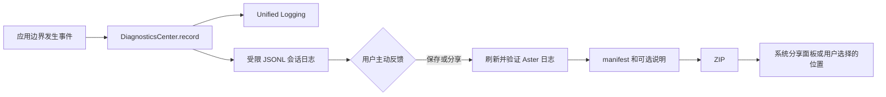

# 诊断与反馈

## 业务背景

Aster 是本机优先的终端工作区。排查应用自身启动、PTY、持久化与集成问题需要运行证据，但终端正文、命令和工作目录天然敏感，不能因诊断而进入反馈包或自动上传。

## 领域概念

- **DiagnosticsCenter**：Aster target 内唯一的诊断 module，负责 Unified Logging、本地 JSONL、轮转和反馈归档。
- **诊断事件**：稳定事件码、分类、有限状态属性和可选错误摘要；错误摘要只有类型、domain 与 code。
- **反馈包**：用户主动生成的 ZIP，仅含 Aster 创建的日志、`manifest.json` 和可选问题描述。

## 核心规则

1. 本地目录是 `~/Library/Logs/Aster`，目录权限 `0700`、日志和归档文件权限 `0600`。
2. 单个 JSONL 文件最多 5 MiB；日志总计最多 20 MiB，或早于 7 天时优先删除最旧文件。
3. 禁止记录终端输入输出、命令、路径、URL、环境变量、剪贴板、配置、账号/主机信息、令牌、secret 及系统 `.ips`。
4. Debug 记录源码位置和 debug 事件；Release 不写这些字段。磁盘失败只降级为 Unified Logging，不能阻止应用启动。
5. 反馈包绝不自动生成或上传；用户只能从“帮助 → 反馈问题…”保存或经系统分享面板发送。

## 业务流程

## 关键实现

- `DiagnosticsCenter.start()` 在 `AsterApplication.main()` 中、创建 AppKit 窗口前调用；`finish(reason:)` 在应用终止时刷新。
- 调用方只能提供稳定事件码与非敏感属性。属性键包含 `path`、`command`、`content`、`prompt`、`clipboard`、`environment`、`token`、`secret`、`url`、`host` 或 `user` 时会被丢弃。
- `makeFeedbackArchive(note:)` 只复制以 `aster-` 命名的普通 JSONL 文件；符号链接、特殊文件和超限文件都会拒绝。压缩使用固定 `/usr/bin/ditto` argv，不经 Shell。
- 异常退出沿用 `AppModel` 已有的会话恢复标记记录恢复决策。该能力不等价于原生 crash stack capture。

## 失败语义

- 日志目录不可用、写入失败或清理失败：继续运行，系统日志记录内部失败；反馈页显示可操作的生成错误。
- 归档失败：不创建半成品 ZIP，原日志保持不变。
- 用户取消保存或关闭分享面板：不视为“已发送”，也不触发网络请求。

## 测试与验收

- `DiagnosticsCenterTests` 验证敏感属性和错误描述不会写入日志，且 ZIP 只含 manifest、用户说明和诊断文件。
- 执行 `swift build`、`swift test --no-parallel`、`swift build -c release`、`./scripts/build-app.sh` 与 `codesign --verify --deep --strict dist/Aster.app`。
- 手工检查帮助菜单、反馈面板、Finder 日志目录和生成 ZIP 的内容；不得通过终端内容或用户配置验证。
