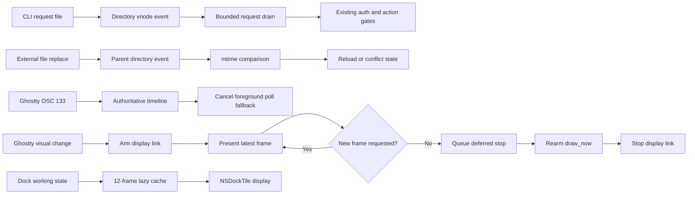

# 能耗与后台唤醒

## 业务背景

Aster 会长期承载多个终端、文件 Pane、Agent 状态和本机 CLI。即使每个固定轮询都很轻，
它们也会阻止进程长期休眠，并随 Pane 数量线性增加 CPU wakeup。能耗优化的首要规则是把
“没有变化”变成零工作，同时保留事件遗漏或系统能力不可用时的功能兜底。

## 领域概念

- **目录事件**：`FileSystemDirectoryWatcher` 基于 vnode `DispatchSource` 合并目录变化，只
  负责唤醒；调用方重新读取自己的有界真值。
- **权威事件流**：Ghostty 的 OSC 133 C/D 精确描述命令生命周期，建立后不再需要前台 PID
  轮询；surface 退出继续由独立 callback 负责。
- **兼容 fallback**：文件系统监听无法建立，或 SwiftTerm 仍需无 I/O Secure Input 采样时
  才保留 timer。fallback 不能成为正常路径。
- **离散帧缓存**：Dock working 动画只有 12 个角度；短任务按需生成，完成一圈后只复用
  `NSImage`，应用图标身份变化时统一失效。
- **按需 vsync**：Ghostty focused surface 保持 `window-vsync=true`，但普通静态终端只在
  内容、光标或几何变化后运行 display link；自定义 shader 动画仍连续刷新。

- **surface 可见性**：后台标签的终端视图会被拆出窗口，窗口也可能最小化、被完全遮住或在
  其他 Space。`GhosttySurfaceView` 把「有没有人看得到像素」同步给 libghostty，看不见的
  surface 不编码 Metal 帧、不呈现 IOSurface，renderer 线程降到 utility QoS。
- **静止期**：Agent 屏幕检测已发布 idle，且 PTY 内容序号自上次读屏后未变。这段时间里
  轮询的每一轮都是空转，改由输出事件叫醒。

## 核心规则

1. 操作系统已经提供目录、PTY、OSC 或进程退出事件时，正常空闲路径不得再增加固定 timer。
2. `FileSystemDirectoryWatcher` 的事件可以合并。CLI 每轮最多处理 32 个请求，达到预算后让出
   主队列再继续排空，不能把“一个事件”等同于“一个文件”。
3. CLI token、owner、权限、普通文件和大小校验仍由 `AsterCLIRequestService` 执行；事件监听
   不读取载荷，也不扩大 IPC 信任边界。监听失败时记录诊断并启用原 100ms 兼容 timer。
4. File Pane 监听目标文件的父目录，以覆盖原位写入和 atomic replace；事件到达后仍比较
   `contentModificationDate`。监听失败时退回带 tolerance 的 1 秒检测。
5. Ghostty 首次收到合法 OSC 133 后立即取消该 Pane 的前台进程轮询。SwiftTerm 继续保留
   一秒 fallback，因为该任务还负责无 I/O 时的自动 Secure Input 检查。
6. 所有 watcher、fallback timer、poll task 和 Dock animation timer 必须随 owner 停止；
   缓存只保存应用图标派生帧，不保存终端或用户内容。
7. Ghostty display link 只能在有待呈现帧时运行。持续输出在刷新间重新置位以保持屏幕节奏；
   禁止用 `window-vsync=false` 换取空闲低 wakeup，因为它会引入撕裂、重负载功耗和 macOS
   外接显示器风险。空闲停止必须等 `draw_now` completion 返回并重新 armed 后执行，不能在
   `drawNowCallback` 内同步调用 `CVDisplayLinkStop`。
8. AI 用量监控（默认关闭）按可见性分三档：开关关闭时不存在任何对象；只开着状态栏图标时
   唯一的周期性工作是 Claude 配额的被动轮询（300 秒一次；有 Claude Pane 在跑时同一条
   请求时间线提高到 90 秒），红点由既有的 `pane.*` 事件驱动；token 扫描与每 3 秒一次的进程采样只在对应
   页面可见时运行，`suspend()` 必须取消全部任务。细节见 [AI 用量监控](ai-usage-monitor.md)。

8. Ghostty surface 的可见性只有一个判定入口 `isSurfaceVisibleToUser`：视图在窗口里、没有隐藏
   祖先、窗口 `occlusionState` 含 `.visible`；系统画中画镜像采集期间无条件视为可见，因为
   镜像直接消费 renderer 的帧。变为可见立即上报，变为不可见延后一轮主队列确认，避免工作区
   整树刷新（同一轮里拆下再装回）触发一次降级加一次补画。
9. Agent 屏幕检测在静止期不做固定 300ms 轮询：生产节奏用 2 秒兜底，`TerminalSession` 的
   `detectionContentSequence` 每次变化调用 `contentDidChange()` 提前叫醒，叫醒后仍按 300ms
   合并一阵连续输出。静止期判定与发布层「跳过读屏」的条件一致，被省掉的轮次本来也不读屏。
10. 热路径不得逐批读屏。Ghostty 的输出活动探针要整屏取文本并和 IO / renderer 线程争终端锁，
    只在空闲后的第一批立即执行，连续输出期间最多每 250ms 一次，且最后一批之后必有一次。
11. 每 300ms 执行的清单 `contains` 门用 UTF-8 字节搜索；`String.contains` 按字素比较，在整屏
    文本上慢一个数量级。needle 与文本都先转小写，语义保持大小写不敏感。
12. 周期性检查不得 fork 可以用系统调用替代的命令。Info 页的监听端口由 `ListeningPortScanner`
    经 libproc 读取；窗口不可见时即使面板展开也跳过这一轮 `ps` 与端口扫描。

## 业务流程

## 关键实现与失败语义

`FileSystemDirectoryWatcher` 位于 `Sources/Aster/` 的 AppKit 交付边界，固定在主队列回调；
CLI 与 File Pane 共享监听机制，但分别持有安全校验和内容重载规则。目录无法打开时抛出只含
`errno` 的错误，不把用户路径写入诊断。`TerminalSession.handleShellIntegrationTimeline` 只在
Ghostty 引擎取消 poll，避免破坏 SwiftTerm Secure Input fallback。`DockActivityCoordinator`
按当前 `NSApp.applicationIconImage` 身份维护 working/error 缓存，图标替换后不会展示旧帧。
自定义 Dock 内容用满 tile 的透明根视图承载按 `824/1024` 居中的图标子视图，补回系统默认
图标的视觉边距；working 只旋转中央星芒，不改变 idle → working 的整块图标尺寸。
`Vendor/Ghostty/patches/0001-aster-extension-abi.patch` 在 pinned renderer 中提供按需 vsync：
更新先请求下一次同步帧，display callback 消费后保留一个合并窗口，无后续请求即停止；
自定义 shader 动画跳过停止逻辑。空闲判定只投递独立 `vsync_stop` async，等当前
`draw_now` completion 返回 `.rearm` 后才停止 display link；执行前再次检查请求位，既避免
CVDisplayLink callback 与 renderer 互等，也不会吞掉并发到达的新帧。

## 2026-08-19 验证基线

在同一台 Mac、AC 电源、fresh `CFFIXED_USER_HOME`、Debug 构建和一个空闲终端下，启动后
预热 5 秒，再以 `top` 连续采样 31 次（每秒一次）：

| 指标 | 修改前 | 修改后 | 变化 |
| --- | ---: | ---: | ---: |
| 平均 CPU | 0.503% | 0.000%（低于采样显示精度） | 降至不可分辨 |
| 平均 POWER | 0.503 | 0.000（低于采样显示精度） | 降至不可分辨 |
| Context switches | 63.2/s | 0.8/s | -98.7% |

修改前 10 秒 `/usr/bin/sample` 明确命中 `drainCLIRequests` 39 次和
`startForegroundPolling`；修改后同样采样未出现 CLI、foreground poll、Dock 栅格化或相关
timer 栈。修改后的真实 `pane capture` CLI 请求在第一次 10ms 检查即得到状态 0 响应。

自动验收覆盖目录事件、CLI 传输、File Pane atomic replace、真实 Ghostty OSC 133，以及
Dock 一圈后不再增加图标栅格化次数。整体验收仍运行 `swift test --no-parallel`；电池瓦时与
复杂多 Pane 工作负载属于发布前的设备级补充测量，不能由单次 `top` 样本替代。

### 前台 active surface 补充验收

用户把目标明确为“耗电降至原来的 1/3”后，对原始 master 与最终构建使用完全相同的
frontmost、fresh home、单终端协议：启动后预热 15 秒，`top` 连续采样 31 秒，再 attach
Xcode `Activity Monitor` 采样约 20 秒。`Power Profiler` 不支持 macOS，`powermetrics` 需要
当前会话没有的管理员权限，因此 POWER、CPU time 与 Idle Wake Ups 共同作为可重复的
进程级 Energy Impact 证据：

| 前台稳态指标 | 原始 master | 最终构建 | 剩余比例 |
| --- | ---: | ---: | ---: |
| `top` POWER | 0.377 | 0.068 | 18.0% |
| `top` CPU | 0.371% | 0.068% | 18.3% |
| Activity Monitor CPU | 2.0406 ms/s | 0.0267 ms/s | 1.31% |
| Idle wakeups | 9.564/s | 0.338/s | 3.53% |
| 稳态磁盘读写 | 0 B | 0 B | 不变 |

所有直接能耗指标都低于目标线 33.33%。两次额外 10 秒 final 复测存在光标/延迟任务带来的
正常波动；其中最差一轮的 CPU 与 wakeups 仍只剩原始值的 25.3% / 18.8%，继续满足目标。
同一最终构建通过真实窗口像素验收：一次性输出 `seq 1 5000` 后可见区显示到 5000 并恢复
prompt，证明低 wakeup 不是停止呈现造成的。

## 2026-09-19 有 Agent 负载时的热点治理

空闲基线已经接近零，剩余能耗集中在「终端里有 Agent 在流式输出」的场景。对正式版
（运行 5 小时 40 分、累计 CPU 688 秒，约等于它托管的那个 `claude` 进程）做 20 秒
`/usr/bin/sample`，剔除等待类栈帧后的忙采样分布：

| 热点 | 忙采样占比 | 处理 |
| --- | ---: | --- |
| 主线程合计 | 55% | 见下 |
| `AgentScreenDetectionMonitor.tick` → `String.contains` | 13% | 字节搜索；静止期停轮询 |
| PTY 每批 `readText`（活动探针） | 7% | 250ms 节流 |
| `NSDockTile.display`（Dock 动画） | 6% | 去掉每帧 Task 跳转，timer 加 tolerance |
| Ghostty renderer + Metal 提交 + CVDisplayLink | 约 40% | 不可见 surface 停止绘制 |

另外两项不在进程自身采样里，但记在 Aster 名下：Info 页展开时每 3 秒 fork 的 `ps` +
`lsof`（`lsof` 单次约 30ms CPU，折合约 1% 的一个核）；以及后台标签、被遮挡窗口里的
surface 仍在持续提交 GPU 帧。活动监视器「能耗」页把终端里运行的全部子进程（`claude`、
`swift build`、测试）都汇总到 Aster 这一行，12 小时电源数值不能直接当作 Aster 自身的开销。

`powermetrics` 需要管理员权限，本轮没有 GPU 瓦数的直接读数；验证依据是定向测试与
同协议 `sample` 对比，设备级电量测量仍属发布前补充项。
