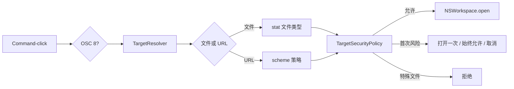
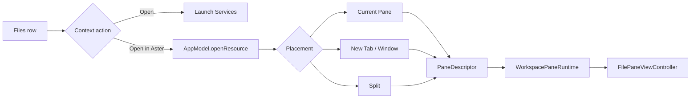

# 文件、链接与 File Pane 领域

## 业务背景

终端输出同时包含本地路径、普通 URL 和程序通过 OSC 8 标注的显式链接。它们均属于不可信输入：Aster 必须先解析、规范化和授权，再交给系统应用，不能沿用终端组件直接调用 `NSWorkspace.open` 的默认路径。

## 领域概念

- **DetectedTarget**：已规范化的文件或 URL，不包含打开动作。
- **TargetResolver**：解析绝对、`~/`、相对、`path:line[:column]`、`file:` 和其它 URL。
- **LinkSchemePolicy**：普通文字采用“全部”或“标准 + 自定义”检测；OSC 8 始终可识别。
- **TargetSecurityPolicy**：普通文件放行；外部网站、非标准 scheme 和可执行文件首次确认；特殊文件拒绝。
- **Security Exception**：分别记住用户在本机确认的网站 host、非标准 scheme 和可执行文件身份签名。
- **WorkspaceResourcePlacement**：资源进入 Current Pane / New Tab / New Window / 四向 Split 的统一落点。
- **WorkspaceResourceOpenMode**：Files 使用 `automatic` 按展示能力选择 editor/preview；CLI 保持显式 view/edit。
- **FileDocumentSession**：由 `WorkspacePaneRuntime` 持有的 UTF-8 文档缓冲、dirty/read-only/error 状态。
- **FilePresentationKind**：Markdown、reStructuredText、HTML、SVG、图片、PDF、富文档、diff、Agent transcript、源码和二进制。
- **WorkspaceFileActionService**：Files 菜单创建、重命名和移入废纸篓的唯一写入边界。

## 核心规则

1. 原始目标最多 4096 UTF-8 字节且不能含控制字符。
2. 相对路径只以活动 Pane 最近一次可靠 OSC 7 CWD 为基准。
3. `file:` URL 转为文件目标，不能绕过文件类型检查。
4. OSC 8 不受自动检测白名单限制，但仍需打开授权。
5. FIFO、socket、设备和未知文件类型不得打开或预读。
6. 网站与 scheme 例外小写去重；可执行授权绑定文件身份，文件变化后重新确认；配置导入会剥离全部本机授权。
7. Files 打开使用 `automatic`：Markdown、reStructuredText、HTML、SVG 和普通源码恢复为 `.editor` 且默认可编辑；图片、PDF、富文档、diff、Agent transcript 与二进制恢复为 `.preview`。CLI 的 `view` / `edit` 与新建文件的显式 `edit` 不受影响。
8. 文件名拒绝空值、`.`、`..`、路径分隔符、控制字符和超过 255 UTF-8 字节的值；创建不覆盖同名项。
9. Rename 只在同一父目录内移动，并同步所有已打开文件及目录后代 Pane；删除只调用系统 Trash。
10. Source/Preview、锁定、语言、Soft Wrap 与缩放属于运行态，不改变既有 `.editor` / `.preview` 快照格式。

## 业务流程

### Files 到 File Pane

Files 的右键菜单保持固定结构：`Open`、`Open in Aster` 子菜单、创建/重命名/废纸篓、路径复制和 Finder。树展开仍由 chevron 或双击负责，不混入资源动作。`Copy Relative Path` 以当前 Files 根目录按 path components 计算，不用字符串前缀，也不添加 `./`。

File Pane 的顶部工具栏负责模式、Send to Chat、Share、保存状态、保存和关闭。Markdown、reStructuredText、HTML 与 SVG 显示 code/eye 胶囊，默认 Source，可切换 Preview；普通源码显示 code/lock 胶囊，默认可编辑，可就地锁定。预览专用类型不显示无效模式开关。Markdown 由固定版本 `swift-markdown` 解析 GFM 后在禁用 JavaScript、禁用网络的 `WKWebView` 中展示；HTML/SVG 使用同一沙箱。源码由 HighlighterSwift/highlight.js 着色，同时保持原生 `NSTextView` 输入语义。图片使用可缩放 `NSScrollView`，PDF 使用 PDFKit，Office/媒体/字体交给 Quick Look，二进制使用 `NSTableView` 按可见行生成有界 hex。可信 Agent transcript 只复用已发现历史的解析结果，并提供 Resume/Fork；任意 JSONL 不会自行升级为会话。

每个 `WorkspaceViewController` 持有一个 `FileRenderPipeline` actor。语法高亮、Markdown 与 reStructuredText 转换在该串行后台边界完成，只把 RTF `Data` 或 HTML `String` 返回主线程；revision guard 会丢弃编辑后迟到的旧结果。`NSTextView` 与 `WKWebView` 在 Pane 生命周期内缓存复用，Source/Preview 和锁定切换只更新层级与编辑状态，不再重建整个工作区、WebKit 实例、选区或 undo 状态。

Pane 通过目标文件父目录的 vnode 事件检查 `contentModificationDate`，同时覆盖原位写入和 atomic replace；只有目录监听无法建立时才回退为带 tolerance 的一秒检测。没有本地改动时自动重载；存在 dirty 内容时显示 `Modified on Disk`，由用户从菜单明确 Reload 后才丢弃内存内容。保存继续使用 `DocumentBuffer` 原子替换，读取只接受普通、非符号链接文件，编辑缓冲上限仍为 10 MiB；超大或二进制预览只读取有界前缀。

## 关键实现与失败语义

### 链接协议设置交互

网页卡片按本机 Otty 1.4.1 的链接协议交互对齐，保留“全部 / 自定义”、按需显示的配置入口、独立预览开关和安全提示重置。`Resources/settings-ui/link-protocols.js` 只负责逐行输入、增删、错误反馈、焦点和串行提交；它依赖设置页传入的提交函数，不访问文件或授予打开权限。有效协议即时保存，空行不入库，`Escape` / 完成在保存结束后关闭；无效输入或明确保存失败保持在编辑器内，允许修正和重试。对话框限制焦点范围，关闭后恢复到重建后的配置按钮。

`LinkSchemePolicy.normalizedCustomSchemes` 统一大小写、可选 `://` 后缀、去重和 64 项/每项 64 字符边界，非法或超限输入整批拒绝。该字段的原生输入上限单独覆盖最大合法列表，不扩大其它文本字段的 4096 字节上限。网页设置写入不再订阅自身变更重复推送快照；显式快照之后发送带 requestID 的 `mutationResult`，逐行编辑器等待回执后提交最后一次输入，避免旧 revision 拒绝连续输入。

重置将网站、非标准协议、可执行文件签名三类例外一次清空，保留检测列表与预览设置；网页收到成功回执后才显示“已重置 ✓”，反馈状态独立于 DOM，在快照更新后仍保持 1.6 秒。`GhosttySurfaceView` 的协议策略变更主动作废命中缓存并更新预览，重新启用预览时按现有鼠标位置恢复。手形与实际点击命中共用判断，不依赖预览开关；失去 Command、离开链接或禁用协议后恢复终端指针。

验证入口：`LinkProtocolSettingsTests` 覆盖实际 WKWebView 输入、持久化、焦点、重置及下一次确认；`GhosttyLinkHoverE2ETests` 通过真实 surface 与 NSEvent 验证指针、预览开关和点击（打开动作使用安全替身）；`DetectedTargetTests` 覆盖标准协议、OSC 8 与配置边界。测试提供 `ASTER_LINK_UI_EVIDENCE_DIR` 可选截图目录，仅使用隔离 defaults。

`flagsChanged` 必须按事件携带的 Command 修饰状态同步整个链接交互，不能只处理物理键码 54/55：系统重映射或合成事件可能保留其它键码。原先预览按修饰状态更新、手形和下划线按键码更新，会出现“有 URL 预览但没有手形和下划线”。回归使用 `[HPM] Proxy created: /api  → http://127.0.0.1:8899`，先停住鼠标再发送左右 Command 和非标准键码的 Command 状态事件，验证目标处下划线、手形与预览同步出现，松开后清除。

原生 `mouse_over_link` 命中单独保存在 `nativeHoveredLink`，与预览开关解耦，并和文字扫描共同驱动手形；OSC 8 的显示文字可能不含 URL，不能用文字扫描失败否定原生命中。鼠标点击、滚动和移动经同一事件坐标更新缓存，避免原生预览位置已变化、Aster 仍命中旧位置。松开 Command、离开视图或销毁 surface 时清理命中，迟到的原生回调不得重新显示预览。下划线通过 `CAShapeLayer` 直接合成到 Metal 宿主中，关闭隐式动画并同步更新路径，不依赖透明 `NSView.draw` 的调度；已在独立测试窗口的真实画面中核对代理 URL 下划线可见。

按下 Command 时每次从窗口读取当前指针位置，不能只在缓存为空时读取；测试通过 `linkPointerLocationProvider` 注入位置，以免合成事件未移动系统指针而掩盖此差异。回归会故意留下错误缓存再按键，确认手形与预览使用新位置。鼠标跟踪仍采用 AppKit 的 [NSTrackingArea 事件机制](https://developer.apple.com/library/archive/documentation/Cocoa/Conceptual/EventOverview/TrackingAreaObjects/TrackingAreaObjects.html)。

`AsterTerminalView` 在点击发生时读取当前终端单元格的 OSC 8 payload，以精确区分显式链接和同值普通文字；`InlineURLDetector` 补充 SwiftTerm 固定 scheme 列表之外的 `scheme://`。自定义 URL 跨物理行时，会在可见区内按占满右边界的连续行重建，最多 8 行和 4096 字节；超出边界时拒绝截断打开。预览文字与实际打开共用 `TargetResolver` 和 Session 当前可信本地 CWD，因此相对路径、`~/`、`file:` 与行列后缀会显示成可核对的绝对路径；远端主机 OSC 7 不会被伪装成本机路径。底部预览使用独立圆角 badge：浅色外观固定为半透明黑底白字，深色外观反转为半透明白底黑字，只跟随系统明暗外观，不读取终端主题或 ANSI 颜色。Ghostty 主引擎下 `link-url` 固定关闭，普通文字 URL 与路径只有 Aster 一条通道：`TerminalInlineTargetScanner`（AsterCore）逐行切出 URL（`scheme://`、`mailto:`）与路径 token（绝对、`~/`、`./`、相对以及 `Makefile` 这类裸文件名，剥离 `@` 前缀、旗标、尾随句读，只接受 `:line[:column]` 形态的冒号）；`GhosttySurfaceView+Links` 把候选映射回终端列（含宽字符第二列），URL 按 `LinkSchemePolicy` 过滤，路径经 Session 提供的 `linkPathValidator`（`TerminalTargetOpenCoordinator.fileTargetExists`，按当前可信本地 CWD 解析后 stat）确认存在才采信，Command 按住期间结果有界缓存，CWD 变化即作废。Command 按下时扫描整个视口，用不参与命中测试的 `GhosttyLinkUnderlineOverlay`（zPosition 高于 CAMetalLayer）画实线下划线，输出、滚动、尺寸变化合并重扫，松开或指针离开即清除；Command 状态取自事件本身而非全局修饰键，便于合成事件测试。Command 悬停时手形指针由 Aster 设置；修饰键按下时立即按窗口当前指针位置重算命中，即使鼠标静止也显示手形。AppKit 在 `NSCursor.set()` 或视图层级变化后会自行合成 `cursorUpdate` 事件，其 `modifierFlags` 在 Command 按住时也为空，因此 `cursorUpdate` 只按当前状态重施指针形状，绝不作为修饰键状态来源（否则按下约 30ms 后下划线与手形即被清空，而预览仍在）。底部预览徽章为紧凑规格：28pt 高、12pt 等宽字；宽度按 cell 尺寸计算并禁用省略号，只有地址超过 Pane 可用宽度才中间截断。Ghostty 的 mouse_shape 在悬停期间只记录不应用，悬停结束后恢复。Command 点击在 mouseUp 放行 Ghostty 之后、以主队列异步方式打开命中目标，并用 `nativeOpenURLSequence` 确认同一次点击没有被 OSC 8 原生 `open_url` 抢先打开。预览仍是双来源：OSC 8 由 Ghostty `mouse_over_link` 原生上报并优先显示，普通文字目标由 Aster 侧识别；原生空清除信号只清原生预览并立刻按最近指针位置补一次 Aster 侧识别；badge layer 显式抬高 zPosition。`TerminalTargetOpenCoordinator` 负责终端目标；Files 的系统 Open 在再次 stat 后沿用同一特殊文件拒绝与可执行确认规则。控制页分别保存链接、文件与文件夹目的地：本地普通文件和目录选择 Aster 时由所属 `WorkspaceTab` 新建 Editor / File Browser Pane，HTTP(S) URL 新建 Web Pane，系统目的地继续交给 LaunchServices。Web Pane 的快照与 Recipe 只接受带 host 的 HTTP(S) URL，不开放脚本桥、本地文件或自定义协议；自定义应用只保存显示名和 bundle ID，每次使用时由 LaunchServices 重新定位，不固化可能失效的 `.app` 路径。SSH 远端文件由详情面板的远端模式单独承载，见下面的「远端文件与传输边界」与 [Inspector Details Panel](details-panel-domain.md)。

解析失败、用户取消或系统无对应应用均返回失败且不写例外。外部网站、非标准 scheme 与可执行目标的“始终允许”分别绑定 host、scheme 和文件路径/设备/inode/大小/修改时间签名；可执行文件发生替换或修改后旧授权不再匹配。特殊文件直接拒绝，配置导入统一剥离这些本机授权。测试位于 `FileDocumentTests.swift`、`WorkspaceFileActionServiceTests.swift`、`FilePaneViewControllerTests.swift`、`WorkspaceDetailsPanelTests.swift`、`DetectedTargetTests.swift`、`AppKitMigrationTests.swift` 和 `WorkspaceBehaviorTests.swift`。

### 远端文件与传输边界

详情面板的远端模式（Files 页）提供远端目录的只读浏览加上传/下载。它与本节的 File Pane 链路是
两条独立管线，不能互相借用：

- 远端条目**不生成 `DetectedTarget`，也不进入 `TargetResolver` 与打开授权链路**。远端路径没有
  本地 inode 可 stat，本节所有基于文件身份的规则（特殊文件拒绝、可执行签名例外）都无从成立；
  把远端路径喂给本地解析器等于拿它当本机路径。远端文件要编辑就下载到本地再打开，或在远端终端里
  用编辑器。远端 File Pane 仍然不开放。
- 传输走 `ssh` + `cat` 而不是 `scp`/`sftp`：旁路复用的是前台连接已建立的 ControlMaster socket，
  `scp` 会另起一条自己的连接与认证，而远端也不保证装了 `sftp-server` 子系统。`cat` 只依赖
  POSIX sh，与目录列表、监控脚本共用同一条通道和同一套上限。
- 上传先写目标目录下的 `.<name>.aster-upload`，`cat` 成功后再 `mv -f` 落盘，前置 `umask 022`
  保证新文件权限可预期。直接写目标文件会在断连或磁盘满时留下一个半截的同名文件，把远端已有内容
  盖掉。同名覆盖前先 `test -e` 让用户确认。
- 下载先在远端 `stat` 大小并与上限比较，再流式接收：`cat` 不报告长度，只靠流式上限会先写掉几百
  MiB 才放弃。本地同样先写同目录隐藏临时文件再原子改名，失败即删半截文件。
- 远端文件名是不可信输入：只经 POSIX 单引号或位置参数进远端 Shell；保存到本地时剥离 `/` 与 `..`
  后再作为默认文件名交给 `NSSavePanel`；非法 UTF-8 名字有损解码后只能显示，不能下载或进入。
