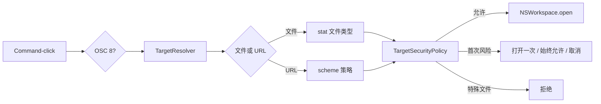

# 文件与链接领域

## 业务背景

终端输出同时包含本地路径、普通 URL 和程序通过 OSC 8 标注的显式链接。它们均属于不可信输入：Aster 必须先解析、规范化和授权，再交给系统应用，不能沿用终端组件直接调用 `NSWorkspace.open` 的默认路径。

## 领域概念

- **DetectedTarget**：已规范化的文件或 URL，不包含打开动作。
- **TargetResolver**：解析绝对、`~/`、相对、`path:line[:column]`、`file:` 和其它 URL。
- **LinkSchemePolicy**：普通文字采用“全部”或“标准 + 自定义”检测；OSC 8 始终可识别。
- **TargetSecurityPolicy**：标准 URL/普通文件放行；非标准 scheme 和可执行文件确认；特殊文件拒绝。
- **Security Exception**：仅记住用户在本机确认的单个非标准 scheme。

## 核心规则

1. 原始目标最多 4096 UTF-8 字节且不能含控制字符。
2. 相对路径只以活动 Pane 最近一次可靠 OSC 7 CWD 为基准。
3. `file:` URL 转为文件目标，不能绕过文件类型检查。
4. OSC 8 不受自动检测白名单限制，但仍需打开授权。
5. FIFO、socket、设备和未知文件类型不得打开或预读。
6. 可执行文件与 `.app` 每次都确认；scheme 例外小写去重，配置导入会剥离授权。

## 业务流程

## 关键实现与失败语义

`AsterTerminalView` 在点击发生时读取当前终端单元格的 OSC 8 payload，以精确区分显式链接和同值普通文字；`InlineURLDetector` 补充 SwiftTerm 固定 scheme 列表之外的 `scheme://`。自定义 URL 跨物理行时，会在可见区内按占满右边界的连续行重建，最多 8 行和 4096 字节；超出边界时拒绝截断打开。远端主机 OSC 7 不会成为本机相对路径基准。`TerminalTargetOpenCoordinator` 是唯一 AppKit 打开边界，并以依赖注入测试确认、拒绝和系统打开失败。

解析失败、用户取消或系统无对应应用均返回失败且不写例外。特殊文件直接拒绝。测试位于 `DetectedTargetTests.swift`、`AsterConfigurationTests.swift`、`AppKitMigrationTests.swift` 和 `WorkspaceBehaviorTests.swift`。
