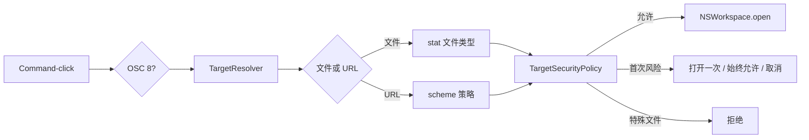
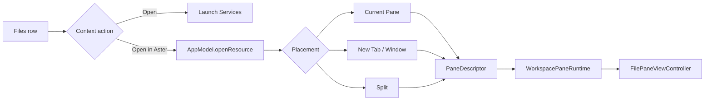

# 文件、链接与 File Pane 领域

## 业务背景

终端输出同时包含本地路径、普通 URL 和程序通过 OSC 8 标注的显式链接。它们均属于不可信输入：Aster 必须先解析、规范化和授权，再交给系统应用，不能沿用终端组件直接调用 `NSWorkspace.open` 的默认路径。

## 领域概念

- **DetectedTarget**：已规范化的文件或 URL，不包含打开动作。
- **TargetResolver**：解析绝对、`~/`、相对、`path:line[:column]`、`file:` 和其它 URL。
- **LinkSchemePolicy**：普通文字采用“全部”或“标准 + 自定义”检测；OSC 8 始终可识别。
- **TargetSecurityPolicy**：标准 URL/普通文件放行；非标准 scheme 和可执行文件确认；特殊文件拒绝。
- **Security Exception**：仅记住用户在本机确认的单个非标准 scheme。
- **WorkspaceResourcePlacement**：资源进入 Current Pane / New Tab / New Window / 四向 Split 的统一落点。
- **FileDocumentSession**：由 `WorkspacePaneRuntime` 持有的 UTF-8 文档缓冲、dirty/read-only/error 状态。
- **FilePresentationKind**：Markdown、reStructuredText、HTML、SVG、图片、PDF、富文档、diff、Agent transcript、源码和二进制。
- **WorkspaceFileActionService**：Files 菜单创建、重命名和移入废纸篓的唯一写入边界。

## 核心规则

1. 原始目标最多 4096 UTF-8 字节且不能含控制字符。
2. 相对路径只以活动 Pane 最近一次可靠 OSC 7 CWD 为基准。
3. `file:` URL 转为文件目标，不能绕过文件类型检查。
4. OSC 8 不受自动检测白名单限制，但仍需打开授权。
5. FIFO、socket、设备和未知文件类型不得打开或预读。
6. 可执行文件与 `.app` 每次都确认；scheme 例外小写去重，配置导入会剥离授权。
7. 普通 Files 打开使用 `view`，因此恢复为 `.preview` 且默认只读；显式新建文件使用 `edit`，恢复为 `.editor` 且默认可编辑。
8. 文件名拒绝空值、`.`、`..`、路径分隔符、控制字符和超过 255 UTF-8 字节的值；创建不覆盖同名项。
9. Rename 只在同一父目录内移动，并同步所有已打开文件及目录后代 Pane；删除只调用系统 Trash。
10. Source/Preview、锁定、语言、Soft Wrap 与缩放属于运行态，不改变既有 `.editor` / `.preview` 快照格式。

## 业务流程

### Files 到 File Pane

Files 的右键菜单保持固定结构：`Open`、`Open in Aster` 子菜单、创建/重命名/废纸篓、路径复制和 Finder。树展开仍由 chevron 或双击负责，不混入资源动作。`Copy Relative Path` 以当前 Files 根目录按 path components 计算，不用字符串前缀，也不添加 `./`。

File Pane 的顶部工具栏负责 Source/Preview、锁定、Send to Chat、Share、保存状态、保存和关闭。Markdown 由固定版本 `swift-markdown` 解析 GFM 后在禁用 JavaScript、禁用网络的 `WKWebView` 中展示；HTML/SVG 使用同一沙箱。源码只读时由 HighlighterSwift/highlight.js 着色，可编辑时保持原生 `NSTextView` 输入语义。图片使用可缩放 `NSScrollView`，PDF 使用 PDFKit，Office/媒体/字体交给 Quick Look，二进制使用 `NSTableView` 按可见行生成有界 hex。可信 Agent transcript 只复用已发现历史的解析结果，并提供 Resume/Fork；任意 JSONL 不会自行升级为会话。

Pane 每秒比较 `contentModificationDate`。没有本地改动时自动重载；存在 dirty 内容时显示 `Modified on Disk`，由用户从菜单明确 Reload 后才丢弃内存内容。保存继续使用 `DocumentBuffer` 原子替换，读取只接受普通、非符号链接文件，编辑缓冲上限仍为 10 MiB；超大或二进制预览只读取有界前缀。

## 关键实现与失败语义

`AsterTerminalView` 在点击发生时读取当前终端单元格的 OSC 8 payload，以精确区分显式链接和同值普通文字；`InlineURLDetector` 补充 SwiftTerm 固定 scheme 列表之外的 `scheme://`。自定义 URL 跨物理行时，会在可见区内按占满右边界的连续行重建，最多 8 行和 4096 字节；超出边界时拒绝截断打开。远端主机 OSC 7 不会成为本机相对路径基准。`TerminalTargetOpenCoordinator` 负责终端目标；Files 的系统 Open 在再次 stat 后沿用同一特殊文件拒绝与可执行确认规则。Aster 内部打开统一进入 `AppModel.openResource`，SSH 远端文件仍不在本功能范围。

解析失败、用户取消或系统无对应应用均返回失败且不写例外。特殊文件直接拒绝。测试位于 `FileDocumentTests.swift`、`WorkspaceFileActionServiceTests.swift`、`FilePaneViewControllerTests.swift`、`WorkspaceDetailsPanelTests.swift`、`DetectedTargetTests.swift`、`AppKitMigrationTests.swift` 和 `WorkspaceBehaviorTests.swift`。
