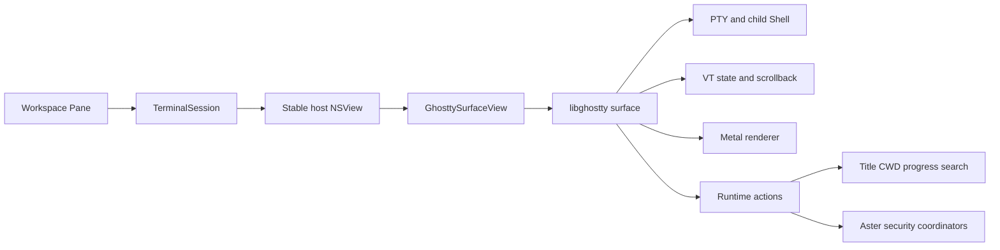
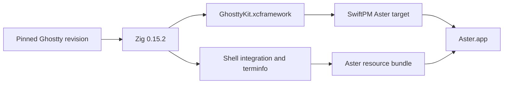

# Ghostty 终端引擎

## 业务背景

Aster 原有 SwiftTerm 适配器同时承担 PTY 输出调度、VT parser、网格状态和 AppKit 绘制。
高频 alternate-screen TUI 会把这些层的时序问题放大为残影、旧 spinner 和光标偏位。
产品终端现切换到 Ghostty，让同一内核拥有 PTY、VT state、scrollback 与 Metal renderer；
Aster 只保留工作区、会话、安全授权和产品交互。

## 领域概念

- **GhosttyApp**：进程级 libghostty application，持有全局配置和 runtime callbacks。
- **GhosttySurfaceView**：一个 Pane 的 `NSView`、Ghostty surface 与本地 Shell。
- **GhosttyConfiguration**：把 Aster 外观和控制设置投影为 Ghostty 配置文本的唯一 seam。
- **TerminalSession**：产品会话边界；工作区只依赖它，不直接接触 C interface。
- **Generated artifacts**：固定 revision 生成的 XCFramework、shell integration 与 terminfo，均不提交 Git。
- **Legacy adapter**：SwiftTerm 代码仅供迁移期精细回归测试，产品 `makeTerminalHost` 不会创建它。

## 核心规则

1. 每个 `TerminalSession` 最多持有一个 Ghostty surface；视图重排、分屏和 PiP 只移动稳定 host。
2. `ghostty.h` 是 internal、未版本化接口；revision 与 Zig 版本必须固定，升级必须做 ABI 审查。
3. 所有 libghostty C 调用都收敛在 `Sources/Aster/Ghostty/`，工作区不得依赖 C 类型。
4. callback 中的 C 字符串必须同步复制；跨线程 UI 变更必须回到 MainActor。
5. surface config 使用的目录、环境和字符串指针必须保留到 surface 销毁。
6. 配置只读取 Aster 的设置，不继承用户独立 Ghostty 配置，避免外部 keybind 或 shell 设置改变产品语义。
7. OSC 52 始终经过 Aster 的 allow/ask/deny 协调器；拒绝时不得读取或写入系统剪贴板。
8. 关闭和重启必须幂等；旧 surface 的迟到 callback 不得改变新进程代次。
9. Surface 创建失败必须进入 `startFailed` 并显示稳定错误，不能静默回退到另一终端内核。
10. Aster 扩展必须通过显式 ABI version gate；升级 revision 时缺少任一符号都必须构建失败。

## 业务流程

构建流程：

## 关键实现

### 依赖与资源

`scripts/setup-ghostty.sh` 从 revision
`4dcb09ada0c0909717d92547623b26eafa50ca8a` 生成 native macOS 静态
`Vendor/GhosttyKit.xcframework`，并复制 `shell-integration`、themes 与 terminfo 到
`Sources/Aster/Ghostty/Resources`。脚本先在临时目录构建和校验，再替换明确目标；stamp
匹配时直接复用。`scripts/build-app.sh` 自动执行 setup，并把 Aster resource bundle 放到
已签名 App 的标准 `Contents/Resources` 目录。

运行时禁止直接访问 SwiftPM 为 executable target 生成的 `Bundle.module`。该访问器只检查
App 根目录和构建机绝对 `.build` 路径，DMG 安装到新电脑后会因找不到后者而 `fatalError`。
`PackagedResourceBundle` 显式优先标准资源目录，并兼容命令行构建和 `.xctest` 布局；资源缺失
只返回领域错误。HighlighterSwift 3.1.0 因存在同类问题固定在 `Vendor/HighlighterSwift`，其
Aster 补丁面记录在 `UPSTREAM.md`。

### 配置所有权

`GhosttyConfiguration` 映射字体、字号、行高、主题颜色、光标、选择、scrollback、Option
键、鼠标、右键、剪贴板和 Shell integration。`GhosttyApp` 从权限为 `0600` 的临时文件加载
配置，完成解析后立即删除文件。任何诊断都视为启动失败，避免拼错配置被静默忽略。
libghostty 没有公开 config 所有权契约，因此已经交给 core 的 config 保留到进程结束。

### Surface 与输入

`GhosttySurfaceView` 在尺寸有效后创建 surface，并保持 working directory、环境变量和 C
字符串存活。Backing scale、pixel size、display ID、窗口焦点和 Pane 焦点随 AppKit 生命周期
更新。键盘与 IME 经 `ghostty_surface_key` / `ghostty_surface_preedit`，鼠标与滚动经 surface
API；普通粘贴经 `ghostty_surface_text`，由 Ghostty 根据前台程序状态写入 PTY。

### 回调与会话状态

`GhosttyCallbacks` 先复制临时 payload，再把 render、PWD、退出、进度、只读、安全输入、
通知和 URL 动作投递到 MainActor。Aster 扩展另外提供原始 PTY read/write 与任意 OSC 的
非消费 observer；OSC barrier 保证同一序列之前的原始输出先进入 Autocomplete，再处理
OSC 133/6974。Wakeup 合并为最多一个待执行 tick，避免输出风暴形成无界主队列任务。
Pinned renderer patch 保留 `window-vsync=true`，但把无自定义 shader 的 display link 改为
按需运行：`updateFrame` 置位并启动，display callback 消费最新帧，下一轮没有新请求就停止；
持续输出在相邻刷新间重新置位，因此仍按屏幕刷新率合并，不退化为无 vsync 的即时绘制。
空闲轮只投递独立的 `vsync_stop` async；`draw_now` completion 返回并重新 armed 后才调用
`CVDisplayLinkStop`，且停止前重查请求位。不能从 `drawNowCallback` 直接停止：display link
callback 正在同步通知同一个 completion 时会形成互等，随后窗口失焦的 focus 消息会把主线程
也拖进死锁，表现为 Dock 再激活无响应。

### Aster extension ABI v1

固定补丁在 Ghostty internal C interface 之外提供：

- 原始 PTY read/write callback，以及支持 BEL、ESC ST、C1 ST 和 64 KiB 上限的任意数字 OSC observer。observer 的流式扫描在 ground 与 payload 状态都跟踪 UTF-8 多字节序列，0x9C/0x9D 处于续字节位置时不会被误判为 C1 终止符（否则 OSC 0 标题里的 "✳"（E2 9C B3）会被截成 U+FFFD）；
- OSC 发生位置的稳定 page anchor、绝对 retained-screen 坐标和 scrollback 裁剪后的重新解析；
- buffer geometry、固定宽度 cell row、selection get/set/clear 和绝对 row 滚动；
- literal/regex、大小写、前后方向的完整搜索，以及精确总数、选中序号和 match range；
- 无活动 display link 时保留 surface、仅关闭 vsync 的嵌入式降级。
- focused 静态 surface 的按需 display link；光标、输入、PTY 输出和 resize 请求下一帧，
  自定义 shader 动画继续使用连续 display link。

Swift adapter 基于这些接口恢复 inline Autocomplete、OSC 6974 Agent 状态、OSC 133 精确
Outline、Vi/Mark 模式和可见 URL/路径 Hint。重复的 OSC 133 仅在 payload 与稳定 cell 锚点
完全相同时幂等化。Ghostty 自身仍负责 OSC 8 点击；Aster Hint 暂不枚举 OSC 8 的隐藏 URI。
依赖旧 SwiftTerm 私有输入状态的特殊 Paste As 动作仍保持禁用。

## 失败语义

- 缺少 Zig 0.15.2、Metal Toolchain、header、terminfo 或 shell integration：setup 失败且不替换旧产物。
- Ghostty 初始化、配置或 surface 创建失败：Session 进入 `startFailed`，记录不含路径和环境的诊断。
- Shell 自然退出：保留最后一帧并进入 ended；用户只能显式重启新 surface。
- Clipboard 请求拒绝：以空结果完成 request，不访问系统剪贴板。
- raw byte 输入包含 NUL：明确返回失败，避免 C 字符串截断后报告假成功。
- 非法正则：返回 `pattern_valid=false`，不降级成普通文本查找。
- stable anchor 所在 page 已被 scrollback 裁剪：解析失败，Outline 明确标为不可跳转。

## 测试与验收

- `swift test --no-parallel`：完整领域、AppKit 与旧适配器回归。
- `terminalHostUsesGhosttySurface`：产品 host 必须包含 Ghostty 视图、配置可初始化，且不含 `AsterTerminalView`。
- `ghosttyExtensionCapabilitiesWorkOnRealSurface`：真实 surface 直接核对 PTY read/write、任意 OSC observer 与
  Ghostty 原 action 并存、稳定 anchor、Autocomplete、前后向搜索 flags、selection、Vi/Mark/Hint、
  OSC 6974、Outline 与跳转。
- `swift build -c release`：验证 binary target、Swift/C bridge 和 linker。
- `./scripts/build-app.sh` 会从最终 App 执行 `--verify-packaged-resources`，真实加载 Ghostty 与
  Highlighter bundle；随后运行 `codesign --verify --deep --strict dist/Aster.app`。
- `./scripts/build-dmg.sh` 会对只读挂载卷内的 App 再执行严格签名和无窗口资源自检。发布验收
  应使用独立 scratch 构建并在自检前移走 scratch，确保构建机绝对路径无法掩盖资源缺失。
- 真机验收普通 Shell、中文 IME、持续输出、全屏 TUI、分屏/PiP、复制粘贴、查找、退出与重启。
