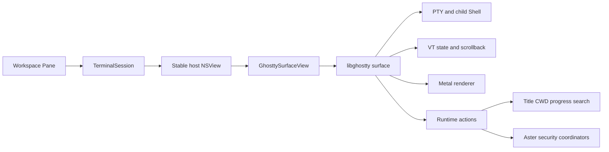
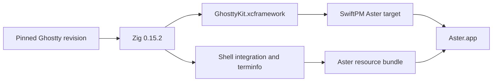

# Ghostty 终端引擎

## 业务背景

Aster 原有 SwiftTerm 适配器同时承担 PTY 输出调度、VT parser、网格状态和 AppKit 绘制。
高频 alternate-screen TUI 会把这些层的时序问题放大为残影、旧 spinner 和光标偏位。
产品终端现切换到 Ghostty，让同一内核拥有 PTY、VT state、scrollback 与 Metal renderer；
Aster 只保留工作区、会话、安全授权和产品交互。

## 领域概念

- **GhosttyApp**：进程级 libghostty application，持有全局配置和 runtime callbacks。
- **GhosttySurfaceView**：一个 Pane 的 `NSView`、Ghostty surface 与本地 Shell。
- **GhosttyConfiguration**：把 Aster 外观和控制设置投影为 Ghostty 配置文本的唯一 seam。
- **TerminalSession**：产品会话边界；工作区只依赖它，不直接接触 C interface。
- **Generated artifacts**：固定 revision 生成的 XCFramework、shell integration 与 terminfo，均不提交 Git。
- **Legacy adapter**：SwiftTerm 代码仅供迁移期精细回归测试，产品 `makeTerminalHost` 不会创建它。

## 核心规则

1. 每个 `TerminalSession` 最多持有一个 Ghostty surface；视图重排、分屏和 PiP 只移动稳定 host。
2. `ghostty.h` 是 internal、未版本化接口；revision 与 Zig 版本必须固定，升级必须做 ABI 审查。
3. 所有 libghostty C 调用都收敛在 `Sources/Aster/Ghostty/`，工作区不得依赖 C 类型。
4. callback 中的 C 字符串必须同步复制；跨线程 UI 变更必须回到 MainActor。
5. surface config 使用的目录、环境和字符串指针必须保留到 surface 销毁。
6. 配置只读取 Aster 的设置，不继承用户独立 Ghostty 配置，避免外部 keybind 或 shell 设置改变产品语义。
7. OSC 52 始终经过 Aster 的 allow/ask/deny 协调器；拒绝时不得读取或写入系统剪贴板。
8. 关闭和重启必须幂等；旧 surface 的迟到 callback 不得改变新进程代次。
9. Surface 创建失败必须进入 `startFailed` 并显示稳定错误，不能静默回退到另一终端内核。
10. 只有 libghostty 公开接口可稳定表达的能力才能对产品宣称支持。

## 业务流程

构建流程：

## 关键实现

### 依赖与资源

`scripts/setup-ghostty.sh` 从 revision
`4dcb09ada0c0909717d92547623b26eafa50ca8a` 生成 native macOS 静态
`Vendor/GhosttyKit.xcframework`，并复制 `shell-integration`、themes 与 terminfo 到
`Sources/Aster/Ghostty/Resources`。脚本先在临时目录构建和校验，再替换明确目标；stamp
匹配时直接复用。`scripts/build-app.sh` 自动执行 setup 并把 Aster resource bundle 放进 app。

### 配置所有权

`GhosttyConfiguration` 映射字体、字号、行高、主题颜色、光标、选择、scrollback、Option
键、鼠标、右键、剪贴板和 Shell integration。`GhosttyApp` 从权限为 `0600` 的临时文件加载
配置，完成解析后立即删除文件。任何诊断都视为启动失败，避免拼错配置被静默忽略。
libghostty 没有公开 config 所有权契约，因此已经交给 core 的 config 保留到进程结束。

### Surface 与输入

`GhosttySurfaceView` 在尺寸有效后创建 surface，并保持 working directory、环境变量和 C
字符串存活。Backing scale、pixel size、display ID、窗口焦点和 Pane 焦点随 AppKit 生命周期
更新。键盘与 IME 经 `ghostty_surface_key` / `ghostty_surface_preedit`，鼠标与滚动经 surface
API；普通粘贴经 `ghostty_surface_text`，由 Ghostty 根据前台程序状态写入 PTY。

### 回调与会话状态

`GhosttyCallbacks` 先复制临时 payload，再把 render、标题、PWD、退出、命令完成、进度、
搜索、只读、安全输入、通知和 URL 动作投递到 MainActor。Wakeup 合并为最多一个待执行
tick，避免输出风暴形成无界主队列任务。`TerminalSession` 再把这些事件投影到标题、目录、
生命周期、徽章和通知领域状态。

### 当前能力边界

Ghostty 公开 C interface 不提供原始 PTY 输出观察器，也不暴露 Aster 旧适配器使用的绝对
缓冲行、任意 OSC observer 或完整搜索 flags。因此当前产品明确暂停：

- Aster Vi / Mark / Hint Mode 与键盘扩展选区；
- 区分大小写和正则终端查找；普通文本查找仍由 Ghostty 提供；
- 依赖原始输入/输出字节的 Aster inline Autocomplete；
- OSC 6974 Agent lifecycle、旧 OSC 133 命令正文/绝对行 Outline 的精确观察；
- 依赖 SwiftTerm 私有状态的特殊 Paste As 动作。

前台 PID、Ghostty command-finished action、标题、PWD、进度、通知、搜索计数、选择读取、
完整文本读取、只读、复制、粘贴和 prompt 跳转继续可用。前台命令状态在缺少权威事件时按
foreground PID 与 Shell PID 的差异保守推断。

## 失败语义

- 缺少 Zig 0.15.2、Metal Toolchain、header、terminfo 或 shell integration：setup 失败且不替换旧产物。
- Ghostty 初始化、配置或 surface 创建失败：Session 进入 `startFailed`，记录不含路径和环境的诊断。
- Shell 自然退出：保留最后一帧并进入 ended；用户只能显式重启新 surface。
- Clipboard 请求拒绝：以空结果完成 request，不访问系统剪贴板。
- raw byte 输入包含 NUL：明确返回失败，避免 C 字符串截断后报告假成功。
- 正则或区分大小写查找：返回不可用，不降级成语义不同的普通查找。

## 测试与验收

- `swift test --no-parallel`：完整领域、AppKit 与旧适配器回归。
- `terminalHostUsesGhosttySurface`：产品 host 必须包含 Ghostty 视图、配置可初始化，且不含 `AsterTerminalView`。
- `swift build -c release`：验证 binary target、Swift/C bridge 和 linker。
- `./scripts/build-app.sh` 后运行 `codesign --verify --deep --strict dist/Aster.app`。
- 检查 app 内 Aster resource bundle 包含 `ghostty/shell-integration` 与 `terminfo/78/xterm-ghostty`。
- 真机验收普通 Shell、中文 IME、持续输出、全屏 TUI、分屏/PiP、复制粘贴、查找、退出与重启。
