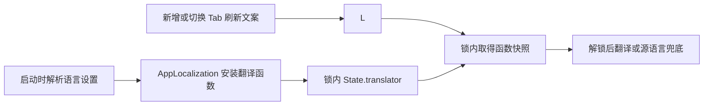

# 界面翻译与交互性能

## 调用边界

`L()` 是界面文案入口，支持 `String.LocalizationValue` 插值。`AsterCore` 不依赖
AppKit 或翻译资源；应用启动时由 `AppLocalization` 解析语言设置并安装对应资源表的
翻译函数。未安装函数时使用源语言兜底，CLI 和 MCP 无须加载应用资源。

## 性能不变量

- 翻译函数的读取不得累积包装调用，单次翻译成本不能随历史调用次数增长。
- 锁只保护函数快照的读取与替换，实际翻译在锁外执行。
- 使用具名 `State` 包装函数字段，避免以闭包类型直接作为 `OSAllocatedUnfairLock`
  的泛型状态。当前 Swift 工具链对后者的 `inout` 读取会产生 reabstraction 写回，
  每次读取叠加包装层；Local 新增或切换 Tab 的文案刷新会放大这一累积成本。

## 回归依据

2026-09-14 在 0.6.1 的运行进程中连续切换 Local Tab，控制接口切换后等待主队列
响应耗时约 587–1,592 ms（包含固定 20 ms 等待）。采样显示大量主线程时间位于
`String.LocalizationValue` 翻译闭包的重复包装栈。

`localizationLookupKeepsCallbackStackBounded` 通过实际 `L()` 入口重复翻译 256 次，
检查回调栈深度保持有界，不依赖容易受机器负载干扰的耗时阈值。修复前该测试的栈深
从 22 增长到 532；修复后通过。既有测试继续覆盖翻译表、插值、缺失 key 与语言切换。

同一 AppKit 宿主使用英文翻译预热 20,000 次后，在 Local 工作区分别新增和切换
3 次标签（每次包含固定 20 ms 等待并完成布局）：

| 操作 | 修复前 | 修复后 |
| --- | --- | --- |
| 新增 Tab | 198–269 ms | 65–75 ms |
| 切换 Tab | 259–287 ms | 31–34 ms |

以上是同机调试构建的对照测量，不代表所有终端负载或设备的响应上限。临时耗时探针
已移除；常驻回归使用栈深度断言，避免在常规测试中引入时间敏感阈值。

定向验证：`./scripts/test.sh --no-parallel --filter 'localization|Language|Localizes|Translates'`。

## 打包应用的连续切换验证

安装版 0.6.1 冷启动后，经控制接口连续切换真实 Local 标签，前 10 次平均约
224 ms，到第 90 次平均约 1,222 ms，之后连接断开且进程退出。
同日提供的另一份崩溃报告为主线程 `ShareKit` / `objc_autoreleaseReturnValue`
上的 `SIGABRT`；该报告本身没有翻译栈，不能仅凭它认定直接崩溃点就是翻译函数。

修复后的 release 构建通过签名和随包资源校验，在至少两个 Local 标签之间实际
切换 500 次：平均约 32 ms，最大约 41 ms，未再退出。每次计时包含固定 25 ms
等待后发出的主队列 ping。这里验证的是重复切换路径；不据此宣称其它闪退均已解决。

## 本轮检查范围与剩余结果

- 翻译相关 11 项测试通过；release 构建、签名验证、随包资源检查通过。
- 全量串行清单共 1,679 项，27 项因特殊界面或远端环境条件跳过。首轮有 9 项失败，
  其中 5 项要求 `SessionRuntime/zig-out/bin/aster-session`；补齐产物后均已定向通过。
- 仍有 4 项未通过：`errorCodesUseSnakeCase`、`titleStormDoesNotRebuildWorkspace`、
  `usageBarAppearsOnEveryAgentPaneAndUpdatesInPlace`、`commandLifecycleDoesNotRebuildWorkspace`。
  前 3 项在恢复本次修复前源码后同样失败；最后一项在全量及修复版定向测试中失败，
  在两次修复前对照中通过，属于尚未确认原因的视图重建问题。本次没有修改这些链路，
  不把全量测试标为全部通过。
- Swift 格式检查有 4 处原有的 `L` 命名和行长问题；对照修复前文件，没有新增告警。
