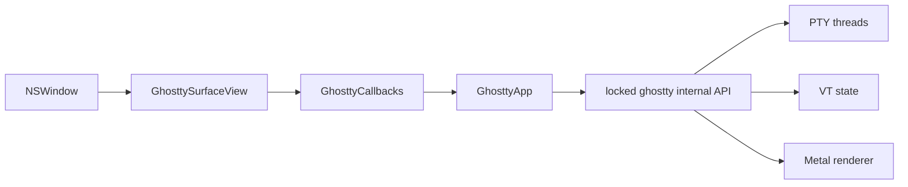

# libghostty 单 Pane PoC

## 目的

这个 vertical slice 回答一个边界明确的问题：不改 Aster 现有 `TerminalSession` 和
Pane 体系时，Ghostty 能否以纯 AppKit `NSView` 在同一进程内完整接管 PTY、VT state、
输入编码和 Metal renderer。

PoC 是独立 SwiftPM executable，主包不依赖 `GhosttyKit`：



## 构建与运行

```bash
./scripts/setup-ghostty-poc.sh
swift build --package-path Prototypes/GhosttyPane
swift run --package-path Prototypes/GhosttyPane AsterGhosttyPane
```

非交互 smoke test：

```bash
swift run --package-path Prototypes/GhosttyPane AsterGhosttyPane --command /usr/bin/true
```

setup 从 `ghostty-org/ghostty` 的固定 revision
`4dcb09ada0c0909717d92547623b26eafa50ca8a` 构建 native macOS XCFramework，flags 为：

```text
-Doptimize=ReleaseFast
-Demit-xcframework=true
-Dxcframework-target=native
-Demit-macos-app=false
```

XCFramework、revision stamp、terminfo、themes 与 shell integration 都是 gitignored
生成物。资源与二进制来自同一 checkout，避免 ABI 和 terminfo 不配套。

## 已实现边界

- `GhosttyApp`：初始化 process-wide app/config，解析用户 Ghostty config，定位 bundle
  resources，并用合并 wakeup 驱动 `ghostty_app_tick`。
- `GhosttyCallbacks`：复制临时 C 字符串后回到主队列；处理 render、title、CWD、
  child-exit 和 clipboard callback。
- `GhosttySurfaceView`：创建/释放唯一 surface，向 libghostty 传递 working directory，
  同步 Retina scale、pixel size、display ID、appearance 与 focus。
- 输入：键盘 press/repeat/release、左右 modifier、IME preedit/commit、鼠标三键、拖选、
  hover position 与 precision scroll。
- 生命周期：`destroySurface()` 幂等；子进程退出与 window close 即使同时发生，也只释放
  C surface 一次。
- Accessibility：PoC 暴露 text-area role/label，验证视图可进入 AppKit accessibility tree；
  terminal text、selection 和 cursor 的完整 AX provider 仍属于迁移项。

## 未进入产品的能力

PoC 不接管 Aster 主应用，也不把 `GhosttySurfaceView` 伪装成
`LocalProcessTerminalView`。以下语义尚未映射，任何生产切换前都必须完成：

- `TerminalSession` 的启动、进程组退休、恢复和 Pane 所有权；
- OSC 133、Agent OSC 6974、title/CWD/bell/notification 状态；
- Read-only、粘贴/OSC 52 授权和安全链接策略；
- Autocomplete、Vi/Hint、Mark、矩形选区与 command navigation；
- 搜索、完整 accessibility、图片协议及 release `.app` 签名/资源验收。

## 决策门槛

PoC 通过不代表应立即替换。进入 `TerminalSession` adapter 前至少记录：

1. `yes`、64 MiB 输出、编译日志和真实 TUI 下的主线程 p95 latency、RSS 与 frame time；
2. resize、Retina、IME、选区、滚动、关闭和快速退出的人工验收；
3. 所有 Aster OSC/授权 seam 能否通过 callback 或受控 parser observer 实现；
4. Release app 中 XCFramework、Metal、terminfo 与 shell integration 的签名和资源完整性；
5. 升级到另一 Ghostty revision 时，对 `ghostty.h` 及 Swift bridge 的 ABI diff。

任何必须 fork Ghostty parser/renderer 大片源码，或无法保持 `TerminalSession` 单一所有权的
情况，均应停止在 PoC，不进入产品迁移。

## 本分支验证记录

2026-08-11 在 Apple Silicon/macOS 26、Zig 0.15.2 环境完成：

- `ASTER_GHOSTTY_FORCE_REBUILD=1 ./scripts/setup-ghostty-poc.sh`：从锁定 SHA
  重新获取源码并生成通过 header/terminfo probe 的工件；
- `swift build -c release --package-path Prototypes/GhosttyPane`：通过；Release
  resource bundle 保留 `ghostty/`、同级 `terminfo/` 和 third-party notices；
- `AsterGhosttyPane --command /usr/bin/true`：surface 创建、快速退出 callback、
  幂等释放与应用退出均通过，退出码 0；
- `AsterGhosttyPane --command "/bin/sh -lc 'yes | head -c 67108864'"`：64 MiB
  连续输出在 20.20 秒完成，退出码 0，无 crash、死锁或尾部退出挂起；
- 主仓库 `swift test --no-parallel` 与 `swift build -c release`：通过。

上述压力 smoke 只证明完整链路能排空并退出，未采集输入/Panel p95 latency、RSS 或
Metal frame time，不能据此宣称 Ghostty 已解决用户感知卡顿。下一阶段应使用真实 Aster
窗口和 Instruments 对照采样。
