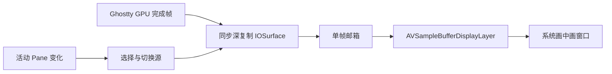

# 系统画中画

## 背景与范围

画中画用于在其他应用或 Space 中观察终端任务。Aster 使用 AVKit 的系统画中画窗口，
以 Ghostty 已完成的 GPU 帧作为实时视频源；原终端仍可输入，保持原有网格和滚动状态。
当前支持终端 Pane。非终端 Pane 没有 Ghostty 帧源，明确提示不可用。

## 规则

- 当前 Pane 模式绑定 Pane UUID，切换标签或聚焦其他 Pane 不改变镜像对象。
- 跟随活动 Pane 模式仅跟随发起画中画的工作区；切换源先停止旧源并清空旧帧。
- 开关画中画不移动 `NSView`、不创建或重启 PTY、不修改工作区布局；缩放浮窗由 AVKit
  按源宽高比完成，不向终端发送尺寸变化。
- 系统暂停按钮只冻结镜像。关闭、启动失败、源消失都会停止帧复制与定时读取。
- 再次选择同一模式会关闭；切换模式等待旧系统浮窗关闭后再启动。
- 系统恢复按钮激活源工作区与 Pane。源不存在时不猜测另一会话。

## 可交互小窗

系统画中画是视频层，系统拒绝它成为键盘窗口，所以镜像永远不能输入。设置项
`pictureInPicture.style`（`mirror` 默认 / `interactive`）让用户改用可交互小窗；未知值按镜像处理。
只有「当前 Pane」模式会走小窗，「跟随活动 Pane」始终走镜像：在小窗里输入时「活动 Pane」
没有稳定语义。两种呈现方式都实现 `PictureInPicturePresenting`，AppDelegate 只持有这个接口，
「再次选择即关闭」「等旧的关闭后再启动」两条路径共用。

- 一个 Ghostty surface 只能挂在一个 `NSView` 上，小窗不是第二份画面，而是把终端 Host 借走。
  因此上面「不移动 `NSView`、不改网格」的规则只对镜像成立；小窗期间网格跟随小窗尺寸，
  PTY、会话与 Pane 身份不变。
- 展示所有权只有一个真值：`AppModel.floatingPaneID`，只由 `PaneFloatingTerminalController`
  写入。`show()` 必须先登记再搬 Host；`WorkspaceViewController.makeTerminalPane` 在
  `makeTerminalHost` 之前看到它就改画占位。顺序反了，工作区下一轮重建的
  `host.removeFromSuperview()` 会把正在输入的终端抢回去。
- 关闭时清空 `floatingPaneID`，工作区重建自然把 Host 挂回原 Pane；控制器不直接操作工作区视图树。
- 焦点状态跟小窗走：工作区的 `updateWindowActivationOverlay` 与 `updatePaneActivationOverlays`
  都跳过该 Pane，由小窗的 key 状态驱动 `setWindowActive`，Pane 始终按活动处理，光标不会停闪。
- 面板配方与 Quick Terminal 相同：`.nonactivatingPanel`、`level = .floating`、
  `[.canJoinAllSpaces, .fullScreenAuxiliary]`、`canBecomeKey == true`。不激活 Aster 也能输入。
- 小窗是键盘窗口时，`⌘W` / `⌥⌘W` 由 AppDelegate 改成收回小窗，不能落到工作区的活动 Pane 上。
- 源 Pane 被关闭、Shell 退出收尾、标签移到别的窗口或源窗口关闭，都按正常生命周期收起小窗，
  不弹错误，也不换成别的 Pane。`stop()` 不会把 Host 摘出视图树，`close()` 统一清空容器；
  surface 的释放仍走 `destroySurface()`（见 Ghostty 终端引擎核心规则 11）。
- 位置与尺寸存在 `aster.picture-in-picture.floating-frame.v1`，读取时夹回仍存在的屏幕。

## 数据流

## 实现与边界

`PanePictureInPictureController` 负责身份、固定/跟随订阅、启动超时和 AVKit 生命周期；
`PictureInPicturePlayback` 负责实时、静音的视频播放语义。
`GhosttyPictureInPictureFrames` 是渲染线程与主线程之间的有锁单帧邮箱，最多 15 fps、
1600 万像素，只保留最新帧；关闭递增 generation，丢弃在途结果。

`PictureInPictureSourceWindow` 用完全透明且不接收事件的独立窗口承载视频层。不能直接
把视频层放在原终端上：AVKit 会在源图层显示“正在画中画播放”占位。
macOS 26 起的 sample-buffer PiP 存在 1:1 镜像裁剪及空覆盖层问题（本机 26.6.2 与 27.0 都已复现，适配按 `majorVersion >= 26` 生效；27.0 上该黑底占位层偏移覆盖了镜像的上半部分，只露出底部一条终端画面；
参见 [Apple Developer Forums 的复现与变通方案](https://developer.apple.com/forums/thread/821582)）。
承载窗口跟随本进程 `PIPPanel` 内容尺寸，暂时隐藏其无内容的
`AVPictureInPictureCALayerHostView`，关闭时恢复；保留 12pt 视频内边距，防止圆角裁掉文字。
系统私有类名只在该兼容适配器内用于识别，未加载私有框架；找不到系统窗口时采用公开的
`didTransitionToRenderSize` 回调作为几何回退。实时帧设置 `DisplayImmediately`，避免系统
播放时钟与源图层时钟不同导致延迟或丢帧。

Pinned Ghostty patch 提供两个可选 Objective-C host selector：
`asterWantsPictureInPictureFrame` 预留采样时隙，
`asterDidRenderPictureInPictureFrame:` 在 GPU 完成且 swap-chain 槽尚未释放时同步调用。
宿主必须在返回前复制像素，不能把可复用的 IOSurface 直接交给异步 AVKit 播放。
独显使用 managed texture，采样帧在完成回调前通过 blit 同步 CPU 副本；未采样的帧没有
此项开销。保持源 BGRA 像素与 Display P3 色彩信息，不读取其他应用的屏幕内容。

这两个 selector 是 pinned renderer 的宿主扩展，不修改既有 C ABI struct。
没有实现 selector 的宿主保持原行为。借用的 host 生命周期与 embedded userdata 一致：
surface 释放时等待所有 GPU completion 结束，回调不得访问 AppKit 或同步等待主线程。

## 验证

- `PanePictureInPictureTests`：固定/跟随源身份、关闭后不复活、真实 GPU 帧、原视图与网格保留。
- `PaneFloatingTerminalTests`：Host 借出与归还、工作区重建不抢回、源 Pane 关闭时收起、设置回退与位置夹紧。
- `GhosttyPictureInPictureFramesTests`：深复制、源重用、限帧、停用与非法格式。
- 系统浮窗需在有桌面会话的 Mac 显式运行：
  `ASTER_TEST_SYSTEM_PIP=1 ./scripts/test.sh --no-parallel --filter pictureInPictureSystemWindowStartsAndStops`。
  该用例启动并关闭真实 AVKit PiP；常规全量测试跳过此项，避免干扰桌面。
- 如需观察窗口，可额外设置 `ASTER_PIP_VISUAL_QA_SECONDS=30`，最多保留 60 秒。
