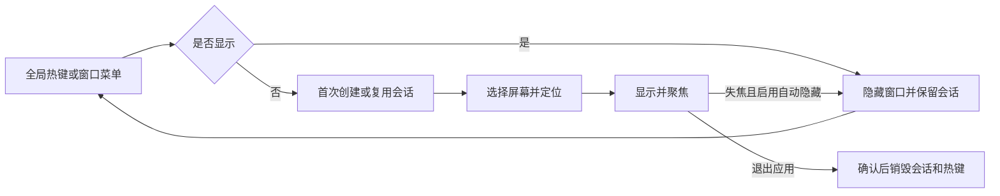

# Quick Terminal

## 背景与概念

提供 Ghostty 风格的随用随收终端：应用运行期间通过全局热键或窗口菜单呼出，
隐藏保留 Shell、工作目录和滚屏内容。普通工作区与 Quick Terminal 各自拥有会话。

`QuickTerminalController` 拥有唯一 NSPanel 与 TerminalSession；`QuickTerminalHotKey`
封装 Carbon 注册和释放。终端仍通过现有 Ghostty 适配器创建，沿用安全剪贴板、Shell
集成、主题和进程管理，不读取独立 Ghostty 应用的配置文件。

## 规则

- 默认不占用全局快捷键；通用设置可选择 Control + ` 或 Control + Option + Space。
- 注册冲突显示错误，窗口菜单始终保留；热键不需要辅助功能或输入监控权限。
- 首次展示才创建终端，初始目录来自最近活动工作区；之后保持自己的目录和进程。
- 默认顶部、50%、边距 12 点、当前键盘屏幕、失焦隐藏、跟随桌面空间；支持五种位置和三种屏幕策略。
- 尺寸使用屏幕可见区域的百分比，范围 10–100；顶部/底部调整高度，左右调整宽度，居中调整两轴。
- 边距范围 0–200 点，只内缩「不贴边的那两侧」：顶部/底部显示时左右留白而贴边那一侧完全贴住
  可见区域边缘，左右显示时上下留白，居中显示四周都留。上界按屏幕短边的三分之一夹紧，
  越界或非有限的导入值不会把窗口挤空。
- 窗口可手动拖拽边缘改宽高，下限 320×160；拖拽结束的尺寸写入
  `aster.quick-terminal.manual-size.v1` 并优先于百分比，隐藏后重开与重启都保持。
- 手动尺寸只在布局设置未变时沿用：`aster.quick-terminal.layout-signature.v1` 记录
  位置、尺寸百分比与边距的指纹，用户在设置里改动任一项即丢弃手动尺寸回到百分比基准。
  签名为空表示首次读取（含重启后第一次），此时保留记忆。
- 位置只由设置决定，窗口不能被拖动移动（`isMovable` 与 `isMovableByWindowBackground`
  都为 false）；只记尺寸不记位置，避免窗口被拖出屏幕或与位置设置冲突。
- 终端内容与窗口边缘之间有 20 点内边距（`QuickTerminalController.contentInset`）：host 装在
  一层容器视图里按 autoresizing 内缩，容器与窗口背景跟随终端背景色。刻意不改全局的
  `window-padding-*`，那会连带改变所有工作区 Pane 的留白。
- 面板使用 `.titled + .resizable + .fullSizeContentView + .nonactivatingPanel` 并隐藏标题
  文字与红绿灯。不能用 `.borderless`：borderless 窗口没有边缘拖拽区域，加 `.resizable` 也
  调不了大小。
- 隐藏、关闭窗口及 Command + W 均只收起窗口；Escape 继续交给终端程序。
- 动画采用淡入淡出，时长 0–1 秒，系统“减弱动态效果”开启时无动画。
- 动画完成回调校验代次，快速重开不会被旧隐藏回调关闭。
- 自然退出保留最后画面，窗口菜单提供显式重启；运行中不能重启。
- 应用退出先确认，再统一终止会话；不提供 Quick Terminal 跨应用重启的会话恢复。

## 流程

## 配置与验证

`quickTerminal.*` 字段通过现有 SettingsWebBridge 白名单与兼容配置持久化，沿用导入导出。
数值范围、枚举选项在桥层校验，窗口布局额外处理非有限值与越界导入值。
新增文件均位于已有 Aster target，不改变 Core、Ghostty ABI 或持久化快照结构。

`./scripts/test.sh --filter quickTerminal` 验证负坐标屏幕布局、边界值、边距语义、手动尺寸
的夹紧与失效规则、不可移动、失焦策略、会话身份、快速显隐与幂等清理；全量验证使用
`./scripts/test.sh --no-parallel`。
多显示器、独立全屏 Space、第三方快捷键冲突需要在对应桌面环境中人工验收。

参考：[Ghostty Quick Terminal 配置](https://ghostty.org/docs/config/reference#quick-terminal-position)。

### 边距与手动尺寸验证记录（2026-09-18）

- `./scripts/test.sh --no-parallel --filter quickTerminal` 6 个用例全部通过。
- Debug 构建真机验收（1800×1169、Dock 在底部、可见区域 1038 点高）：顶部显示、尺寸 20%、
  边距 12 时窗口为 `X=12 Y=39 W=1776 H=208`，上沿贴住菜单栏下沿，左右各留 12 点。
- 拖拽窗口底边把高度从 208 改到 477，`aster.quick-terminal.manual-size.v1` 落盘为
  `1776×477`；收起再呼出尺寸不变，位置仍为设定的顶部。
- 拖拽窗口内部（标题栏区域）300 点，窗口位置不变，确认不可移动。
- 加上 20 点内容内边距后重新呼出截图核对：提示符不再贴窗口左上角，内边距区域与终端
  背景同色，没有露出系统窗口色的边。

### 本次验证记录（2026-09-05）

- Debug 构建、Swift 格式检查、设置 JavaScript 语法检查、差异空白检查通过。
- 专项检查覆盖真实 Shell 环境变量在隐藏后保留、热键注册冲突/释放、菜单关闭不误关工作区标签，以及设置持久化。
- 全量非并行运行记录了 701 个通过用例，Agent 生命周期、设置 WebKit 宿主、设置窗口样式、标题栏颜色比较共 4 个用例失败；日志在标签整理菜单测试处结束，没有全量完成汇总，因此不能认定全量通过。这些失败未在本功能中修改。
- 未替换 `/Applications/Aster.app`，未执行发布、公证或远端操作；多显示器和独立全屏 Space 尚未人工验证。
