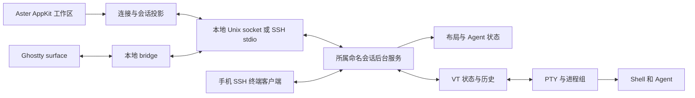

# 远程工作模式设计草案

状态：P0、P1、P2、P3、P4、P5 已通过。跨平台原型与协议基线（A01–A03）、持久后台会话（A04–A07）、本地受管终端与旧数据迁移（A08、A09）、SSH 连接与远端安装闭环（A10–A12）、命名会话与多机器共享工作区（A13–A15）验收完成，远端 Agent 状态与通知（A16）在真实 Grok Build 上验收完成，P6–P8 未开始。远端运行证据只覆盖 OrbStack Linux x86_64。实现、验证与未完成项以阶段表及证据记录为准；未提交、未发布。

执行顺序、任务与交付物见 [分阶段实施](remote-work-stages.md)，测试步骤与通过标准见 [验收规格](remote-work-acceptance.md)。实现者必须同时遵循三份文档。本文定义功能与架构真值，阶段文档只分配任务，验收文档只定义证据。

## 1. 目标与对齐边界

实现“工作在所在机器上运行，客户端从所在位置连接”：Aster macOS App 保留 AppKit/Ghostty 界面；每台执行机器运行独立的 Aster 后台会话服务；Shell、Agent、项目代码及凭据留在执行机器；客户端分离后进程继续运行。

以 Herdr 0.9.0 下列官方文档的远程工作语义为对齐基线，不复制其商标、UI 外观、内部协议或版本编号：

- H1：[工作方式](https://herdr.dev/zh-cn/docs/how-to-work/)。
- H2：[连接机器](https://herdr.dev/zh-cn/docs/connecting-machines/)。
- H3：[持久化与远程访问](https://herdr.dev/zh-cn/docs/persistence-remote/)。
- H4：[会话状态与恢复](https://herdr.dev/zh-cn/docs/session-state/)。
- H5：[智能体](https://herdr.dev/zh-cn/docs/agents/)，仅引用跨机器状态、检测权威和原生会话恢复规则。

下表全部属于交付范围。“最终验收阶段”表示最晚完成阶段，不表示该阶段之前可以忽略其设计约束。

| ID | 必须交付的行为 | 基线 | 最终验收阶段 |
| --- | --- | --- | --- |
| R01 | 本地后台会话、分离及重连，App 退出后受管进程存活 | H1/H4 | P2 |
| R02 | 本地 App 通过 SSH 操作远端后台会话 | H1/H3 | P3 |
| R03 | SSH shell 内运行完整终端客户端；手机/平板 SSH 客户端可浏览工作区、切换窗格、输入及分离 | H1 | P7 |
| R04 | 默认和命名会话，列出、创建、附加、停止、删除 | H3 | P4 |
| R05 | 同窗 Local 与多台机器；添加、重命名、禁用、启用、移除；每个配置绑定一个远端会话 | H2 | P4 |
| R06 | 独立连接、退避重连、健康检查、Attention 状态；本地立即可用，不抢焦点 | H2 | P4 |
| R07 | 工作区、标签、分屏、目录在服务端共享；焦点属于客户端；仅感兴趣画面传输，后台元数据继续更新 | H2/H4 | P4 |
| R08 | 跨机器 Agent 状态、等待输入、完成未读、导航和去重通知 | H2/H5 | P5 |
| R09 | SSH 配置别名、URI、自定义端口、代理跳转和 ssh-agent；凭据不进入机器配置 | H2/H3 | P3 |
| R10 | 平台探测、兼容二进制发现、显式安装、运行中服务器能力协商与无破坏连接 | H2/H3 | P3 |
| R11 | 普通分离、冷重启布局恢复、可选屏幕历史、Agent 原生恢复分别建模和展示 | H4 | P6 |
| R12 | 单终端附加、只读观察、可写控制、单写者与显式接管 | H3 | P2/P7 |
| R13 | 本地主题与快捷键、远端配置/自定义命令执行边界、可选服务端快捷键 | H2/H3 | P7 |
| R14 | 本地图片剪贴板上传远端临时文件，成功后粘贴远端路径 | H1/H3 | P7 |
| R15 | 兼容客户端更新保留旧服务；显式服务替换；实验性进程实时交接 | H3/H4 | P8 |
| R16 | macOS 桌面客户端；Linux/macOS x86_64/arm64 服务和终端客户端 | H2/H3 | P8 |
| R17 | GUI 与 CLI 具有相同操作及权限语义；自动化始终显式定位机器和会话 | H2/H3 | P7 |

Windows 客户端/服务器、Web 仪表盘、独立手机 App 不在本次范围。Herdr 的插件市场、全部 Agent 品牌清单、自动化编排产品功能不作为远程模式复制目标；把 Aster 已支持的 Agent、命令和扩展能力接入远端。

远端文件编辑、Git 面板、代码同步、目录挂载和端口转发属于独立功能，不以“完整远程模式”隐含实现。通过终端在远端运行 Git 和编辑器。远端 File Pane 与本机文件操作保持明确禁用，显示原因；后续单独定义远端文件服务再开放。

## 2. 已核实的起点

- `SSHHostResolutionService.swift` 使用 OpenSSH 配置解析；`TerminalSession.sshRemoteEndpoint` 仅为运行态投影，未保存远端终端身份。
- `AsterCore/WorkspaceLayout.swift` 的 `PaneDescriptor` 保存目录和资源；`WorkspacePersistence.swift` 保存本地布局。
- `TerminalSession.stop` 销毁 Ghostty surface。当前退出链路不能直接复用为远端结束操作。
- `Ghostty/GhosttySurfaceView.swift` 创建拥有子进程的 surface；PTY observer 是观察接口，不视为可直接注入外部 PTY 的接口。
- `Vendor/Ghostty/README.md` 锁定 revision `4dcb09ada0c0909717d92547623b26eafa50ca8a`、Zig 0.15.2 和 Aster 扩展 ABI v1。跨平台 headless 使用尚未验证，必须完成 P0。
- `ssh -o BatchMode=yes -o ConnectTimeout=8 root@ubuntu@orb` 已登录 Ubuntu 26.04 LTS x86_64、root。Git/Python 3 可用；当次 PATH 检查未找到 herdr、tmux、screen、swift、zig、cargo。实施前重新探测，不把该快照作为永久配置。

## 3. 固定架构决策

### 3.1 运行时与目录

实现 Aster 自有 `aster-session` 可执行文件。使用 Zig 构建 headless 服务、PTY 托管、SSH stdio 桥接及终端客户端；复用仓库锁定的 Ghostty VT 核心解析终端状态。把所有 Ghostty 内部 API 调用隔离在一个适配层，并沿用 vendor revision、补丁和 provenance 管理。Herdr、tmux、screen 均不是运行依赖。

新增顶层 `SessionRuntime/`，仅承载 Linux/macOS 可独立构建的 Zig 运行时、测试和协议实现；它不依赖 SwiftPM 应用、AppKit、Metal 或 Sparkle。新增 `Sources/Aster/Remote/`，只承载 App 侧机器配置、连接编排和会话投影。协议 schema、版本及测试样例放在 `SessionRuntime/protocol/`，Swift 和 Zig 实现用同一份样例验收。新增目录是跨平台构建边界所必需，不搬迁无关业务代码。

在 `AsterCore` 增加纯值类型和状态转换；继续使用既有 `AsterCLI` 产品和控制入口。`aster-cli` 转发会话操作，不复制服务端领域逻辑。资源界面仍由 AppKit 负责，终端显示仍由 Ghostty 负责。

### 3.2 进程与显示

后台服务持有 PTY master、进程组、终端状态和布局。连接断开只回收连接资源，服务进程与 PTY 不依附 SSH 会话。每个命名会话运行独立后台服务，故障及停止操作限定在该会话。

Ghostty surface 启动本地 `aster-session bridge` 子进程；bridge 使用 raw 模式，把规范化终端画面输出到本地 PTY，并把键盘、鼠标和尺寸传回服务。控制协议通过独立通道传输，不混入可见终端内容。关闭 surface 只结束 bridge。以此接入当前 Ghostty 进程模型，不假定存在尚未实现的外部 PTY 注入 API。

终端池持有每个 PTY/VT 的唯一所有权，不以客户端引用计数决定是否销毁。公开创建适配层先解析
执行路径并合并执行机器的环境，再传入独立 argv/envp；启动失败不占槽位。默认限制为 32 个记录、
单屏 262144 单元及 4096 列，超限返回资源错误，不分配超大 VT。终端池的启动等待须通过待启动
状态或异步编排接入主循环，不能阻塞其他客户端。强制清理先终止所拥有的进程并关闭 PTY master，
再等待回收，避免输出排空与 waitpid 互相等待；完整进程树处理继续按 P1.2 验证。

服务端 VT 是屏幕、模式和历史真值。重连先发送完整渲染快照，再发送带序号增量；bridge 不向新 surface 重放任意截断的原始字节尾部。快照包括主/备用屏幕、光标、颜色、宽字符、超链接、输入模式及受支持图形状态。终端查询由服务端 VT 统一应答，避免本地 Ghostty 再次应答造成重复输入。P0 必须验证此边界。

### 3.3 数据归属

| 对象 | 权威位置 | 规则 |
| --- | --- | --- |
| 机器配置 | 客户端配置目录 | 保存 UUID、标签、原始 SSH target、明确命名会话及 enabled；不保存密码、密钥、临时 socket |
| 服务身份 | 服务状态目录 | 持久 `serverID`，每次启动生成 `serverEpoch`；握手返回实际 sessionID |
| 工作区/标签/窗格/远端 cwd | 所属会话服务 | 全部通过服务端事务更新；本地快照只缓存远端引用 |
| 终端实例 | 所属会话服务 | `terminalID` 与进程生命周期绑定；冷恢复新进程产生新实例 ID |
| 窗格身份 | 所属会话服务 | `paneID` 跨布局恢复稳定，不能用它证明原进程仍活着 |
| 焦点/活动机器/可见订阅/主题 | 客户端 | 客户端互不抢选中项；主题默认本地配置 |
| Agent 状态及原生引用 | 执行机器 | 只接收所属终端的有效上报，不读取本机同路径作为远端数据 |
| 代码、工具、凭据、扩展 | 执行机器 | SSH 连接不复制这些内容；缺失时明确报错 |

跨机器引用使用 `(machineProfileID, serverID, sessionID, paneID/terminalID)`；服务端并发及事件校验额外携带 epoch。hostname、端口、显示名、PID 都不能单独用作资源身份。两个 OrbStack 目标解析到同一地址仍保持两个配置；两配置连接同一服务时按真实服务身份共享资源并去重事件，保留各自配置。

旧工作区未含机器引用时解码为现有本地模式。P2 添加“托管到后台”显式迁移入口：只能迁移布局和创建新终端，不声称可以收养旧 PTY。旧进程保留到用户自行关闭；迁移失败回滚配置，不结束旧进程。完成 P8 后全新终端默认托管，升级用户保留原有终端直至迁移。

## 4. 生命周期和交互合同

### 4.1 连接与机器管理

连接状态使用 `disconnected / connecting / online / reconnecting / attention / disabled`；终端另有 `running / exited / unavailable`，不能把终端退出表示成整机离线。

1. 启动立即展示 Local 和持久化布局，后台独立连接 enabled 机器。
2. 添加机器依次执行输入解析、SSH 验证、平台/二进制探测、服务握手与命名会话启动。需要安装或停止不兼容服务时展示目标、版本和进程影响，由交互式设置流程执行。成功后原子保存配置；取消或失败不保存。
3. 接受 SSH alias、`user@host`、`ssh://user@host:port` 和 OrbStack 的 `root@ubuntu@orb`。通过 OpenSSH argv 与配置解析，不自行按第一个 `@` 拆分。目标不得解释为 Shell 片段或 SSH 选项。
4. 使用 OpenSSH 的密钥、代理、known_hosts、ProxyJump 及用户保活配置。后台连接使用非交互认证，不代答主机密钥或口令；需要交互时进入 attention 并给出精确设置入口。
5. 连接超时默认 10 秒，握手 5 秒；退避 1/2/4/8/16/30 秒并加 ±20% 抖动。在线无应用层流量 15 秒发心跳，连续 3 次未响应转重连。有效业务响应可刷新活性。所有值集中定义并测试。
6. 重连先检查 serverID/epoch、快照及控制权，再启用输入。清空旧代输入，不缓存断线期间的键入；输入结果未知时返回 `delivery_unknown`，不自动重放。
7. 重命名只改标签。禁用、移除即使离线也可操作；只断开该配置，不停止服务。当前配置被禁用/移除时回 Local；Local 故障时保留其错误态，不自动跳到别的远端。
8. 配置文件无效时保留最后有效配置及现存连接，显示可恢复错误；完整校验成功后一次性应用。删除文件与内容损坏分别处理，禁止把解析失败当作空配置。

Local 在首次使用时自动启动或附加本地默认服务。已保存远端机器的后台连接只连接现存兼容服务；服务不存在、需要安装或替换时进入 attention，不后台重启服务。用户主动打开远端设置入口后才能启动缺失的目标服务。

SSH 配置管理默认使用私有临时配置：先包含用户配置，再补充未设置的保活选项；每次连接使用私有 control socket，结束时只回收本次资源。提供 `manage_ssh_config=false`，直接使用用户 OpenSSH 配置。提供 `ASTER_REMOTE_BINARY` 指定本地自定义服务产物，安装前同样检查平台、协议与摘要；受管发布要求签名，自定义构建明确标为开发产物并由显式设置流程接受。相关开关属于客户端连接设置，不进入凭据存储。

### 4.2 工作区与控制权

服务端维护工作区→标签→递归分屏→终端。新标签和分屏继承所选机器、会话及远端 cwd。远端目录须在执行机器校验；不存在时返回可定位错误，由用户选择新目录，不回落到本机目录。

共享结构中的节点只承载受管终端。现有本地文件、编辑器、预览和 Web Pane 仍由客户端管理；迁移混合布局时保存本地视图关联，向服务端提交受管终端子树，不上传本地文件内容或资源路径。其他客户端只显示共享终端布局，不打开来源客户端的本地资源。远端工作区禁用本地文件类 Pane 创建入口并显示原因。

每个客户端维护自己的焦点和订阅集合。可见终端传输画面；隐藏机器仅传结构、Agent 状态和通知。服务端持续排空所有 PTY，即使没有画面订阅也不阻塞任务。隐藏后取消画面订阅，重新可见时发完整快照；尺寸只由持有写租约的可见控制器更新。

每个终端同一时刻一个写租约，租约绑定 clientID、connectionGeneration 和 leaseEpoch；旧代输入及 resize 返回 `lease_lost`。只读观察不取得租约。只读 `terminal.observe` 必须返回精确 UInt64 `currentLeaseEpoch`，初始空闲为 0，释放或过期后保留最后代数；观察不返回写 token、不申请或续租。客户端使用该观察值发起接管，冲突后重新观察。显式接管必须提交 `expectedLeaseEpoch`，原子比较观察到的代数并更换租约，通知旧写者；空闲时使用初始 0 或最后代数，同一旧代数的并发接管只允许一个成功，失败返回 `lease_lost`。普通申请遇到占用返回 `lease_busy`。租约无活性 15 秒失效，重新附加不得复用失效 token。

| 操作 | 必须产生的结果 |
| --- | --- |
| 分离、断网、退出 App/终端客户端 | 释放本客户端租约和订阅；进程及服务端布局保留 |
| 关闭受管终端 Pane/标签 | 关闭该资源，结束其远端进程；运行任务按现有关闭确认策略展示影响 |
| 临时不显示某远端工作区 | 分离该工作区视图，保留服务端资源；使用“分离”名称，不能复用“关闭” |
| 禁用/移除机器 | 仅断开配置；远端所有资源保留 |
| 停止命名会话 | 结束该会话所有进程，保留布局快照 |
| 删除命名会话 | 必须已停止；删除该会话状态，活动会话返回 `session_running` |
| Shell 正常退出 | 保留结束状态和 exit code，不无条件创建替代远端进程 |

断线时保留灰显结构和最后状态，显示更新时间；可查看缓存信息，但不能以它发送输入、操作窗格或宣称任务已完成。重连不改变当前活动机器和焦点。

## 5. 协议、资源上限与安全

使用同一 Unix socket 服务协议连接本地客户端和 SSH stdio 桥。控制帧采用有长度前缀的版本化 JSON，终端画面采用同一信封的二进制分块载荷；stdout 只承载协议，诊断写 stderr。握手包含协议主次版本、serverID、epoch、sessionID、平台及能力集合。主版本不兼容拒绝；次版本与发行版本不同不等于不兼容。

必需能力为 `session_snapshot`、`terminal_control`、`surface_interest`、`health_check`；历史、上传、Agent 恢复及 handoff 单独协商，缺少可选能力仅禁用对应动作。

固定协议族：`hello`、`health.check`、`session.*`、`workspace.*`、`tab.*`、`pane.*`、`terminal.create/attach/observe/control/release/terminate`、`surface.subscribe/unsubscribe/snapshot`、`agent.list/report/explain`、`upload.*`、`server.prepare/replace/handoff`。P0 把每个操作的字段、错误和能力写入 schema；阶段新增操作必须先补 schema 与互操作样例。

当前实例的停止使用 session 范围的 `server.stop` 和 `server_lifecycle` 能力，必须匹配
serverID、serverEpoch、sessionID；不得用 PID 代替控制请求。回复 stopping 只表示接受，客户端还须
确认原连接结束与锁释放，或验证替代 epoch 已接管。停止仅针对原实例，禁止向替代实例重发。
服务进入 stopping 后拒绝新操作，最多尝试 250ms 排空已生成回复，再关闭连接与监听器并释放锁。

请求携带 requestID、clientID、目标资源及预期 revision；修改布局使用乐观并发，冲突返回 `revision_conflict`。事件携带服务 epoch 与当前连接可见事件流内连续递增的 sequence；定向事件不消耗其他连接的序号，新连接重置事件游标并重新同步快照；序号缺口重新获取快照，不能把有缺口缓存标为最新。创建/结束/布局修改必须携带固定 `createdAtUnixMs`（UInt64 毫秒时间戳），重试保留原始时间与 requestID；服务拒绝未来时间，从该时间起计算 24 小时有效窗口。固定集合为 `session.create/stop/delete`、`workspace.create/update/close`、`tab.create/update/close`、`pane.split/update/close`、`terminal.create/terminate`；其他请求不携带此字段。这些操作在服务端持久化幂等结果，保留 24 小时、最多 10000 项；超出有效重试窗口返回 `request_expired`，调用方先查询实际资源再决定动作。输入按连接内序号去重，不承诺断线后的 exactly-once。

创建事务先落盘意图和预分配 terminalID，再启动进程并提交结果；崩溃恢复检查未决记录，结果不能确定时返回 `outcome_unknown`，禁止自动重复启动。服务冷重启后幂等查询返回旧操作及其终端已失效状态，不能把原成功响应解释成当前进程仍在运行。

单控制帧上限 1 MiB，画面块 256 KiB、单快照总量 32 MiB；单客户端待发送队列 8 MiB。慢消费者丢弃旧画面并标记需快照，控制/生命周期事件不得静默丢失，无法保留时断开并要求重新同步。单终端内存历史默认 16 MiB，会话总量 256 MiB；超过总量淘汰最旧历史，不停止 PTY 读取。图形缓存和落盘历史计入独立显式配额，测试配额耗尽路径。

服务目录权限 0700，socket 和状态文件 0600，拒绝不安全属主和符号链接；状态文件必须为普通文件，socket 路径只接受 Unix socket。服务端校验 peer UID，SSH 端只连接该用户的 socket；不建立公开 TCP 监听，不转发客户端 macOS IPC token。远端自然拥有该 SSH 用户的权限，不宣称 root 用户内存在额外隔离。

服务启动先持有状态目录 FD 和 server.lock 的非阻塞独占锁；锁文件不得删除重建。服务在
启动线程之前进入该目录，再绑定相对 control.sock。只有当前 UID 的陈旧 socket 且非阻塞
连接明确被拒绝时才能恢复路径；活动监听器、普通文件和符号链接必须保留并报错。关闭时
按 dev/inode 校验，只删除本实例的 socket，然后释放锁。PTY 的 cwd 由创建请求独立传入，
不得通过改变服务 cwd 切换终端目录。这些基础模块已接入测试，完整后台启动及 ready
报告仍按 P1.1 完成后才开放。
持久服务身份存入私有 identity.bin：固定版本、长度和摘要均须校验。首次提交按
identity.pending → 文件同步 → 原子 rename → 目录同步执行，持锁期间串行处理；已提交身份
损坏时停止启动并保留原文件，不以新 UUID 冒充同一服务。serverEpoch 只在当前实例内生成。
服务状态目录 FD 必须支持 fsync，不能在 Linux 使用仅用于路径定位的 O_PATH FD 提交元数据。

启动结果使用独立父子管道，只有完整 ready 报告并关闭写端才返回成功；已有服务和初始化失败
分别报告，截断及超时不得改写为 ready。超时后先查询服务真实身份与状态，不盲目重启或杀进程。

终端输出视为不可信数据：远端 OSC 不得直接写本地剪贴板、打开本机文件、执行本机命令或触发下载；保留文本/图形显示能力，通过显式本地 UI 动作处理有副作用功能。记录与诊断不写输入正文、密钥、原始命令参数或上传内容；导出诊断执行现有脱敏规则。

## 6. Agent、配置与桌面桥接

Agent CLI 在执行机器发现、安装与运行；远端提供可用性和版本，界面区分“未安装”和“未连接”。把 Aster 已支持的 provider 接入服务端状态源。一个实例只使用一个状态权威：有效完整生命周期 hook 优先；其余使用服务端实时底部屏幕及进程证据。不能用本地 ssh/bridge 进程名当作远端 Agent，也不能用用户滚动后的画面判断等待状态。

Agent 事件携带服务/终端实例、provider、会话引用、语义状态、来源和序号。聚合优先级为等待输入、运行中、完成未读、空闲；完成未读直到查看或显式标记已读。断线状态保持 stale，不能推导完成。跨配置同源事件以 serverID、epoch、eventID 去重。未支持的 CLI 作为普通终端运行，不伪造高级状态。

主题、字体、缩放和快捷键默认使用当前客户端；配置重载不重启服务。远端自定义命令/扩展在远端执行，本地配置和机密不自动上传。提供显式 `--remote-keybindings server` 模式；覆盖范围是终端客户端可表达的键绑定，App 的窗口级系统快捷键仍由本地控制。按键冲突在设置中显示实际生效绑定。

图片粘贴只由本地用户粘贴动作触发：读取本地剪贴板→有界上传→校验摘要与原子完成→向当前拥有租约的终端粘贴转义后的远端文件路径。禁止自动回车。默认单图 20 MiB、临时文件总量 200 MiB、保留 24 小时；取消/失败不粘贴、不留半文件。会话切换、租约丢失或终端变化时停止投递。远端服务生成随机文件名与私有目录，拒绝客户端指定任意写入路径。手机 SSH 内运行的客户端仅使用终端文本粘贴，不声称可读取 Mac 剪贴板。

## 7. 恢复与更新

| 场景 | 进程 | 布局/画面 | 行为 |
| --- | --- | --- | --- |
| 客户端分离后附加 | 同一进程继续 | 服务端实时状态 | 直接附加，不运行恢复命令 |
| 服务冷重启 | 原进程不保留 | 布局恢复；磁盘历史仅在开启时恢复 | 新 shell 或符合条件的 Agent 原生恢复，标明新实例 |
| 兼容客户端更新 | 旧服务继续 | 不变 | 不替换或停止服务 |
| 显式普通服务替换 | 旧进程结束 | 按冷恢复处理 | 先列出影响并确认，之后停止及替换 |
| 显式 handoff | 成功时原进程保留 | 状态与 PTY 转移 | 仅支持已协商能力的版本，失败不自动降级成停止 |

磁盘屏幕历史默认关闭。开启后按会话记录有界历史、配置来源及时间，遵循录制隐身/排除策略，提供清除入口；回放屏幕显示“历史”，不得作为当前任务运行证据。

Agent 原生恢复默认开启，仅接收有效集成上报且属于本机/会话/provider 的原生引用；按 provider 的已验证恢复 argv 启动。缺失、重复、失效或不支持引用回到明确的新 shell 状态，并显示原因。启动前必须获得客户端尺寸/主题上下文；一次恢复覆盖该会话全部符合条件的窗格，不依赖逐个聚焦。任意服务器/测试命令不自动重跑。

受管安装保存版本化二进制，以原子切换选择下次启动版本，保留可回退旧版本；运行中服务使用自己的二进制实例。发现路径顺序为 PATH、Aster 私有安装目录、已知包管理器目录；每个候选都执行协议探测。安装使用发布清单中的平台、版本、摘要及签名验证；不匹配平台的本地二进制不得复制到远端。后台连接仅探测和连接，安装、替换和 handoff 进入显式设置/更新事务。

handoff 使用同用户私有 Unix socket 传递 PTY FD、子进程标识、VT 状态、布局、Agent 元数据及持久幂等记录；新服务完成验证并确认接管后旧服务才释放所有权。在接管确认前失败回退旧服务继续工作，禁止双重读取 PTY、重复输入或停止旧进程。连接、订阅、在途请求和写租约全部失效并重建；持久幂等记录允许安全查询重试。进程组存活、退出状态回收与父子关系必须用实测证明，不能只验证文件描述符存在。仅 Aster 受管安装开放 handoff，外部包管理安装显示能力不可用。

## 8. 完成定义

P0–P8 均通过，R01–R17 均有可复查证据，才标记“远程工作模式完整对齐”。阶段交付只标记对应阶段。实验性 handoff 必须交付开关、能力探测、成功路径及失败回退测试，不能以“实验性”为由留空。

各阶段更新对应开发者文档及 `docs/user/help.md`；帮助文档只描述已实现行为。保留本草案的实际状态、测试日期、平台、commit 和未完成项。提交、合并、发布与实现验收分开记录，本文不授予发布或影响既有用户会话的授权。
