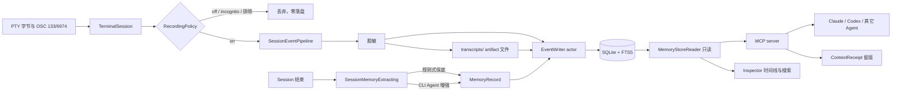

# Session Memory 与 Context 领域

## 业务背景

Aster 的终端里跑着 Claude Code、Codex 等 Coding Agent。这些 Agent 读了哪些文件、试过哪些方案、
为什么失败、最终为什么选当前实现，过去只存在于一次性的 PTY 字符流里，任务结束即消失；换一个
Agent 更是从零开始解释。

本领域把终端活动转成可长期复用的工程记忆：

```text
Terminal Activity → Session Events → Task → Memory → Context Engine → 任意 Agent
```

核心价值不是「记录更多」，而是**在正确的时间把正确的历史交给正确的 Agent**，且 Agent 可替换、
项目记忆不丢失。记录层是终端的旁路增强：它可以失败，终端不可以。

## 领域概念

- **RecordedEvent**：一条工程语义事件（命令、完成、输出摘录、Agent 状态、git 快照、工具调用、
  文件读写）。与 `ShellCommandTimeline` 严格区分——后者是屏幕坐标上的无正文标记，只服务 Outline。
- **RecordedSessionDescriptor**：一次终端会话的可持久化描述，不含 PID、FD 与运行对象。
- **RecordingPolicy / RecordingMode**：`off | on | incognito` 三态，加排除目录与排除命令。
  判定发生在事件产生的源头，被排除的内容**从不落盘**，而不是落盘后再删。
  内置**排除基线**（`RecordingPolicy.baselineExcluded*`：`~/.ssh` 等高敏目录与 `op`/`vault`
  等秘密管理 CLI）在 `AppPreferences.mergedRecordingPolicy` 装配时并入，用户列表只能追加、
  不能移除基线 —— 与 Incognito「只能收紧」同一哲学。偏好键里只存用户自己的项。
- **ArtifactRef**：命令输出正文的文件指针。正文落在 `transcripts/` 目录，主库只存 ≤4KiB 摘录供 FTS。
- **ProjectIdentity**：Memory 的隔离边界，按 git toplevel 解析，无仓库时回落工作目录。
- **TaskDescriptor**：跨 Agent、跨 Session 的工作单元。
- **MemoryRecord**：提炼产物，带 `type / status / importance / confidence / extractor`。
  `status = disabled` 表示用户主动屏蔽，对检索完全不可见。
- **MemorySourceRef**：Memory 到 session / event / task / commit 的回链，保证任何结论都能回到现场。
- **ContextReceipt**：一次「把 Memory 交给 Agent」的留痕，是 Agent 可观测性的组成部分。
- **SessionMemoryExtracting**：提炼抽象。规则式实现为永久保底，CLI Agent 实现为增强。

## 核心规则

1. **Raw Event 优先**：事件先落库，再谈提炼。提炼失败、超时或未授权都不影响已记录的事实
   （PRD §76）。
2. **终端优先**：记录层的任何故障都被吞掉并计数，绝不回流到终端。主线程只做字节拷贝与入队，
   解析、脱敏与 IO 全在后台；`TerminalSession` 创建路径零新增同步 IO。
3. **源头拦截**：`off` 与 `incognito` 都零落盘；排除目录与排除命令在事件产生处判定，
   命令被排除时其输出一并排除。
4. **写入前脱敏**：命令、输出摘录、artifact 正文与 transcript 补录路径统一经 `AgentContextRedactor`，
   与 Send to Chat 共用同一套 secret 规则。
5. **单写者**：进程内只有一个 `EventWriter` actor 持写连接（WAL + busy_timeout）。
   MCP server 以只读连接查询；唯一例外是 `context_receipts`，由 `ContextReceiptWriter` 用
   短生命周期连接单表写入，失败静默。
6. **通道隔离**：Session Memory 与 `DiagnosticsCenter` 是两个独立存储与两套隐私策略。
   诊断通道刻意剔除 path/command/content 类字段，绝不可把该策略套用到本领域，反之亦然。
7. **不记录 prompt**：Agent lifecycle hook 与 transcript 补录都只上报状态、工具名与可判定路径，
   不记录 prompt 正文、工具参数全文或 Agent 输出正文。
8. **可见与可删**：用户能看到记录状态、能进入隐身、能删除 session 与 memory；删除必须连带清理
   事件、artifact 文件与派生 Memory，而不只是从列表消失。
9. **外发需授权**：CLI Agent 提炼会把会话摘要发给对应 Agent 的云端，默认关闭，
   需显式开启且确认过外发提示，内容可预览（PRD §73）。

## 业务流程



## 关键实现

### 分层与 target

```text
AsterCore    值类型与纯函数：事件模型、隐私策略、规则式提炼、项目路径还原
AsterMemory  SQLite/FTS5 与文件布局：Location / Database / Schema / EventWriter / Reader
Aster        接线与服务：SessionRecordingService、提炼服务、安装服务、Inspector UI
AsterMemoryMCP  独立 stdio JSON-RPC server，只读开库
```

`AsterCore` 不 import SQLite3，保持纯值可测；SQL 编解码集中在 `AsterMemory`。

### 存储布局

```text
~/Library/Application Support/Aster/Memory/     0700
├── memory.sqlite (+ -wal/-shm)                 0600
└── transcripts/<session-uuid>/<seq>.txt        0600
```

数据库 schema 由 `PRAGMA user_version` 管理，迁移只做增量 DDL；已发布版本的迁移分支不得修改。
MCP server 打开时以同一常量握手，不匹配则返回结构化错误而非崩溃。

### 事件源接线

`TerminalSession` 是唯一的事件来源边界，通过窄协议 `TerminalEventRecording` 转发，
不为记录层做额外解析：

- `handleShellIntegrationEvent` 的 `.commandStart` / `.commandFinished`：命令文本、CWD、退出码。
  命令文本来自用户输入重建（best-effort，粘贴与 TUI 内命令可能不准），
  `.commandFinished` 分支必须在把 `submittedCommand` 置 nil **之前**上报。
- `onPTYRead`：原始字节的并列消费者（与 Autocomplete 并存），只做拷贝转发。
  输出正文由记录层自持的 `ShellCommandOutputCapture` 从 OSC 133 C…D 区间抽取，128KiB/命令封顶。
- `handleAgentTerminalDirective`：OSC 6974 的 provider 与 agent session 关联。
- `handleGhosttyProcessExit`：session 结束，触发提炼。

OSC barrier（`TerminalOutputMessageBus.enqueueBarrier`）保证同批字节先于 OSC 事件交付，
这是「输出正文与完成事件正确配对」的前提。

### 清空记录

「清空全部记录」必须走 `EventWriter.purgeAll()`，不能由 UI 直接删文件：连接一旦打开，
`unlink` 只摘掉目录项，writer 仍持有那个 inode 并继续往里写 —— 用户看到「已清空」，
数据其实还在长，要重启进程才干净。`purgeAll` 先丢弃待写队列、释放连接（`deinit` 触发
`sqlite3_close_v2`），再删 `memory.sqlite` / `-wal` / `-shm` 与 `transcripts/`，最后复位
`openFailed` 让下一条事件重新建库。它是 actor 方法，调用方必须 `await`，
**绝不能在主线程用信号量等它**（等同 `waitUntilExit`，会排空主队列造成重入）。

### 检索

FTS5 contentless 虚表 + 触发器同步：`events_fts(command, output_excerpt)` 与
`memories_fts(title, content)`。用户输入经 `ftsQuery(from:)` 转成加引号的前缀 AND 表达式，
避免 `-` / `:` 被当作 FTS 语法。检索结果排除 `status = 'disabled'` 的 Memory。

以下四条借鉴 zero-mem-pi（Zero-Mem 论文的 pi 扩展）的生产教训：

- **弱池门控**：「没有记忆」好过「混乱记忆」。判据是 FTS5 的 idf clamp——超半数文档
  含有的查询词会被 clamp 成 ~1e-6 量级的 rank（稀有词正常在 -3 量级，实测差 6 个数量级），
  池内最优 rank 落在 clamp 区即整池丢弃。**不要改成绝对 bm25 分数门槛**：clamp 行为加上
  前缀查询语义让绝对分数在 FTS5 上不可靠。语料低于 `minimumGatedCorpus` 时豁免
  （微型库里合法词也会超半数触发 clamp）。浏览器 UI 检索关闭门控，用户可看全量自行判断。
- **federation 回落**：项目内零命中时自动放宽到全部项目重查一次，命中标注
  `isCrossProject`，渲染时整体声明「来自其它项目、未必适用」。项目内有任何命中绝不触发。
- **PINNED 固定席位**：`status = 'pinned'` 的 Memory 由 `get_project_context` 无条件全量
  交付、排在最前，不与检索排名竞争（zero-mem 连续五个身份类 live bug 的结论：关键事实
  需要 slot，不能依赖每次都被搜出来）。pinned 与 disabled 互斥；普通检索仍可搜到 pinned。
- **检索质量 eval**：`RetrievalQualityTests` 是确定性 eval（种子事实 + 干扰项 +
  hard-negative 对 + 弱池 + 小库豁免 + federation 语义）。任何改动检索排序、门控或
  FTS 查询构造的提交都必须让它保持绿。

### 保留策略

Raw events 不能无限增长（PRD §23）。`EventWriter.enforceEventRetention`（默认 90 天）
在 session 收尾时裁剪**已结束且超龄** session 的 events 行与 artifact 文件；
sessions 行与 memories **永久保留**——「Raw 可裁，结论长存」与提炼分层一致。
裁剪以 session 为原子单位，artifact 文件删除失败会在下次重试。

混合检索按 **bm25 相关度**排序（FTS5 隐藏列 `rank`），不是时间倒序：高相关但年代久远的
结论不能被新的噪音命令挤出窗口。memory 命中乘以 `memoryRankBoost`（bm25 为负值，系数 >1
即整体前移）——同等相关度下，已提炼的结论比单条历史命令更有价值。两个 FTS 索引的 bm25
不严格同尺度（语料统计不同），该系数是工程近似。相关度相同才回落时间倒序；两类命中合并后
统一截断到 `limit`，不再各取 N 条返回 2N。

### 零命中提示（数据新鲜度）

Agent 查到空结果时必须能区分三种情况：记录没开、项目过滤太窄、真的没发生过。
`MemoryStoreReader.storeStatus()` 一次查询返回三表计数与最后事件时间；MCP 侧在零命中的
`search_memory` / `get_related_history` / `get_recent_commands` 与空项目的
`get_project_context` 结果里附加状态行：库为空时提示「记录可能未开启」，库有数据时给出
计数 + 最后事件时间（写端有批量延迟，这也是「数据截至」的可信标记）。
状态查询失败只是不附加提示，绝不影响主结果。

## 失败语义

- 开库失败：记录层进入「已失败」状态，丢弃后续操作并计数，不重试拖垮队列；终端完全正常。
- 队列洪峰：有界队列满时丢弃新操作并计数——宁可缺记录，不可卡终端。
- 输出洪峰：环形缓冲只保留命令输出尾部（错误信息几乎总在尾部）。
- 提炼失败 / 超时 / 未授权：回落规则式提炼；事件早已落库，不受影响。
- transcript 缺失或格式漂移：静默降级为纯终端事件流，只记一条不含敏感字段的诊断。
- MCP 侧库不存在、版本不匹配、参数非法：返回 `isError` 的可读文本，进程不崩溃；
  留痕（receipt）失败不影响查询结果。
- 删除 session：连带清理事件、artifact 文件与派生 Memory；只删主行是错误实现。

## 测试与验收

- `AsterCoreTests`：策略判定真值表（排除目录的路径段边界、空 CWD 保守拒绝）、规则式提炼、
  redaction、项目路径还原。纯函数是本领域的测试主力。
- `AsterMemoryTests`：批量写入与 FTS 检索性能、迁移幂等、只读与写连接并发、
  MCP 二进制的 JSON-RPC 往返集成测试。
- `AsterTests`：记录服务的策略拦截与隐身、artifact 落盘与配额、安装服务的文件安全。
- 性能门禁：万条事件批量写 < 1s；FTS 查询 < 20ms；10MB 输出经捕获+清理+脱敏 < 2s。
- 发布前：`swift test --no-parallel` → `swift build -c release` → `./scripts/build-app.sh` →
  `codesign --verify --deep --strict dist/Aster.app` → 实机验收（开启记录后键入无感知延迟；
  真实 Claude Code / Codex 经 MCP 查到跨 session 历史）。
