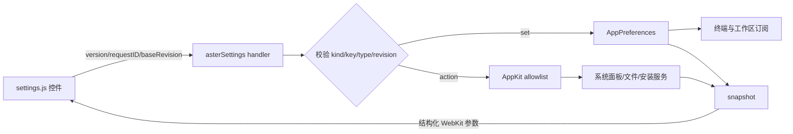

# 网页设置架构

## 背景

Aster 设置页以 Otty 1.3.1 应用包内的 `settings-ui.html` 为功能与视觉基准，并以应用自有 HTML、CSS 和 JavaScript 实现。外观分类逐段对应原页的布局选择、标签页、窗口、主题详情、文本、四级字体来源、光标和 Dock 图标；主题详情同时覆盖语义 token 与 ANSI 16 色。

没有把 Otty 的编译产物原样复制进 App Bundle：该文件直接调用私有的 `window.webkit.messageHandlers.otty`，原样使用会让 Aster 依赖 Otty 的消息协议和安装路径。Aster 保留相同页面结构与交互契约，改由受控的 `asterSettings` bridge 接入自身强类型配置，也不加载远程页面。AppKit 继续拥有窗口、系统面板、文件选择器和所有本机副作用，网页只负责展示与提交结构化意图。

## 领域边界

- `Resources/settings-ui/index.html`：静态入口与 CSP，只允许同目录脚本、样式和图片，禁止网络连接、对象、表单和外部 base URL。
- `Resources/settings-ui/settings.js`：九类字段清单、搜索、Otty 外观页专用渲染器、主题/Agent/Recipe/快捷键列表和消息协议。
- `Resources/settings-ui/settings.css`：Otty 风格的 200px 侧栏、单列卡片、外观预览、明暗外观、键盘焦点和响应式布局。
- `SettingsViewController`：创建非持久化 `WKWebView`，只允许 `settings-ui` 目录内的 file URL 导航；接收消息、校验字段和执行 allowlist action。
- `AppPreferences`：强类型 `AsterConfiguration` 是运行时真值；尚未进入运行时模型的跨平台字段由 `SettingsCompatibilityValue` 按 Bool、Number 或 String 原类型持久化。
- `SoftwareUpdateService`：全仓库唯一 `import Sparkle` 的文件。设置页与菜单只见 `SoftwareUpdateControlling` 协议；更新检查由原生侧发起，网页仍然不能联网。

Windows 的 `windowsTextRendering` 字段会完整显示和往返，但 capability 明确为 false，macOS 上不可编辑。产品外链和已废弃 Auto Approve 不进入清单。自动更新自 0.5.0 起进入「通用 → 更新」，但四个字段的真值都不在本页的两层存储里：两个自动开关归 Sparkle 自己的 `UserDefaults`，通道归 `AppPreferences` 的独立键，详见 [`software-update.md`](software-update.md)。开发构建与未配置更新源的构建下 `capabilities.softwareUpdate` 为 false，该组整体置灰。

## 消息流程



桥协议版本为 1。`set` 一次最多 32 项，字段名和文本长度有上限；未知字段、错误 JSON 类型和过期 revision 均拒绝。Swift 使用 `callAsyncJavaScript(arguments:)` 传入结构化对象，不把用户文本拼进脚本源码。动作只能进入 Swift switch 的显式 allowlist，网页不能直接访问文件或执行命令。`checkForUpdates` 是本页第二个会发起网络请求的动作（第一个是 `updateAutocomplete`），且结果不同步返回——Sparkle 的更新会话包含用户交互，可能持续数分钟，状态经 `.softwareUpdateStatusDidChange` 通知回流刷新快照。

## 配置与运行时

设置变更通过 `AppPreferences.objectWillChange` 实时通知现有工作区。字体、主题 token、ANSI 16 色、光标、选择、剪贴板、通知声音、链接安全、Agent、Panel 宽度、Recipe 重放、终端类型和 East Asian Ambiguous 宽度等沿用强类型配置；Shell 路径、Scrollback 与背景透明度也会作用到新建或现有终端。普通、粗体、斜体和粗斜体各自拥有 fallback 链，未配置的样式继承普通 fallback。主题颜色写入按主题 ID 隔离的 override，内置主题在首次修改字体或 ANSI 色时先复制为用户主题；能映射到文件键的 token 同步到 `.astertheme` 的 managed 段。快捷键录制保存为可读符号串，由 `ShortcutOverrideApplier` 修改现有 AppKit 菜单的 `keyEquivalent`，不复制 selector 或绕开 responder chain。

设置窗口打开期间，只合并由配置广播触发的工作区整树刷新；现存终端偏好仍就地应用，
而 Tab、Pane、焦点和其它工作区模型变化继续经过普通 `scheduleRefresh()` 立即显示。设置页的
`WKWebView` 只占据系统 content area，不使用 `.fullSizeContentView` 覆盖透明标题栏，窗口顶部
因此保留原生拖动区域。

软件更新的四个字段不写入 `settings.json`，导入导出也不携带它们。

可编辑配置文件位于 `~/Library/Application Support/Aster/settings.json`，schema 版本为 3，同时包含强类型配置和兼容字段。导入仍接受旧版单块 `AsterConfiguration` JSON；新格式只接收 allowlist 中的兼容字段，本机链接与剪贴板授权继续按原有安全规则剥离。

## 资源与失败语义

`scripts/build-app.sh` 必须把 `Resources/settings-ui` 复制到签名 App Bundle。资源缺失时设置窗口不回退到远程 URL，而是报告需要重新构建。异步动作把成功或失败消息回传页面；配置文件解码失败时保留当前配置不变。

外观页 Dock 图标预览的品牌 logo 以内联 SVG 写在 `settings.js` 的 `makeDockGroup`：`WKWebView` 的读权限只覆盖 `settings-ui` 子树，网页引用不到上层 `Resources/AsterIcon.svg`。图稿真值仍是 `Resources/AsterIcon.svg`，改动 logo 时两处需逐路径同步。

## 验证

`SettingsResponsivenessTests` 与 `AppKitMigrationTests` 覆盖窗口几何、原生标题栏拖动边界、设置打开期间 Tab/Pane 与标签栏布局实时刷新、单一非持久化 WebView、CSP/九类资源、Otty 外观页结构与范围控件真值、主题详情快照、Windows capability、强类型与复合字段写入、动态 Agent 字段、菜单快捷键、兼容字段持久化和活动工作区 Panel 宽度。软件更新一组另有专门回归：`settingsBridgeRoutesUpdateSettingsToUpdaterAndPreferences`（真值归属）、`settingsSnapshotExposesUpdateStatusAndCapability`（状态点与取反派生键）、`settingsUpdateActionTriggersCheck`（action allowlist 与重入）、`settingsUpdateSectionMatchesBridge`（网页清单与 Swift 桥、CSS 状态色一致）。发布前还需运行：

```bash
node --check Resources/settings-ui/settings.js
swift build
./scripts/test.sh --no-parallel
scripts/build-app.sh
```

最后打开打包后的 Aster.app，逐类检查搜索、明暗外观、键盘导航、主题、Agent 安装状态、Recipe 列表、快捷键录制和系统面板动作。
