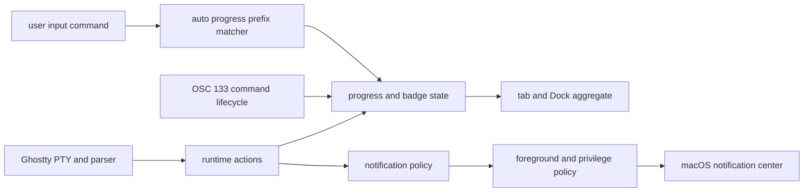

# 终端任务状态、权限与通知领域

## 业务背景

Aster 需要把程序上报、Shell Integration 和用户显式 CLI 指令归并成一致的 Pane 任务状态，同时阻止不可信终端输出绕过通知、标题和声音权限。运行态只存在于 `TerminalSession`，不会把 PID、命令输出或未完成通知分片写入工作区快照。

当前产品 Ghostty surface 直接提供 progress、command-finished、BEL 和 desktop-notification
action；旧 SwiftTerm 的任意 OSC observer、OSC 99 分片和 OSC 6974 lifecycle 路径仅保留为
回归基线，不能在 Ghostty Pane 上宣称可用。

## 领域概念与规则

- `TerminalProgressState`：解析 `OSC 9;4` 的清除、百分比、错误、不定进度及 `aster watch` 完成状态；暂停状态按 Otty 语义忽略。
- `TerminalBadgeState`：错误优先于等待输入，等待输入优先于运行；成功先短暂显示完成 checkmark，再保留未读圆点。私有 OSC 6974 只接受 CLI 文档中的六类徽章。
- `AutomaticProgressMatcher`：按空白分词前缀匹配设置列表。命令文本只来自当前 Pane 的用户输入内存，不经 OSC，也不持久化。
- `KittyNotificationAssembler`：实现 OSC 99 title/body、urgency、base64、8 KiB 分片、共享 ID 重组、替换 ID 与 capability query；会话关闭即丢弃未完成分片。OSC 9 与 777 共用控制字符清理。
- `TerminalNotificationPolicy`：Shell Controlled 只门控应用 OSC；前台策略、Dock 弹跳和三类通知声音独立判断。命令错误的直接 beep 与通知声音互不替代。
- 标题修改与标题读取是两个权限。OSC 0/1/2 默认可修改；XTWINOPS 20/21 默认只返回空值，显式开启后仍清理控制字符并限长。

## 关键实现边界

SwiftTerm 的 `registerOscObserver` 是非消费 seam：Aster 可观察 OSC 9/99/777，而内建 `OSC 9;4` 顶部进度条继续执行。`TerminalOSCStreamLimiter` 在 parser 前对通知序列施加约 8 KiB 独立上限；领域解析器在完整 payload 上再次复验。Kitty capability response 直接写 PTY，不进入用户输入、Autocomplete 或学习路径。

等待输入只在任务运行时检测输出末行的 password、`[y/n]`、yes/no 与 Press Enter 提示，并要求 1.5 秒静默；任何键盘输入立即清除。Dock 聚合不持久化，点击应用图标选择一个失败标签并确认当前错误，新错误仍会再次标红。Dock 图标由 `DockIconArtwork` 按 `Resources/AsterIcon.svg` 的几何分图层重画，而不是给 `NSApp.applicationIconImage` 这张拍平位图加滤镜——只有分图层才能让**中央星芒单独旋转**、**底板整块换成红色**。Working 旋转动画按需缓存 12 个离散角度、每帧 30°，正好走满一圈，首尾无缝衔接；完成一圈后 timer 只切换已有 `NSImage`。Dock tile 尺寸变化会清空缓存，避免把旧帧拉伸成糊图。出错态刻意用不透明红底板而不是叠半透明红：珊瑚品牌色本身偏红，叠色混出来仍然是橙的，用户看不出状态变了。

对未取得权威 lifecycle hook 的 Claude Code / Codex Pane，长寿命 TUI 进程存活本身不代表仍在处理。`TerminalSession` 以命令启动、用户输入与 PTY 输出刷新回退 processing，连续 5 秒无活动后只清除 Agent 运行徽章，不伪造命令退出或触发 Prompt Queue。任意合法 hook 一旦到达就取消该超时，之后 `processing / awaiting-input / idle` 完全以 hook 为准，因此无输出的真实推理不会被误清。

Dock 提醒用 `NSApp.requestUserAttention(.criticalRequest)`，图标会一直跳到应用被激活；`applicationDidBecomeActive` 显式调用 `cancelDockAttention()` 收尾，多条通知叠加也不会残留请求。`.informationalRequest` 只弹一下，用户切走跑长任务时基本看不到，因此不用。

`TerminalTabItem.onActivityBadgeChanged` 把 Session 的普通进度、Agent lifecycle 和完成未读
归并到 `AppModel.tabActivityChanged`。`WorkspaceViewController` 只原地替换对应 `TabRowButton`
的行尾附件，`DockActivityCoordinator` 只重新计算全窗口聚合；两者都不借这类高频状态重建
Pane 树。由于 `@Published` 在 `willSet` 发出事件，徽章聚合延后一轮主队列读取新值，避免
图标总停留在上一状态。状态附件带稳定 identifier 与辅助功能标签，覆盖运行、等待输入、
刚完成、未读完成、错误和空闲。

`TerminalNotificationPosting` 是 Session 到通知基础设施的最小接口。生产实现仍由
`TerminalNotificationService` 执行权限与前后台策略；测试记录器只验收 lifecycle 产生的
通知请求，不申请系统权限，也不写入用户通知中心。

## 失败语义与测试

畸形、超限、非法 base64 和未结束 OSC 99 不通知；系统权限拒绝时不伪报投递成功。无退出码的 OSC 133 D 不猜测成功。SwiftPM 测试宿主没有应用 Bundle，因此通知中心只在真实 app bundle 中延迟创建。

功能测试覆盖协议全状态、分片/替换/查询、前后台策略、旧配置默认值、标题权限、BEL、CLI `watch` 退出码、直接徽章、parser 前限长、左侧 Tab 行尾 lifecycle 变化、等待/完成通知去重，以及 Dock `idle/working/error` 聚合。发布验证使用 `swift test --no-parallel`。
