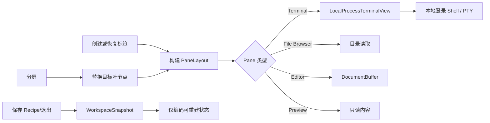

# Aster 工作区领域与实现

## 业务背景

Aster 是原生 macOS 终端工作区，面向同时使用 Shell、全屏 TUI、代码文件和 AI CLI 的开发者。产品采用轻量标签导航、弱化标题栏、纸张色终端画布和克制的苔绿色反馈。实现从零编写，使用独立品牌和素材，不包含 Otty 的私有代码或品牌资源。

## 领域概念

- **Workspace**：窗口内的标签集合、当前选择、详情面板和命令面板。
- **Tab**：一棵可恢复的 `PaneLayout` 分屏树。
- **Pane**：终端、文件浏览器、编辑器或预览四种叶节点之一。
- **Runtime**：PTY、编辑缓冲区等不可序列化的资源，与 `PaneDescriptor` 分离。
- **Recipe**：`.asterrecipe` 格式的可移植工作区描述，可包含标签、分屏、目录、文件和可选命令。
- **Snapshot**：只保存可重建状态的会话恢复记录，不保存 PID、描述符和临时焦点。
- **Configuration**：通用、Shell、控制、编辑器、智能体、外观、Recipes、快捷键和高级九个设置域。
- **TerminalTitleState**：分离 OSC 1 图标名与 OSC 2 窗口标题，OSC 0 同时更新两者；固定名称和动态前缀独立覆盖并进入快照。
- **RecentlyClosedTabs**：只保存可重建标签快照的 LIFO 历史，供 `⇧⌘T` 跨重启恢复。

## 核心规则

1. 工作区始终至少保留一个标签。
2. 分屏操作只替换目标叶节点；关闭 Pane 后提升兄弟节点，不留下空容器。
3. `TerminalSession` 强持有唯一 `LocalProcessTerminalView`，AppKit 视图重排不得重建 PTY。
4. 会话恢复和 Recipe 只能持久化可重建状态，禁止序列化运行进程身份和敏感环境数据。
5. 编辑器保存使用原子替换；保存失败必须保留 dirty 状态并显示错误。
6. 配置以单个 JSON 数据块持久化；终端相关配置立即同步到已存在的终端视图。
7. 关闭标签或 Pane 时必须幂等终止所拥有的进程。
8. 关闭未保存编辑器必须经过“保存 / 不保存 / 取消”事务；取消会阻止 Pane、标签或应用退出。
9. 关闭操作以「当前聚焦的 Pane」为对象：还有分屏时不得连带关闭整个标签页，焦点转移到被关 Pane 的相邻兄弟。
10. 面板导航与拖放重排（方向聚焦、移动分隔条、等分、交换、搬移）是 `PaneLayout` 上的纯函数，不依赖 AppKit 帧尺寸。
11. 拖放重排只改描述符位置，面板 ID 必须保持不变——ID 变了就等于重建运行态，PTY 会重启。

## 业务流程



## 关键实现

### 完整终端网格

界面使用 SwiftTerm 的 `LocalProcessTerminalView` 承载 VT100/xterm 网格、本地进程、alternate screen、ANSI 颜色、宽字符、选择、鼠标报告、超链接和窗口尺寸同步。`TerminalSession` 是唯一适配边界，负责延迟创建视图、设置 `TERM=xterm-256color`、发送命令和 Ctrl+C、查找滚动缓冲区、同步标题/目录以及终止进程。

`AsterCore` 中原有的 `PTYShellProcess`、`ANSICleaner` 和 `TerminalTranscript` 仍作为底层行为测试与备用基础设施保留，但主 UI 不再以滚动纯文本模拟终端。

### 递归分屏

`PaneLayout` 是间接枚举：叶节点保存 `PaneDescriptor`，容器保存方向、两个子树和比例。`PersistedSplitView` 使用原生 `NSSplitView` 按该比例布局递归子树，只在用户拖动期间把限制在 `0.05...0.95` 的比例写回快照。`WorkspacePaneRuntime` 以 Pane ID 关联终端或文档缓冲，避免把 UI 树和进程生命周期耦合。

分屏导航与重排全部建模为 `PaneLayout` 的纯函数：`path(toPane:)` / `node(at:)` 定位子树，`adjacentPaneID(from:direction:)` 做方向聚焦，`nearestSplitPath(fromPane:axis:)` + `splitRatio(at:)` 支撑移动分隔条，`equalizingRatios()` 做等分，`neighborPaneID(ofPane:)` 决定关闭后的焦点归属，`swappingPanes(_:_:)` / `movingPane(_:nextTo:direction:)` 承担拖放重排。拖放只搬描述符：交换是对两个叶做映射（结构与比例都不动），移动是「先 `removing` 再 `splitting`」（摘除自动提升兄弟节点，不留空容器）。两者都保持面板 ID 不变，因此运行态跟着一起搬，PTY 不重启。方向聚焦采用树式回溯（自底向上找第一个「轴向匹配且当前子树位于移动方向来源侧」的祖先分屏，再进入对侧子树取靠近分隔条的叶），而不是屏幕坐标比较——领域层没有真实帧尺寸，窗口未完成布局时坐标法还会给出错误结果。

`TerminalTabItem` 持有两项纯 UI 运行态：`activePaneID`（当前聚焦面板）和 `zoomedPaneID`（缩放拆分），两者都不进快照——恢复会话应当回到完整分屏，而不是停在某次临时放大上。拆分新面板或把焦点移到其它面板都会自动退出放大态，否则新面板会藏在不可见的分屏里。

### 文件与 Recipe

文件浏览器只读取用户明确打开的目录，双击文件会在相邻编辑器 Pane 打开；Markdown/文本可在预览 Pane 查看。`DocumentBuffer` 使用 UTF-8 和原子保存，显式跟踪 dirty 状态。

`RecipeStore` 只接受 `.asterrecipe` 后缀，并以排序、美化 JSON 编码。数据模型保留命令与重放策略字段用于向前兼容，但 0.4 只恢复通过结构和规模校验的工作区布局，不执行外部 Recipe 中的任何命令。

外部 Recipe 会先确认自身是 2 MiB 以内的普通文件，再在创建任何运行态前限制标签数、Pane 数、树深度和命令数量，并验证 Pane UUID 唯一、split ratio 合法。编辑器只读取 10 MiB 以内的普通文件，单个 Recipe 引用的现有编辑资源累计不得超过 32 MiB；设备文件和 FIFO 会在读取前被拒绝。

### 设置与状态恢复

`AsterConfiguration` 按领域拆分，并在 `AppPreferences` 中原子持久化。`WorkspaceSnapshot` 在新建、关闭、分屏、打开文件或 Recipe 后更新；下次启动重建标签、Pane 和新登录 Shell，不尝试附着已经失效的进程。

新标签插入由 `NewTabPosition` 统一计算：`auto` 把空标签放在当前手动分组末尾、把带内容标签放在当前标签后；`end` 始终追加；`after-current` 始终紧跟当前标签。分组边界以“位于标签之后”的 ID 保存，向分组末尾插入时边界会转移到新标签，避免标签落入下一组。

程序标题属于不可信终端输入。`TerminalTitleState` 在持久化前移除控制字符并限制为 512 UTF-8 字节；固定名称忽略后续 OSC，前缀模式保留动态更新。每个 Pane 保留自己的程序标题，后台 Pane 的 OSC 不覆盖活动标题，焦点切换时再投影目标 Pane 的最新状态。OSC handler 在上报领域事件前调用 SwiftTerm 的 `setTitle` / `setIconTitle`，维持其内部标题栈；`TerminalTitleStackObserver` 另从真实 PTY 字节流镜像 OSC/CSI，在 SwiftTerm 的 macOS 图标标题回调缺失或 `23;1t` / `23;2t` 语义颠倒时补发正确恢复事件。最近关闭历史使用 `aster.workspace.recently-closed.v1`，不包含 PID、PTY 或文件描述符；解码时把容量限制到 `1...100`，并移除与当前活动标签重复的条目。

`TerminalTabItem` 会把子 Session 的状态变化转发给标签视图，并把 OSC 7 当前目录写回分屏树。应用退出前再次持久化最终快照。

### 进程关闭

SwiftTerm 视图只在 `process.running` 为真时按当前 `shellPid` 终止进程组。进程级 `TerminalRetirementCoordinator` 会在 Pane 和 Session 释放后继续强持有 retiring View，直到 SwiftTerm 的进程 monitor 完成 `waitpid`；普通 Pane/标签关闭在 750ms 后仍未退出才升级为 `SIGKILL`。应用整体退出时事件循环不会继续等待，因此在保存快照和确认文档后立即结束进程组。自然结束的 Session 不再对保留的旧 PID 发送信号，避免 PID 复用后误杀无关进程。

## 失败语义

- 文件/目录读取失败：对应 Pane 显示系统错误，不影响其它 Pane。
- 文档保存失败：保留 dirty 标记和内存文本。
- Recipe 后缀或 JSON 无效：拒绝导入并显示提示。
- Recipe 结构超限、UUID 重复或比例非法：在启动 Shell 前拒绝导入。
- 关闭 dirty 编辑器：保存失败或用户取消时中止关闭事务。
- Shell 结束：终端保留滚动内容并显示结束状态；关闭 Pane/标签负责最终清理。
- 配置导入失败：保留当前配置，不写入部分结果。

## 测试与发布

测试覆盖纯 AppKit 迁移、配置编码、24 套主题真值、颜色解析、递归分屏、方向聚焦与分隔条调整、分屏面板在两个方向/两种标签栏布局下的真实 frame、⌘W 的面板优先语义、比例更新、移除节点、文档 dirty/原子保存、Recipe 往返、FIFO 和累计资源预算、恶意结构上限、会话快照、UTF-8 分块、ANSI 边界和真实 PTY 生命周期。发布前必须运行：

```bash
swift test
swift build -c release
./scripts/build-app.sh
codesign --verify --deep --strict dist/Aster.app
```

随后实际启动 `.app`，检查主窗口、设置窗口、分屏、终端输入和资源 Bundle。
