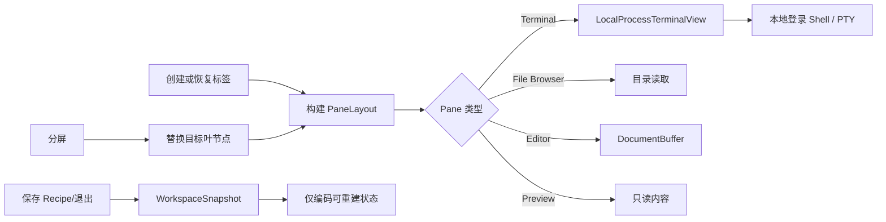
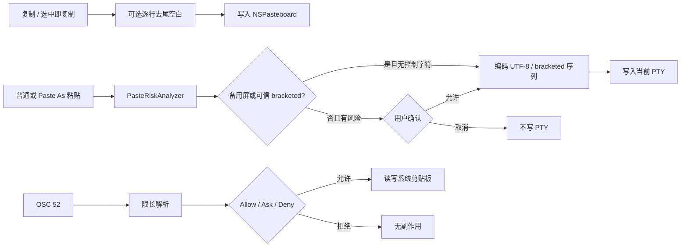
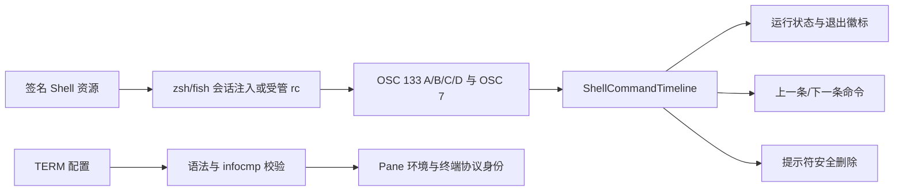
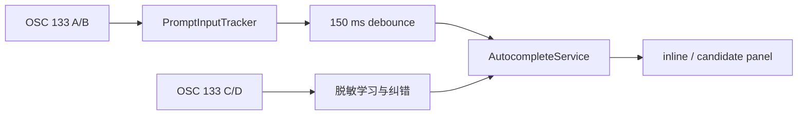

# Aster 工作区领域与实现

## 业务背景

Aster 是原生 macOS 终端工作区，面向同时使用 Shell、全屏 TUI、代码文件和 AI CLI 的开发者。产品采用轻量标签导航、弱化标题栏、纸张色终端画布和克制的苔绿色反馈。实现从零编写，使用独立品牌和素材，不包含 Otty 的私有代码或品牌资源。

## 领域概念

- **Workspace**：窗口内的标签集合、当前选择、详情面板和命令面板。
- **Tab**：一棵可恢复的 `PaneLayout` 分屏树。
- **Pane**：终端、文件浏览器、编辑器或预览四种叶节点之一。
- **Runtime**：PTY、编辑缓冲区等不可序列化的资源，与 `PaneDescriptor` 分离。
- **Recipe**：`.ottyrecipe` TOML 格式的可移植工作区描述，可包含作用域、内容级别、标签、分屏、目录、文件和可选命令；旧 `.asterrecipe` JSON 仅作兼容读取。
- **Snapshot**：只保存可重建状态的会话恢复记录，不保存 PID、描述符和临时焦点。
- **Configuration**：通用、Shell、控制、编辑器、智能体、外观、Recipes、快捷键和高级九个设置域。
- **TerminalTitleState**：分离 OSC 1 图标名与 OSC 2 窗口标题，OSC 0 同时更新两者；固定名称和动态前缀独立覆盖并进入快照。
- **RecentlyClosedTabs**：只保存可重建标签快照的 LIFO 历史，供 `⇧⌘T` 跨重启恢复。
- **FrequentFolders**：本机目录访问数据库，以名称匹配等级和时间衰减后的 frecency 排名；忽略列表具有粘性。
- **PasteAnalysis**：一次粘贴的瞬时风险分类，只在内存中保存正文，不进入日志或持久化。
- **OSC52ClipboardCoordinator**：终端程序通过 OSC 52 访问系统剪贴板的 AppKit 授权边界。
- **SecureInputCoordinator**：合并多 Pane 自动请求与手动请求的进程级 Secure Event Input 所有者。
- **TerminalSelection**：由光标或指针建立锚点和焦点，支持线性范围与按列输出的矩形范围。
- **VirtualScrollPosition**：normal buffer 的整行 `yDisp` 与单行内像素偏移之和，可在配置边界内越过首尾内容。
- **ShellCommandTimeline**：由 OSC 133 A/B/C/D 构成的有界命令位置与退出状态序列，不保存命令文本。
- **TerminalIdentityResolution**：`auto`、自定义 terminfo 校验与安全回退后的实际 TERM。
- **Autocomplete**：由当前 prompt、命令规格、目录级学习、README、文件和 alias 合成的本机候选，不拥有命令执行权。

## 核心规则

1. 工作区始终至少保留一个标签。
2. 分屏操作只替换目标叶节点；关闭 Pane 后提升兄弟节点，不留下空容器。
3. `TerminalSession` 强持有唯一 `LocalProcessTerminalView`，AppKit 视图重排不得重建 PTY。
4. 会话恢复和 Recipe 只能持久化可重建状态，禁止序列化运行进程身份和敏感环境数据。
5. 编辑器保存使用原子替换；保存失败必须保留 dirty 状态并显示错误。
6. 配置以单个 JSON 数据块持久化；终端相关配置立即同步到已存在的终端视图。
7. 关闭标签或 Pane 时必须幂等终止所拥有的进程。
8. 关闭未保存编辑器必须经过“保存 / 不保存 / 取消”事务；取消会阻止 Pane、标签或应用退出。
9. 关闭操作以「当前聚焦的 Pane」为对象：还有分屏时不得连带关闭整个标签页，焦点转移到被关 Pane 的相邻兄弟。
10. 面板导航与拖放重排（方向聚焦、移动分隔条、等分、交换、搬移）是 `PaneLayout` 上的纯函数，不依赖 AppKit 帧尺寸。
11. 拖放重排只改描述符位置，面板 ID 必须保持不变——ID 变了就等于重建运行态，PTY 会重启。
12. 危险粘贴默认必须确认；备用屏 TUI，或已协商 bracketed paste 且用户允许信任时可跳过，但控制字符风险永不跳过。
13. OSC 必须在进入组件 parser 前流式限长；OSC 52 读取默认每次询问，拒绝时不得触碰系统剪贴板。
14. 原生文本编辑只接管普通 Shell 屏幕；全屏 TUI 和增强键盘协议必须保留程序协商的按键编码。
15. 自动安全输入只保护当前聚焦 Pane 中 `ECHO` 关闭且 `ICANON` 保持开启的密码式输入；raw-mode TUI 必须排除。多 Pane 共享引用计数，应用失活时暂停系统保护。
16. 鼠标报告开启时，`Option` 必须强制进入原生选择，不向前台 TUI 泄漏部分鼠标序列；`Shift` 是否绕过报告遵循终端协商的捕获模式，`Option` 拖动产生矩形选区。
17. 平滑滚动只改变 normal buffer 的视口；alternate screen 不允许首尾越界，手势结束必须回到完整字符行。
18. Shell Integration 资源必须来自签名 Bundle；受管 rc 区块必须幂等、可卸载并保留区块外内容、权限与符号链接。所有目标先预检，后续写入失败时回滚已改目标。
19. OSC 133 只接受 A/B/C/D 与非负退出码，不接收或持久化命令正文；命令位置使用包含已裁剪行数的绝对坐标。时间线变化通过专用 `outlineChanged` 事件局部刷新 Outline，不提升为通用工作区重建。
20. `TERM=auto` 解析为 `xterm-256color`；自定义名称只有真实 terminfo 存在时才能进入子进程，终端不得冒充其它产品。
21. Autocomplete 只在 OSC 133 确认的可靠 prompt 中工作；接受候选只发送尚未输入的后缀，不自动发送回车。
22. 命令学习必须先脱敏并遵守忽略模式；关闭本机学习时不得读取历史/README、运行 help 探测或生成纠错。

## 业务流程



### 剪贴板与粘贴保护流程



## 关键实现

### 完整终端网格

界面使用 SwiftTerm 的 `LocalProcessTerminalView` 承载 VT100/xterm 网格、本地进程、alternate screen、ANSI 颜色、宽字符、选择、鼠标报告、超链接和窗口尺寸同步。`TerminalSession` 是唯一适配边界，负责延迟创建视图、设置 `TERM=xterm-256color`、发送命令和 Ctrl+C、查找滚动缓冲区、同步标题/目录以及终止进程。

`AsterCore` 中原有的 `PTYShellProcess`、`ANSICleaner` 和 `TerminalTranscript` 仍作为底层行为测试与备用基础设施保留，但主 UI 不再以滚动纯文本模拟终端。

### 递归分屏

`PaneLayout` 是间接枚举：叶节点保存 `PaneDescriptor`，容器保存方向、两个子树和比例。`PersistedSplitView` 使用原生 `NSSplitView` 按该比例布局递归子树，只在用户拖动期间把限制在 `0.05...0.95` 的比例写回快照。`WorkspacePaneRuntime` 以 Pane ID 关联终端或文档缓冲，避免把 UI 树和进程生命周期耦合。

分屏导航与重排全部建模为 `PaneLayout` 的纯函数：`path(toPane:)` / `node(at:)` 定位子树，`adjacentPaneID(from:direction:)` 做方向聚焦，`nearestSplitPath(fromPane:axis:)` + `splitRatio(at:)` 支撑移动分隔条，`equalizingRatios()` 做等分，`neighborPaneID(ofPane:)` 决定关闭后的焦点归属，`swappingPanes(_:_:)` / `movingPane(_:nextTo:direction:)` 承担拖放重排。拖放只搬描述符：交换是对两个叶做映射（结构与比例都不动），移动是「先 `removing` 再 `splitting`」（摘除自动提升兄弟节点，不留空容器）。两者都保持面板 ID 不变，因此运行态跟着一起搬，PTY 不重启。方向聚焦采用树式回溯（自底向上找第一个「轴向匹配且当前子树位于移动方向来源侧」的祖先分屏，再进入对侧子树取靠近分隔条的叶），而不是屏幕坐标比较——领域层没有真实帧尺寸，窗口未完成布局时坐标法还会给出错误结果。

`TerminalTabItem` 持有两项纯 UI 运行态：`activePaneID`（当前聚焦面板）和 `zoomedPaneID`（缩放拆分），两者都不进快照——恢复会话应当回到完整分屏，而不是停在某次临时放大上。拆分新面板或把焦点移到其它面板都会自动退出放大态，否则新面板会藏在不可见的分屏里。

### 文件与 Recipe

文件浏览器只读取用户明确打开的目录，双击文件会在相邻编辑器 Pane 打开；Markdown/文本可在预览 Pane 查看。`DocumentBuffer` 使用 UTF-8 和原子保存，显式跟踪 dirty 状态。

`WorkflowRecipeTOML` 是 `.ottyrecipe` 的主编解码入口；`RecipeStore` 保留旧 `.asterrecipe` JSON 兼容。外部 Recipe 会先确认自身是 2 MiB 以内的普通、非符号链接文件，再在创建任何运行态前限制标签数、Pane 数、树深度和命令数量，并验证 Pane UUID 唯一、split ratio 合法。编辑器只读取 10 MiB 以内的普通文件，单个 Recipe 引用的现有编辑资源累计不得超过 32 MiB；设备文件和 FIFO 会在读取前被拒绝。

命令重放由 `WorkflowRecipeOpenPlanner` 合并来源、用户策略和 `WorkflowRecipeTrustStore` 的 SHA-256 内容摘要。默认先显示有界预览；“从不”只恢复布局，“信任”也会在文件字节变化后失效。获准命令不会交给独立 Shell 批量执行：`AppModel` 只在目标 Pane 已启用 Shell Integration 且处于空闲 Prompt 时发送第一条，之后由 OSC 133 完成事件逐条推进。

### 设置与状态恢复

`AsterConfiguration` 按领域拆分，并在 `AppPreferences` 中原子持久化。`WorkspaceSnapshot` 在新建、关闭、分屏、打开文件或 Recipe 后更新；下次启动重建标签、Pane 和新登录 Shell，不尝试附着已经失效的进程。

新标签插入由 `NewTabPosition` 统一计算：`auto` 把空标签放在当前手动分组末尾、把带内容标签放在当前标签后；`end` 始终追加；`after-current` 始终紧跟当前标签。分组边界以“位于标签之后”的 ID 保存，向分组末尾插入时边界会转移到新标签，避免标签落入下一组。

程序标题属于不可信终端输入。`TerminalTitleState` 在持久化前移除控制字符并限制为 512 UTF-8 字节；固定名称忽略后续 OSC，前缀模式保留动态更新。每个 Pane 保留自己的程序标题，后台 Pane 的 OSC 不覆盖活动标题，焦点切换时再投影目标 Pane 的最新状态。OSC handler 在上报领域事件前调用 SwiftTerm 的 `setTitle` / `setIconTitle`，维持其内部标题栈；`TerminalTitleStackObserver` 另从真实 PTY 字节流镜像 OSC/CSI，在 SwiftTerm 的 macOS 图标标题回调缺失或 `23;1t` / `23;2t` 语义颠倒时补发正确恢复事件。最近关闭历史使用 `aster.workspace.recently-closed.v1`，不包含 PID、PTY 或文件描述符；解码时把容量限制到 `1...100`，并移除与当前活动标签重复的条目。

`TerminalTabItem` 会把子 Session 的状态变化转发给标签视图，并把 OSC 7 当前目录写回分屏树。应用退出前再次持久化最终快照。

OSC 7 目录变化还会在“自动记录访问目录”开启时写入 `aster.frequent-folders.v1`。每次访问把原始分数加 1，读取时按最近一小时 `×4`、一天内 `×2`、一周内 `×0.5`、更早 `×0.25` 衰减；查询优先级依次为目录名精确、前缀、包含、完整路径包含。数据库只保留最高分的 100 项，`ignore` 会同时删除记录并阻止后续自动学习，`unignore` 后才可重新进入。路径进入数据库前必须是 4096 字节以内、无控制字符的规范化绝对路径；OSC 7 自动入口还要求目录当前真实存在。

### 复制、Paste As 与 OSC 52

`AsterTerminalView` 覆盖 SwiftTerm 的复制和粘贴入口。复制可选逐物理行删除尾部水平空白，并可在显式复制成功后清除选区；“选中即复制”复用同一转换，但始终保留高亮供用户继续扩展选区。普通粘贴识别多行、末尾换行、`sudo`/`su` 命令词和 C0/C1 控制字符，确认框只展示经可视化和 2,000 字符上限处理的预览。正文按原始 UTF-8 写入 PTY；终端协商 bracketed paste 或用户显式选择“括号粘贴”时，使用 `CSI 200~` / `CSI 201~` 包裹。控制字符始终要求确认，正文内嵌的 `CSI 201~` 与 C1 等价结束标记会转为可见文本，不能提前逃逸括号模式。

Edit 菜单和终端右键菜单提供粘贴选区、普通文件 Base64、POSIX Shell 单参数转义、强制括号粘贴，以及 Composer 交接入口。Base64 文件读取使用 `lstat` + `O_NOFOLLOW` + `fstat`，在打开前后比较设备号、inode、大小、mtime 与 ctime，限制为 8 MiB；目录、符号链接、FIFO、socket、设备和读取期间变化的文件都被拒绝。Composer 动作通过 `onPasteIntoComposer` 窄回调解耦；Composer 领域接入前右键项保持禁用。

`TerminalOSCStreamLimiter` 在原始 PTY 字节进入 SwiftTerm 前跨分片跟踪 OSC：普通 OSC 上限 16 MiB，OSC 52 上限 8 MiB；超限时发送 CAN 取消组件内部缓存，并丢弃到真实终止符。自定义 OSC 52 handler 再执行第二层解析，Base64 解码后限制 6 MiB；读响应正文限制 1 MiB，并使用七位 OSC/ST。写权限默认 `Allow`，读权限默认 `Ask`；导入配置中的 `Allow Read` 会降级为 `Ask`，显式 `Deny` 保留。`Ask` 不持久化临时授权，提示期间拒绝重入，提示结束后 5 秒内静默拒绝后续请求，防止模态提示风暴。畸形、超限、拒绝和取消请求均无剪贴板副作用。

### 原生文本编辑与安全键盘输入

`TerminalInputEncoder` 将 AppKit 的行首/行尾、词移动、行/词删除和撤销动作编码为可移植的 readline/Emacs 字节。Edit 菜单的快捷键通过 responder chain 进入 `AsterTerminalView`；仅在普通屏幕且没有 Kitty 增强键盘协商时启用，alternate screen 与现代协议继续由 SwiftTerm 编码。不同 Shell 没有通用 Redo 字节，因此在 Shell Integration 提供明确绑定前不伪装支持。`Option as Meta` 的新安装默认值为关闭，保留系统输入法产生重音和特殊字符的能力；用户显式开启后仍由 SwiftTerm 发送 Esc 前缀。

`TerminalSession` 在终端输出到达、用户输入写入 PTY 前、Pane 获焦和配置开启时立即对 PTY master 调用 `tcgetattr`，既有一秒轮询只作兜底。当自动保护开启、窗口与 Pane 聚焦、`ECHO` 关闭且 `ICANON` 仍开启时，向 `SecureInputCoordinator` 注册当前 Session；raw-mode TUI、失焦、恢复回显、进程结束、关闭 Pane 或关闭设置都会释放。协调器只在首个自动/手动请求时调用 `EnableSecureEventInput`，最后一个请求释放时调用 `DisableSecureEventInput`；启用或关闭失败都保留真实状态并允许后续同步重试。手动开关位于 Edit 菜单且不持久化为导入配置；应用失活时只暂停系统保护，重新激活后按用户开关恢复。

### 原生选区与滚动视口

SwiftTerm 1.15 的公开接口不能表达键盘扩展选区、矩形范围或行内像素位移。Aster 因而固定并 vendored 官方 revision；`SelectionService` 保存 keyboard anchor/focus，并让方向动作可以越过锚点收缩后反向扩展。普通拖动、双击单词和三击整行沿用上游语义；`Option` 拖动切换矩形模式，复制时在每个物理行截取相同列区间，短行的内部 NUL 空单元格转换为可见空格。鼠标手势在 mouseDown 时锁定由原生选择、链接还是终端报告拥有，修饰键中途变化不会产生孤立 press/release；Command-click 链接始终由本地完整处理。任何发送到 PTY 的输入都按配置清除选区，显式复制清理与选中即复制互不干扰。

normal buffer 的虚拟滚动位置由整行 `Buffer.yDisp` 和 `viewportContentTranslationY` 组成。精确触控板手势直接累计像素，结束或取消时四舍五入到最近行；关闭平滑滚动时，残余像素累积到完整字符行才移动。滚过末尾可把最后内容行或光标行放到顶部，也可把最后内容行放到中部；滚过开头可独立把第一内容行放到底部/中部或跟随末尾策略。所有范围按实际内容、光标和视口行数计算，新输出及用户输入会复位到底部，alternate screen 会清除像素偏移并忽略越界设置。

### Vi、Hint 与 Read-only Pane 模式

`TerminalPaneModeState` 将互斥的 normal / Vi / Hint 导航状态与正交 Read-only 锁分开；临时进入 Hint 后恢复原导航模式，退出 Vi 也不会解除只读。`TerminalViEngine` 只依赖 `TerminalNavigationSnapshot`，以活动 Buffer 坐标实现计数移动、字符/行/矩形选区、搜索请求和 Hint 跳转。SwiftTerm 仅额外公开活动 Buffer 光标、scroll-invariant 行范围、程序化矩形选区和有界可见链接列表；Aster 不访问其内部行数组。选区更新期间抑制“选中即复制”，只有 `y` 或 `Enter` 执行显式复制。

Hint 标签最多 676 个，26 个以内使用单字符，更多时全部使用双字符以消除前缀歧义。目标按可见行列稳定去重，OSC 8 来源保持显式身份；普通键走 `TerminalTargetOpenCoordinator`，Shift 最终键只用 `TargetResolver` 生成规范化复制值。任何输出都会使当前标签快照失效并退出 Hint。

Read-only 先通过 SwiftTerm 的 `shouldSendUserData(_:)` 在清选区、回到底部等副作用前拒绝应用输入，再由 `AsterTerminalView.send(source:data:)` 统一覆盖键盘编码、IME、普通/变体粘贴和应用命令输入。SwiftTerm 从 `TerminalDelegate.send(source: Terminal, ...)` 产生的 DA/DSR 等协议回包使用动态作用域标记绕过门禁；OSC 52 与 Kitty 通知回包本来就直接写进程，同样不受锁影响。鼠标按下和滚轮在锁定期间临时关闭报告，保留本地选择与 normal-buffer 滚动；移动报告直接丢弃。`WorkspacePaneRuntime` 持有 Pane 级锁并同步终端或编辑器，锁不进入会话快照。

### Shell Integration 与终端身份

zsh、Bash 与 fish 的静态脚本位于 `Resources/shell-integration/`，由构建脚本原样复制进签名应用。zsh 通过当前会话的 `ZDOTDIR` 加载最小 `.zshenv`，先读取用户真实 `.zshenv`；用户若在其中重定向 `ZDOTDIR` 则保留该值，否则恢复启动前状态，再在首个 prompt 延迟安装 hook。fish 通过临时 `XDG_DATA_DIRS` 加载 vendor conf，并在 source 后从环境中移除该目录。Bash 没有干净的 per-spawn 入口，因此 `ShellIntegrationInstaller` 在 `.bashrc` 与 `.bash_profile` 维护带 `TERM_PROGRAM=aster` 守卫的区块；检测到 tmux 时，zsh 与 fish 也写入仅在 `$TMUX` 内生效的区块。安装器先读取并校验全部目标，再逐文件原子替换；后续写入失败时恢复此前内容和权限。禁用会先确认，再移除所有区块，依赖设置值保留。

脚本在提示符与命令边界发送 OSC 133 A/B/C/D，并在提示符发送 OSC 7。OSC 7 主机固定为 `localhost`，路径按 UTF-8 字节完整 URL 转义，目录名中的 BEL/ESC 不能截断控制序列。`AsterTerminalView` 把标记时刻的光标转换成包含 `totalLinesTrimmed` 的绝对位置，`ShellCommandTimeline` 组成最多 1,000 条命令记录。时间线驱动运行 spinner、最近退出码、标签徽标和详情面板 Outline；命令完成后 `TerminalSession.outlineChanged` 只失效 Outline 页缓存，点击条目按绝对行跳回未裁剪锚点。`Command+Page Up/Down` 使用同一导航基础。当前提示符内同一行的线性 ASCII 选区可安全映射成左右移动与 Backspace，Cut 先复制再删除；跨行、矩形、Unicode 或命令运行中的范围不发送猜测字节。

`TerminalLaunchEnvironmentBuilder` 为每个 Pane 注入 `TERM`、`COLORTERM=truecolor`、`TERM_PROGRAM=aster`、应用版本、`CW_TERM=aster`、稳定 `ASTER_PANE_ID` 和兼容别名 `ASTER_SESSION_ID`。默认配置 `auto` 使用 `xterm-256color`；自定义名称先通过字符白名单，再由固定 `/usr/bin/infocmp -x` 验证。应用 Bundle 内置构建期编译的 `aster-direct` terminfo，并把其目录放在 `TERMINFO_DIRS` 首位。SwiftTerm 的 opt-in 产品身份返回 DA1 `CSI ? 6 c`、带语义版本整数的 DA2、`DCS > | aster(version) ST`、DSR 5/6，并对 DA3 保持无响应。



### Autocomplete 与 Inline Suggest

`AutocompleteEngine` 是不依赖 AppKit 的候选合并与排序边界，输入为当前命令行、Fig/本地规格、目录级学习、固定命令、README 和 Shell alias，输出为候选、ghost 后缀及替换起点。`PromptInputTracker` 只重建能够由用户输入字节确定的编辑状态；遇到 Up/Down 等依赖 Shell 内部历史的操作即标记不可靠，直到下一次 OSC 133 A/B。`ShellCommandOutputCapture` 按 C/D 标记截取最多 128 KiB 的瞬时输出，只供失败纠错，不持久化。

`AutocompleteService` 组合签名 Bundle 的 715 命令索引、用户手动 Fig tree 更新、本地 help 规格、README 普通文件读取、文件系统候选和脱敏学习库。状态文件先做 2 MiB 上限和结构校验，再以 0600 权限原子写入；符号链接和特殊文件不会被读取或覆盖。更新只从固定 GitHub API 端点发起，绝不后台联网。没有详细结构的命令只执行 PATH 中普通可执行文件的固定 `--help`、`-h` 或 `help` 参数，使用 `sandbox-exec` 拒绝网络与文件写入，并施加 2.5 秒超时、128 KiB 输出上限和最小环境 allowlist；远程会话完全跳过本机目录读取与 help 探测。



Shell Integration 通过私有 OSC 6973 仅上报符合 ASCII allowlist 的 alias 名称，不传输展开值。`aster learn` 使用 Application Support 中的 256-bit 随机 token 验证本机 URL，命令和目录采用有界 hex 编码；未通过鉴权的 URL 不会污染固定命令。

### 任务状态、徽章与通知

任务状态与通知的领域模型、协议流、权限边界和失败语义见 [terminal-activity-and-notifications.md](terminal-activity-and-notifications.md)。核心约束是：进度观察不得覆盖 SwiftTerm 内建渲染；通知在 parser 前后双重限长；Shell 应用通知、BEL、错误 beep、标题修改与标题报告分别授权；所有 Pane/Dock 状态均为可丢弃运行态。

### 进程关闭

SwiftTerm 视图只在 `process.running` 为真时按当前 `shellPid` 终止进程组。进程级 `TerminalRetirementCoordinator` 会在 Pane 和 Session 释放后继续强持有 retiring View，直到 SwiftTerm 的进程 monitor 完成 `waitpid`；普通 Pane/标签关闭在 750ms 后仍未退出才升级为 `SIGKILL`。应用整体退出时事件循环不会继续等待，因此在保存快照和确认文档后立即结束进程组。自然结束的 Session 不再对保留的旧 PID 发送信号，避免 PID 复用后误杀无关进程。

## 失败语义

- 文件/目录读取失败：对应 Pane 显示系统错误，不影响其它 Pane。
- 文档保存失败：保留 dirty 标记和内存文本。
- Recipe 后缀或 JSON 无效：拒绝导入并显示提示。
- Recipe 结构超限、UUID 重复或比例非法：在启动 Shell 前拒绝导入。
- 关闭 dirty 编辑器：保存失败或用户取消时中止关闭事务。
- Shell 结束：终端保留滚动内容并显示结束状态；关闭 Pane/标签负责最终清理。
- 配置导入失败：保留当前配置，不写入部分结果。
- Frequent Folders 数据损坏：丢弃非法路径、非有限分数和重复项；单个 OSC 7 记录失败不影响工作区目录同步。
- 粘贴保护取消：不写入任何 PTY 字节；剪贴板正文不记录日志。
- OSC 52 畸形、超限或被拒绝：静默忽略且不读取/写入系统剪贴板。
- Base64 文件不是普通文件、不可读或超过 8 MiB：显示错误并停止粘贴。
- 终端切换 alternate screen：立即丢弃 normal buffer 的越界像素偏移，不把空白区域带入 TUI。
- Cut 无法证明选区是当前提示符内同一行 ASCII 范围：只复制，不猜测发送 Backspace。
- Shell 集成资源缺失、rc 是特殊文件、超过 1 MiB 或 marker 损坏：在任何写入前停止；磁盘写入中途失败则回滚已更新目标，回滚自身失败时明确要求检查对应路径。
- 自定义 TERM 不合法或缺少 terminfo：记录单行启动告警并回退 `xterm-256color`，Shell 仍可启动。
- 通知 OSC 畸形、超过 8 KiB、base64 非法或分片未结束：静默丢弃，不请求系统权限；OSC 99 查询只返回固定能力响应。
- OSC 133 完成标记缺少退出码：停止进度但不猜测成功、不发完成通知。
- SwiftPM 测试宿主没有应用 Bundle：通知中心保持不可用，设置页仍可构建；打包 app 才延迟解析系统通知中心。

## 测试与发布

测试覆盖纯 AppKit 迁移、配置编码、24 套主题真值、颜色解析、递归分屏、方向聚焦与分隔条调整、分屏面板在两个方向/两种标签栏布局下的真实 frame、⌘W 的面板优先语义、比例更新、移除节点、文档 dirty/原子保存、Recipe 往返、FIFO 和累计资源预算、恶意结构上限、会话快照、UTF-8 分块、ANSI 边界、线性/矩形选区、鼠标报告绕过、像素滚动与首尾边界、粘贴风险、括号序列、OSC 52 权限/限长、OSC 9;4/9/99/777、通知策略、标题权限、Shell 受管文件、真实 zsh/Bash FTCS、命令时间线、提示符删除、TERM 回退、DA/XTVERSION/DSR、Base64 文件边界和真实 PTY 生命周期。发布前必须运行：

```bash
swift test
swift build -c release
./scripts/build-app.sh
codesign --verify --deep --strict dist/Aster.app
```

随后实际启动 `.app`，检查主窗口、设置窗口、分屏、终端输入和资源 Bundle。
