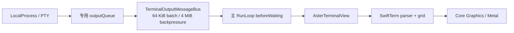
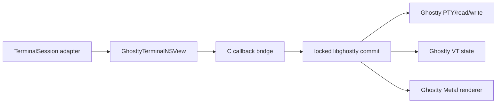

# 终端引擎替换调研

> 调研日期：2026-08-11
> 范围：macOS 14+、纯 AppKit 宿主、SwiftPM 应用；只采用项目官方仓库、官方文档、源码与许可证作为依据。

## 业务背景

Aster 当前不是简单地把 PTY 字节写入一个现成控件，而是在 vendored SwiftTerm 1.15.0 上维护了一条定制链路：

其中 `AsterTerminalView` 还承载标题与 OSC 观察、Shell Integration、Autocomplete、Read-only、Vi/Hint、链接授权、选区、主题和通知等 Aster 语义。替换候选只有在同时解决 **PTY、VT parser/state、输入编码、像素渲染及调度** 时，才可能消除当前输出调度问题；只提供 parser 的库不会直接解决渲染卡顿或主线程饥饿。

当前 vendor 基线记录在 [`Vendor/SwiftTerm/UPSTREAM.md`](../../Vendor/SwiftTerm/UPSTREAM.md)，相对原始 1.15.0 已修改 18 个 SwiftTerm 源文件。换引擎意味着这些能力要逐项映射，而不是替换一个 SwiftPM dependency 即可。

## 结论

有可以利用的开源实现，但没有“零成本直接替换”。

1. **若目标是完整替换 SwiftTerm + 自建输出调度，Ghostty 的完整引擎是唯一值得做 PoC 的候选。** Ghostty 本身已有每个 terminal 独立 read/write/render thread、Metal renderer 和 macOS 宿主；`agterm` 与 `macterm` 进一步证明了 Swift/AppKit 应用可以通过 `libghostty` C API 驱动完整 surface。
2. **不能把 `libghostty` 描述为稳定 SDK。** Ghostty 官方明确表示尚未给 `libghostty` 打版本，API signature 仍会变化；公开、文档化的 `libghostty-vt` 只负责 VT parsing/state/render state，不包含像素 renderer 或 windowing。Ghostty 自己 macOS App 使用的 `include/ghostty.h` 更直接标注为 internal、仅为官方 macOS App 定制且不面向外部使用。因此 PoC 必须锁定 Ghostty commit，并接受维护 C/Swift bridge 和跟随上游改 API 的成本。
3. **`agterm` 和 `macterm` 是最有价值的 MIT Swift/AppKit 桥接参考，不是可直接依赖的 terminal SDK。** 应借鉴它们的 `GhosttyApp`、callbacks、resources、surface `NSView`、输入和生命周期边界，而不是整体 fork 产品代码。
4. **实现阶段复核推翻了“1.18 新增输出背压”的假设。** Aster 锁定的 SwiftTerm 1.15 revision 已包含主队列 4 ms time slice、4 MiB high-water / 1 MiB low-water 背压；1.18 在 `LocalProcess.swift` 的新增内容是快速退出进程的 DispatchSource 时序修复。Aster 给 `LocalProcess` 传入专用 queue，因此走的是自有 `TerminalOutputMessageBus` 路径而非上游 main-queue backlog。全量 1.18 rebase 仍有兼容价值，但不能作为本轮输出问题的独立对照实验。
5. WezTerm/termwiz、Alacritty、Contour、terminalpp 只有可复用 core，没有 AppKit embeddable view；xterm.js 需要 WKWebView/JavaScript bridge；iTerm2 是 GPL 完整应用。它们都不适合承担本轮替换 PoC。

## 候选总表

| 候选 | 官方嵌入边界 | macOS 原生嵌入 | PTY / parser / renderer | 许可证 | 截至调研日状态 | 对 Aster 的判断 |
| --- | --- | --- | --- | --- | --- | --- |
| **Ghostty / internal `libghostty`** | C API + Ghostty surface；API 明示 internal | 可由 AppKit `NSView` 承载 Metal surface，已有第三方一手源码验证 | 完整 Ghostty 路径可覆盖三者 | MIT | Ghostty tag `v1.3.1`；主仓库持续活跃；lib API 未版本化 | **唯一值得做完整替换 PoC；高成本、高收益** |
| **`libghostty-vt`** | 文档化 C/Zig API、Apple XCFramework | 能从 Swift 调 C，但宿主需自己画 pixels | parser/state/render state；**无 drawing/windowing**，PTY 也由宿主接线 | MIT | 功能成熟，API signatures 仍在变化 | 适合 parser 实验，不单独解决当前输出/渲染问题 |
| **agterm** | 完整产品内的 Swift/AppKit bridge | 是 | 通过固定 Ghostty commit 获得完整引擎 | MIT | `v0.22.0`，2026-08-10 | **首选 bridge 参考；不是 library dependency** |
| **macterm** | 完整产品内的 `GhosttyTerminalNSView` bridge | 是 | 通过固定 Ghostty commit 获得完整引擎 | MIT | `v1.23.0`，2026-08-10 | **首选 bridge 参考；不是 library dependency** |
| **SwiftTerm 1.18.0** | SwiftPM library；`LocalProcessTerminalView: NSView` | 最直接 | 三者齐全，AppKit/CoreText + 可选 Metal | MIT | `v1.18.0`，2026-08-09 | 可升级获得兼容修复；输出基准必须显式切换 queue |
| WezTerm / `wezterm-term` / termwiz | Rust crates；GUI 是完整 WezTerm 应用 | 无 AppKit control，需 Rust FFI + 自建 view | `portable-pty`、`wezterm-term` 可拆；GUI renderer 与应用耦合 | MIT | 主仓库活跃；最新稳定 release 仍为 2024-02-03；termwiz 自述 API 大幅变化 | 不适合本轮，集成成本很高 |
| Alacritty | `alacritty_terminal` Rust crate | 无 AppKit control，应用依赖 winit/glutin/OpenGL | core 含 PTY/parser/grid；renderer 在 app crate | Apache-2.0 | `v0.17.0`，2026-04-06 | 只能替换 core，仍需 renderer/FFI；不解决“直接拿来用” |
| xterm.js | 浏览器 terminal component | 只能经 WKWebView | parser/grid/DOM/Canvas/WebGL；PTY 由宿主桥接 | MIT | `6.0.0`，2025-12-22 | 技术上可嵌入，但改成 Web terminal，破坏原生交互边界且增加 JS bridge |
| iTerm2 | 完整 Objective-C/AppKit 应用，无 library product | 原生但高度应用耦合 | 三者齐全 | 官方 README 称 GPLv3；仓库 `LICENSE` 是 GPL-2.0，需法律确认 | 稳定 tag `v3.6.11`，2026-06-02；活跃 | 只借鉴架构；不复制或链接代码 |
| Contour | C++23 内部分层库 + Qt/QML/OpenGL GUI | macOS frontend 是 Qt，不是 AppKit | `vtpty` / `vtparser` / `vtbackend` / `vtrasterizer` 可拆 | Apache-2.0 | `v0.6.3.8249`，2026-04-09 | 分层值得参考，但 C++/Qt/renderer 接入成本过高 |
| terminalpp | C++ 完整应用；macOS 只支持 Qt renderer | 不是 AppKit | 自带 PTY/parser/renderer，但没有稳定 Apple control | MIT | 最新 release `v0.8.4` 停在 2021；仓库 2025 有提交 | 活跃度、Apple 原生性和 API 成熟度都不足 |

## 重点候选

### Ghostty 与 `libghostty`

Ghostty 官方架构说明其每个 terminal 使用独立 read thread、write thread 和 render thread，macOS 走 Metal，正面覆盖 Aster 当前在主线程输出调度上反复处理的问题。主仓库 README 也把 `libghostty` 定位为可嵌入的 C/Zig library，并提供 `libghostty-vt` 示例与 Doxygen API。

但这里存在必须写进决策的边界：

- [`include/ghostty.h`](https://github.com/ghostty-org/ghostty/blob/main/include/ghostty.h) 的文件头说明它是 **internal embedder API**，唯一消费者是 Ghostty macOS App，接口为该 App 定制且不面向外部使用。
- [Ghostty README 的 libghostty 状态](https://github.com/ghostty-org/ghostty#cross-platform-libghostty-for-embeddable-terminals) 明确写明尚未给 libghostty 打版本，API signatures 仍在变化。
- 对外文档化的 [`libghostty-vt`](https://libghostty.tip.ghostty.org/) 提供 parser、terminal state、selection、key/mouse encoder 与 render state；官方 [Ghostling](https://github.com/ghostty-org/ghostling) 示例明确说明它不包含 renderer drawing/windowing，示例自己用 Raylib 绘制。
- Ghostty 完整 macOS frontend 是 SwiftUI 应用；直接搬官方 view 会违反 Aster `Sources/Aster` 不得使用 SwiftUI 的规则。PoC 应参考纯 `NSView` bridge，把 Ghostty surface 当 Aster Pane 的叶子视图，而不接管窗口、标签或分屏。

因此，这是一条“能完整替换，但需要拥有 bridge”的路线。合理构建方式是像 agterm 一样锁定 Ghostty commit、从源码构建 XCFramework/资源、在 Aster 中维护薄 C/Swift adapter；不能依赖 Ghostty standalone tag 推断 C API 兼容性。

### agterm 与 macterm：已验证的 AppKit 桥接参考

两个项目都不是传闻或二手封装，而是可审查的一手 MIT 源码：

- [agterm](https://github.com/umputun/agterm) 明确声明 terminal rendering、VT parsing 和 shell I/O 均由固定 Ghostty commit 提供；其 [`agterm/Ghostty`](https://github.com/umputun/agterm/tree/master/agterm/Ghostty) 包含 `GhosttyApp`、callbacks、resources、`GhosttySurfaceView`、输入、IO、tracking 和 accessibility 分层。其 [`scripts/setup.sh`](https://github.com/umputun/agterm/blob/master/scripts/setup.sh) 展示了从 Ghostty source 构建和 stage 资源的真实流程。
- [macterm](https://github.com/thdxg/macterm) 提供更紧凑的 [`GhosttyTerminalNSView`](https://github.com/thdxg/macterm/blob/main/Macterm/Views/Terminal/GhosttyTerminalNSView.swift) 以及 [`Macterm/Ghostty`](https://github.com/thdxg/macterm/tree/main/Macterm/Ghostty) 下的 app/callback/resource bridge。agterm 官方也明确注明其 Swift 6 strict-concurrency bridge 从 macterm 学习并保留 attribution。

对 Aster 最有价值的是以下实现证据：

- `NSView` 生命周期怎样对应 `ghostty_surface_t` 创建、resize、focus、close；
- Ghostty C callback 怎样安全回到 Swift 6/MainActor；
- Metal layer、resource bundle、terminfo/shell integration 怎样随 `.app` 打包；
- 键盘、IME、mouse、scroll、clipboard、OSC 52 permission 和 accessibility 怎样留在宿主策略层。

不能直接复制其整个 surface 类：Aster 已有自己的 `TerminalSession` 生命周期、Read-only、授权、Agent OSC、Pane 模式和进程退休语义，必须先定义 adapter protocol 再移植必要 bridge。

### SwiftTerm 1.18.0：版本升级不是输出调度实验变量

SwiftTerm 仍是唯一正式提供 AppKit `NSView` + local PTY 的 Swift library。[官方 README](https://github.com/migueldeicaza/SwiftTerm) 把 `TerminalView` 和 `LocalProcessTerminalView` 定义为可嵌入 AppKit control；最新 [v1.18.0 release](https://github.com/migueldeicaza/SwiftTerm/releases/tag/v1.18.0) 还修复了快速退出丢失 child-exit event，并公开更多 selection API。

源码逐 revision 对比确认，Aster 当前锁定的 1.15.0 [`LocalProcess.swift`](https://github.com/migueldeicaza/SwiftTerm/blob/v1.15.0/Sources/SwiftTerm/LocalProcess.swift) 已在 main-queue delivery path 中实现：

- 4 ms `pendingTimeSliceNs`，到预算后重新排队；
- 4 MiB high-water mark，达到后停止 re-arm PTY read；
- 1 MiB low-water mark，排空后恢复读取；
- chunk cursor 批量清理，避免持续输出时无界积压。

这与 Aster 自建 bus 的 4 MiB 背压目标一致，但调度点不同：上游用 main queue time slice，Aster 用默认 RunLoop 的 `beforeWaiting` 且每轮最多 64 KiB。`LocalProcess` 只有在 `dispatchQueue === DispatchQueue.main` 时才启用其 backlog；Aster 的专用 PTY queue 刻意绕开了该分支，再由宿主 bus 接管。1.15 → 1.18 对该文件的实质输出无关差异只有 fast-exit 时序修复，所以不能用升级前后直接验证输出调度。若未来完成 18 文件补丁 rebase，可比较以下三组，但必须显式切换 queue，而不是只切换版本：

1. Aster 1.15 + 当前 message bus；
2. Aster 1.15 + SwiftTerm 原生 main-queue pipeline；
3. 完成兼容 rebase 后的 SwiftTerm 1.18 + Aster bus（用于验证版本回归，不用于归因 queue）。

若第 2 组已稳定且 UI latency 合格，可以删除 Aster 一层调度；若 parser/render 仍是瓶颈，再推进 libghostty PoC。这个顺序能避免用一次全引擎迁移掩盖一个已被上游修复的 queue 问题。

## 其余候选为何不适合

### WezTerm / termwiz

[`wezterm-term`](https://github.com/wezterm/wezterm/blob/main/term/Cargo.toml) 是 MIT 的 VT core，[`portable-pty`](https://github.com/wezterm/wezterm/blob/main/pty/Cargo.toml) 是独立 PTY crate；但 [`wezterm-gui`](https://github.com/wezterm/wezterm/tree/main/wezterm-gui) 是完整 Rust GUI，renderer、window、font、mux、Lua config 与 wgpu 依赖面很大，没有 C ABI 或 AppKit control。`termwiz` 官方 [README](https://github.com/wezterm/wezterm/blob/main/termwiz/README.md) 更明确称其仍在 active development，可能发生大范围 API 变化。若采用它，Aster 仍需维护 Rust FFI、Swift wrapper、AppKit view 和 renderer，成本接近自研新终端。

### Alacritty

[`alacritty_terminal`](https://github.com/alacritty/alacritty/tree/v0.17.0/alacritty_terminal) 是清晰的 Apache-2.0 core，含 PTY、event loop、parser/grid、selection、search 和 Vi mode；但 OpenGL renderer 位于 [`alacritty/src/renderer`](https://github.com/alacritty/alacritty/tree/v0.17.0/alacritty/src/renderer)，窗口层依赖 winit/glutin。它没有可插入 AppKit hierarchy 的 view，也没有稳定 C API。借 core 仍要重做完整 Apple 输入和像素渲染边界。

### xterm.js

[xterm.js](https://github.com/xtermjs/xterm.js) 的定位就是 browser frontend component，PTY 需宿主通过 node-pty 或等价桥接。它功能成熟、MIT、拥有 DOM/Canvas/WebGL renderer，但在 Aster 中意味着 WKWebView + JavaScript message bridge + 自有 PTY flow control；first responder、IME、拖放、选区、accessibility、主题透明度和安全链接都跨进程/跨语言。它适合 Web/Electron 产品，不适合把纯 AppKit 终端叶子替换成网页。

### iTerm2

[iTerm2](https://github.com/gnachman/iTerm2) 是成熟且活跃的原生 AppKit 应用，但没有可消费的 terminal library product，screen、session、text view、profile、window 和进程管理高度耦合。其 README 声明 GPLv3，而仓库 license metadata/COPYING 又存在 GPL-2.0 标记；在许可证和拆分成本都不利的情况下，只应借鉴 flow control、screen model 和现场诊断思路，不应复制代码进 Aster。版本活跃度可由 [官方下载页](https://iterm2.com/downloads.html) 验证。

### Contour 与 terminalpp

[Contour internals](https://contour-terminal.org/internals/) 的分层很完整：`vtpty`、`vtparser`、`vtbackend`、`vtrasterizer`；但它们是 C++23/CMake 内部 targets，GUI 是 Qt/QML/OpenGL，macOS 也不是 AppKit。要复用需要 C++ interop、依赖打包和自建 `NSView` 适配，无法直接替换当前视图。

[terminalpp](https://github.com/terminalpp/terminalpp) 同样是 C++ 完整应用，官方 README 明确 macOS 只有 Qt renderer、测试有限；最新正式 release 仍为 [v0.8.4](https://github.com/terminalpp/terminalpp/releases/tag/v0.8.4)。其 Apple 原生性、维护节奏和 library API 均弱于 Ghostty，没有继续 PoC 的理由。

## 推荐 PoC

### PoC A：SwiftTerm 投递模式基线

实现阶段已确认 1.15 与 1.18 的 main-queue time-slice/backpressure 相同；这个 PoC 的目标相应调整为“显式切换投递模式”，而不是把版本号当作实验变量。

验收项：

- `yes`、大文件 `cat`、编译日志与 Codex/Claude TUI 持续输出时，输入、滚动、Panel 动画的 p95 latency；
- 主线程 parser 时间、draw 时间、pending bytes 峰值、RSS；
- 输出无丢失、顺序不变，进程退出前尾部完全 drain；
- alt screen、synchronized output、resize/reflow、Unicode、Kitty/Sixel 图像回归；
- 现有 `TerminalSession`/Agent/Shell Integration 测试保持通过。

### PoC B：libghostty 单 Pane vertical slice

只做一个不可持久化、无分屏的实验 Pane，不先迁移整个产品。

首轮必须验证：

1. Aster AppKit view hierarchy 中 resize、Retina scale、焦点、IME、键鼠与 accessibility；
2. 持续输出时 terminal render thread 不饿死 AppKit 主线程，且 resize/关闭无竞态；
3. 将 title、CWD、bell、clipboard、open-link、process-exit 映射回 `TerminalSession`；
4. Aster 的链接授权、Read-only、Agent OSC 6974、OSC 133、Autocomplete 能留在宿主层或有等价 Ghostty callback；
5. 关闭 Pane 的进程组语义不会和 Ghostty 自身生命周期重复发信号；
6. release `.app` 正确携带 XCFramework、Metal shader、terminfo、shell integration resources，并通过签名；
7. 记录所锁 Ghostty SHA、build flags、公开/内部 API 使用清单及升级 diff 流程。

停止条件：任何必须 fork Ghostty parser/renderer 大片源码、无法安全观察 Aster 必需 OSC、或 surface 生命周期无法服从 `TerminalSession` 单一所有权的问题，都应先停在 PoC，不进入产品迁移。

## 最终建议

采用两阶段决策：

- **现在**：保留 SwiftTerm 1.15 + Aster bus 作为稳定对照；若评估上游 pipeline，显式切换为 main queue，不能以 1.18 版本号代替实验变量。1.18 全量 rebase 另行处理其 selection/fast-exit 等兼容收益。
- **替换方向**：本分支实现严格限界的 libghostty 单 Pane PoC；bridge 以 agterm/macterm 为参考，锁定 commit，不宣称稳定 SDK。
- **不投入**：WezTerm、Alacritty、xterm.js、iTerm2、Contour、terminalpp 暂不做实现性 PoC。

只有 libghostty PoC 在真实 Aster 工作负载中同时证明更低主线程延迟、功能 seam 可迁移、打包可控，才值得把 vendored SwiftTerm 和自建输出调度整体替换掉。

## 第一方来源

- SwiftTerm：[仓库与 AppKit embedding 说明](https://github.com/migueldeicaza/SwiftTerm)、[v1.18.0](https://github.com/migueldeicaza/SwiftTerm/releases/tag/v1.18.0)、[LocalProcess 1.18 source](https://github.com/migueldeicaza/SwiftTerm/blob/v1.18.0/Sources/SwiftTerm/LocalProcess.swift)、[MIT license](https://github.com/migueldeicaza/SwiftTerm/blob/main/LICENSE)
- Ghostty：[仓库与架构状态](https://github.com/ghostty-org/ghostty)、[internal C header](https://github.com/ghostty-org/ghostty/blob/main/include/ghostty.h)、[`libghostty-vt` headers](https://github.com/ghostty-org/ghostty/tree/main/include/ghostty/vt)、[Doxygen](https://libghostty.tip.ghostty.org/)、[Ghostling](https://github.com/ghostty-org/ghostling)、[MIT license](https://github.com/ghostty-org/ghostty/blob/main/LICENSE)
- Swift/AppKit bridge：[agterm](https://github.com/umputun/agterm)、[agterm Ghostty bridge](https://github.com/umputun/agterm/tree/master/agterm/Ghostty)、[macterm](https://github.com/thdxg/macterm)、[macterm Ghostty bridge](https://github.com/thdxg/macterm/tree/main/Macterm/Ghostty)
- WezTerm：[仓库](https://github.com/wezterm/wezterm)、[`wezterm-term`](https://github.com/wezterm/wezterm/blob/main/term/Cargo.toml)、[`portable-pty`](https://github.com/wezterm/wezterm/blob/main/pty/Cargo.toml)、[termwiz README](https://github.com/wezterm/wezterm/blob/main/termwiz/README.md)、[MIT license](https://github.com/wezterm/wezterm/blob/main/LICENSE.md)
- Alacritty：[仓库与 v0.17.0](https://github.com/alacritty/alacritty/tree/v0.17.0)、[`alacritty_terminal`](https://github.com/alacritty/alacritty/tree/v0.17.0/alacritty_terminal)、[Apache-2.0 license](https://github.com/alacritty/alacritty/blob/v0.17.0/LICENSE-APACHE)
- xterm.js：[仓库](https://github.com/xtermjs/xterm.js)、[6.0.0 release](https://github.com/xtermjs/xterm.js/releases/tag/6.0.0)、[MIT license](https://github.com/xtermjs/xterm.js/blob/master/LICENSE)
- iTerm2：[仓库与 README 许可声明](https://github.com/gnachman/iTerm2)、[GPL-2.0 LICENSE 文件](https://github.com/gnachman/iTerm2/blob/master/LICENSE)、[v3.6.11 tag](https://github.com/gnachman/iTerm2/releases/tag/v3.6.11)、[官方下载](https://iterm2.com/downloads.html)
- Contour：[仓库](https://github.com/contour-terminal/contour)、[internals](https://contour-terminal.org/internals/)、[v0.6.3.8249](https://github.com/contour-terminal/contour/releases/tag/v0.6.3.8249)、[Apache-2.0 license](https://github.com/contour-terminal/contour/blob/master/LICENSE.txt)
- terminalpp：[仓库](https://github.com/terminalpp/terminalpp)、[v0.8.4](https://github.com/terminalpp/terminalpp/releases/tag/v0.8.4)、[MIT license](https://github.com/terminalpp/terminalpp/blob/master/LICENSE.md)
