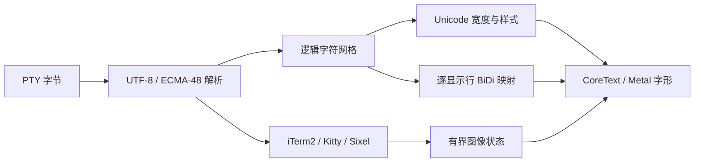

# 终端文本与图像领域

## 业务背景

Aster 的终端网格必须同时满足两个不变量：PTY、复制和搜索始终保留逻辑文本；屏幕可以按字体、Unicode BiDi 和图像协议生成不同的视觉布局。任何渲染设置都不能改写缓冲区，也不能让不可信图像输入触发无界分配。

## 领域概念与流程

- `TerminalOptions.widenedEastAsianAmbiguousBlocks` 只影响之后写入的字符；默认仅加宽 Enclosed Alphanumerics。窗口重设网格时必须保留该策略。
- `ViewLineSegment.utf16CellOffsets` 是 CoreText UTF-16 range 与终端单元之间的唯一映射。连字可以由多个逻辑单元生成一个 glyph；背景、装饰线和后续 glyph 仍按单元推进。
- `TerminalBidirectionalMap` 对每条显示行使用 CoreText 的 UAX #9 run 顺序生成逻辑列与视觉列映射。缓冲区、查找和复制不重排；鼠标命中、caret 与普通屏幕左右键使用视觉映射。
- ECMA-48 mode 8 表示应用自行布局 BiDi；启用期间停用隐式重排，reset、DECSTR 或 mode reset 恢复默认。
- blink 默认稳定显示；启用动画后只交替前景和装饰属性。SGR 5 与 6 共用 SGR 25 清除语义。Invisible 始终使用背景色且不画装饰线。

## 图像协议与失败语义

- iTerm2 OSC 1337 使用现有 PNG/JPEG/GIF 解码与单元放置链路。
- Kitty 支持 direct/file/temp、分片、zlib、RGB/RGBA/PNG、placement/query/delete 和 placeholder；单 APC、累计 base64、chunk 数、解压结果及缓存总量分别受限。CAN/SUB、非法 base64 或超限会清除 pending transfer。
- Sixel 支持 raster attributes、RGB/HLS、RLE、透明背景和 VT340 256 色默认 palette。输入、尺寸、repeat、乘法溢出及 64 MiB RGBA 位图均在分配前拒绝。

## 测试

`TerminalUnicodeRenderingTests` 覆盖宽度策略、SGR 与 blink；`TerminalBidirectionalTests` 覆盖视觉/逻辑映射、复制、方向键和 mode 8；`TerminalGraphicsTests` 覆盖 Sixel/Kitty 正常流、取消、分片和资源上限。界面视觉验收由用户执行。
