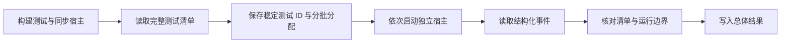

# 测试执行与完整性审计

## 背景和执行合同

Aster 的 AppKit/Ghostty 测试需要持续运行的主事件循环和 Sparkle 动态库路径。SwiftPM 的
async-main 宿主曾在没有最终汇总时提前退出；将全部 UI 用例放在同一进程还会累积由
NSApplication 保留的窗口和终端资源。使用 `scripts/test.sh` 构建一次，再通过同步
AppKit 宿主串行执行完整清单。不得以单个进程退出码 0 代替测试完整性证据。

## 命令

- 全量：`./scripts/test.sh --no-parallel`。默认每批最多 2 个测试函数，批次之间不并发。
- 定向：`./scripts/test.sh --filter <name>`。使用单宿主并保持 Swift Testing 的过滤语义。
- 调整批次：`ASTER_TEST_BATCH_SIZE=20 ./scripts/test.sh --no-parallel`，范围 1–100。
- 单进程诊断：`ASTER_TEST_BATCH_SIZE= ./scripts/test.sh --no-parallel`。此模式用于复现跨测试
  资源问题，不能忽略异常退出或缺失汇总。
- P0 实际图形桥：设置 `ASTER_SESSION_PROBE_BINARY` 为已构建的本机 `aster-session`。
  系统 PiP 的单独验收通过 `ASTER_TEST_SYSTEM_PIP=1` 开启。未开启的条件测试记录为 skipped，
  不计为已执行通过。

`ASTER_BUILD_PATH` 继续控制构建和报告根目录。过滤、重复执行及显式 event-stream/xunit
报告选项路由到单宿主。Swift Testing 的清单模式不应用过滤条件，因此分批驱动器拒绝这些
选项，不能把定向请求悄悄扩成全量。

## 完整性验证

`test-batches.py` 使用 Swift Testing v0 JSONL 事件。每批必须有且只有一个 runStarted 和
runEnded，实际测试清单必须等于分配清单；每个函数必须出现 testEnded 或明确的 testSkipped。
进程失败、记录的未知错误、缺失测试、额外测试、损坏事件和未知事件版本均使整体失败。
失败批次不会自动重试，也不会阻止其余批次交付各自证据。参数化测试的所有 case 由 Swift
Testing 在所属函数中完整运行，原始 case 事件保存在 JSONL 中。

每轮在 `.build/test-runs/<runID>/` 保存 inventory、各批 stdout/stderr、事件流和 result.json。
结果区分 completed、skipped、missing、issues；status 只有全部批次审计结束后才能从 running
变为 passed 或 failed。完整运行通过仍不替代某阶段要求的真实平台、图形或设备验收。

Python 驱动器的失败路径由 `Tests/Support/test_batches.py` 验证，每次标准测试入口先执行。
