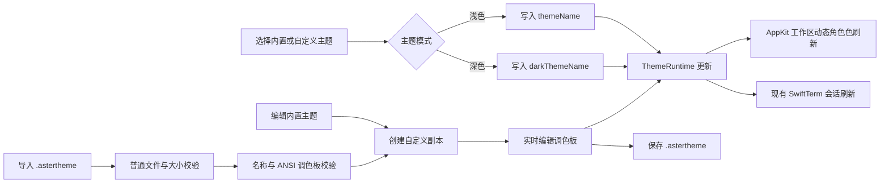

# Aster 外观主题领域与实现

## 业务背景

Aster 0.4.0 将内置主题升级为 Otty 1.3.1 的完整主题集，并由纯 AppKit 界面逐层应用。用户可以从 9 个浅色与 15 个深色预设中选择主题，实时查看终端示例，再复制为自己的主题并修改界面角色色、ANSI 16 色、光标与文本设置。主题同时作用于工作区和既有终端，不要求重启应用。

## 领域概念

- **TerminalTheme**：一个具名、可导入导出的主题，包含稳定 ID、明暗模式和完整调色板。
- **TerminalThemePalette**：分别保存终端背景/文字、界面窗口/容器/面板/表面令牌、光标及其文字、选区前景/背景和 ANSI 16 色。
- **OttyBuiltInThemes**：Otty 1.3.1 内置 `.ottytheme` 的 24 套只读真值表与缺省值级联。
- **TerminalThemeCatalog**：统一暴露内置主题，并提供按名称解析和安全回退规则。
- **TerminalThemeLibrary**：用户复制或导入的可编辑主题集合，负责唯一名称与身份。
- **TerminalThemeStyle**：保存侧栏、标题栏、标签、容器、圆角、边框、阴影、间距和原生材质等 Otty 非颜色令牌。
- **ThemeRuntime**：线程安全的界面调色板快照，为 AppKit 动态 `NSColor` 提供当前明暗主题。
- **TerminalThemeStore**：`.astertheme` 文件的唯一编解码和校验入口。

## 核心规则

1. 内置主题不可原位修改；编辑内置主题前先创建独立副本。
2. 主题名称必须非空、不得超过 128 字节，并且不能与其它内置或自定义主题重名。
3. 每个主题必须具有完整的 16 色 ANSI 调色板。
4. 导入前必须确认文件是 256 KiB 以内的普通 `.astertheme` 文件，FIFO 和设备文件不得读取。
5. 选择、复制、编辑或导入主题后，配置与用户主题库分别原子写入 `UserDefaults`。
6. 浅色和深色主题可以独立选择；关闭独立主题后，两种系统外观使用同一套主题令牌。
7. 主题变更必须同步更新 AppKit 工作区、设置窗口、终端前景/背景、ANSI 256 色派生、选区前景/背景和光标前景/文字。
8. 标签栏自动隐藏只在开启该选项且工作区只有一个标签页时生效。
9. Otty 的 `background = "none"` 必须保留为透明 RGBA；由于 SwiftTerm 的内部颜色没有 alpha，实际终端栅格使用主题自身的 `surface` 预合成，避免透明黑错误显示成纯黑。旧版 `Catppuccin` 选择迁移为 `Catppuccin Mocha`。

## 业务流程

## 关键实现

`OttyBuiltInThemes` 提供 April、Glass Light、Paper、Pink、Catppuccin Mocha、Glass Dark、Monokai Classic、Rosé Pine 等完整 24 个 Otty 1.3.1 内置主题。终端前景、背景与 ANSI 16 色使用原始色值，测试将每套主题压成 SHA-256 签名，能够发现漏主题、改名、错色和 ANSI 顺序变化。`TerminalThemeLibrary` 只保存自定义主题；复制和导入时自动生成唯一名称，编辑时拒绝与其它主题重名。

`ThemeRuntime` 使用锁保护当前浅色和深色调色板。`AsterTheme` 将 Otty 的 window、panel、surface、token foreground/secondary/tertiary 等令牌映射为动态 `NSColor` Provider，因此设置页与主工作区可以共同实时换肤；`ThemeVisualEffectView` 把 Glass 与 Vibrancy 映射为 macOS 原生 `NSVisualEffectView.Material`。

`TerminalThemeStyle` 逐项保留 Otty 的 sidebar/titlebar/tab/horizontal-tab/container 数据。AppKit 工作区根据主题设置标签高度、活动前景和背景、顶部选中线、容器圆角、边框、阴影及不同标签方向下的外边距，不再用一套固定卡片样式近似所有主题。

`TerminalSession.apply` 在每次偏好更新时同步 SwiftTerm 的默认前景/背景、选区前景/背景、光标前景/文字和 ANSI 16 色。透明终端背景通过 `renderedTerminalBackground` 使用 Otty `surface` 预合成，保留 Glass 的视觉色调且不会退化为黑色。SwiftTerm 以这 16 色派生完整 256 色调色板；光标样式和闪烁状态会更新到已经打开的终端，终端程序仍可通过 `DECSCUSR` 临时覆盖。

## 失败语义

- 文件后缀、文件类型或大小不合法：拒绝导入，不改变当前主题。
- JSON 解码或调色板不完整：显示导入失败原因，不写入用户主题库。
- 主题名称为空、过长或重复：保留编辑草稿，不覆盖已保存主题。
- 主题文件夹创建或写入失败：主题仍保存在应用配置中，同时提示文件保存失败。
- 已保存主题选择失效：按明暗模式回退到 Ayu Light 或 Ayu Dark。

## 测试重点

- 24 套内置主题的数量、名称、明暗模式，以及终端前景/背景/ANSI 16 色的 Otty 1.3.1 签名。
- Otty 显式定义的光标文字、选区前景与透明 Glass 背景不会被近似值覆盖。
- `.astertheme` 安全往返、FIFO 拒绝、名称与调色板边界。
- 自定义主题复制、唯一命名、编辑与重名拒绝。
- 主题选择的自定义优先与同模式回退。
- 单标签自动隐藏与多标签恢复标签栏。
