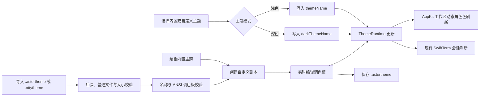

# Aster 外观主题领域与实现

## 业务背景

Aster 0.4.0 将内置主题升级为 Otty 1.3.1 的完整主题集，并由纯 AppKit 界面逐层应用。用户可以从 9 个浅色与 15 个深色预设中选择主题，实时查看终端示例，再复制为自己的主题并修改界面角色色、ANSI 16 色、光标与文本设置。主题同时作用于工作区和既有终端，不要求重启应用。

## 领域概念

- **TerminalTheme**：一个具名、可导入导出的主题，包含稳定 ID、明暗模式和完整调色板。
- **TerminalThemePalette**：分别保存终端背景/文字、界面窗口/容器/面板/表面令牌、光标及其文字、选区前景/背景和 ANSI 16 色。
- **OttyBuiltInThemes**：Otty 1.3.1 内置 `.ottytheme` 的 24 套只读真值表与缺省值级联。
- **TerminalThemeCatalog**：统一暴露内置主题，并提供按名称解析和安全回退规则。
- **TerminalThemeLibrary**：用户复制或导入的可编辑主题集合，负责唯一名称与身份。
- **TerminalThemeStyle**：保存侧栏、标题栏、标签、容器、圆角、边框、阴影、间距、原生材质和主题字体候选等 Otty 非颜色令牌。
- **ThemeRuntime**：线程安全的界面调色板快照，为 AppKit 动态 `NSColor` 提供当前明暗主题。
- **TerminalThemeStore**：`.astertheme` 与 `.ottytheme` 文件的统一安全读取、编解码和校验入口。
- **OttyThemeParser**：只解析主题所需 TOML 子集的无副作用解析器；未知键被忽略，不执行外部命令，也不读取主题引用之外的文件。
- **ThemeColorOverrides / ThemeOverrideLibrary**：用户对某套主题的颜色覆盖（按 `ThemeColorSlot.id` 记录），按主题 ID 存放。生效主题 = 基础主题 `applyingOverrides(_:)`。
- **OttyThemeKeyMap / ThemeOverrideFileWriter**：覆盖写回 `.ottytheme` 时的键映射与追加段规则。
- **ThemeColorSlot / ThemeColorGroup**：主题详情色板的 token 真值表（`TerminalTheme.colorSlots`）。每个 slot 同时给出 `value`（主题显式声明的值，`nil` 表示未声明）与 `resolved`（当前实际生效色），`kind` 区分实心填充与只描边的 border token。`applyingColor(_:toSlot:)` 是配套的写回入口。

## 核心规则

1. 内置主题不可原位修改。**改单个颜色写覆盖层，不复制整套主题**：内置的 24 套是 Otty 只读真值表，复制会让主题列表被「副本」堆满，副本还会与上游脱钩；覆盖只记用户显式改过的 token，清掉即完整回到原主题。整套改造（改名、换模式、批量调色）仍走「编辑当前主题」的副本流程。
2. 主题名称必须非空、不得超过 128 字节，并且不能与其它内置或自定义主题重名。
3. 每个主题必须具有完整的 16 色 ANSI 调色板。
4. 导入前必须确认文件是 256 KiB 以内的普通 `.astertheme` 或 `.ottytheme` 文件；符号链接、FIFO 和设备文件不得读取。
5. 选择、复制、编辑或导入主题后，配置与用户主题库分别原子写入 `UserDefaults`。
6. 浅色和深色主题可以独立选择；关闭独立主题后，两种系统外观使用同一套主题令牌。
7. 主题变更必须同步更新 AppKit 工作区、设置窗口、终端前景/背景、ANSI 256 色派生、选区前景/背景和光标前景/文字。
8. 标签栏自动隐藏只在开启该选项且工作区只有一个标签页时生效。
9. Otty 的 `background = "none"` 必须保留为透明 RGBA；由于 SwiftTerm 的内部颜色没有 alpha，实际终端栅格使用主题自身的 `surface` 预合成，避免透明黑错误显示成纯黑。旧版 `Catppuccin` 选择迁移为 `Catppuccin Mocha`。
10. 字体按“全局角色字体 → 主题 `token.font-mono` → JetBrains Mono”解析，粗体、斜体、粗斜体允许独立覆盖；Nerd Symbols 与用户回退字体只参与缺字级联，不替换正文主字体。
11. 光标的“默认”闪烁模式允许终端程序通过 DECSCUSR 临时调整形状和闪烁；“始终”模式固定用户选择。颜色覆盖、不透明度、平滑动画和失焦停止闪烁均在两种模式下生效。

## 业务流程

## 关键实现

`OttyBuiltInThemes` 提供 April、Glass Light、Paper、Pink、Catppuccin Mocha、Glass Dark、Monokai Classic、Rosé Pine 等完整 24 个 Otty 1.3.1 内置主题。终端前景、背景与 ANSI 16 色使用原始色值，测试将每套主题压成 SHA-256 签名，能够发现漏主题、改名、错色和 ANSI 顺序变化。`TerminalThemeLibrary` 只保存自定义主题；复制和导入时自动生成唯一名称，编辑时拒绝与其它主题重名。

`OttyThemeParser` 将 Otty 主题中的 `meta`、`terminal`、`token`、`window`、`panel`、`sidebar`、`titlebar`、`tab-bar`、`tab`、`tab-bar.tab`、`container` 等令牌映射到领域模型；水平标签未覆盖的字段按 Otty 规则继承 `[tab]`。解析器支持主题实际使用的十六进制颜色、`rgba()`、`none`、边框、阴影与间距表达式；所有外部数值先检查有限性并约束到渲染安全范围，避免 NaN、Infinity 或超大值进入 AppKit。`meta.mode` 缺失时按可见终端背景的相对亮度推断，非法枚举则拒绝导入。导入后仍统一经过名称、模式和 ANSI 16 色完整性校验。内置主题继续由版本化 Swift 真值表提供，避免应用启动依赖用户的 `~/.config/otty/themes`；该目录中的主题可由用户显式导入。

颜色覆盖的读写只有一条路径：`AppPreferences.resolved(_:)` 把覆盖叠到基础主题上，`lightTheme` / `darkTheme` / `themes(for:)` 全部经过它——任何绕过它的读取都会让终端与界面看到不同版本的同一套主题。覆盖持久化在 `aster.theme-overrides.v1`，并同步写进主题文件夹里的同名 `.ottytheme`：文件保留原主题内容不动，末尾以 `# --- aster overrides (managed) ---` 起一段，每个键前带 `# otty-added: <section>.<key>` 注释，用户能直接看出哪些行是 Aster 写的、删掉某行即撤销该条覆盖。重写前先按 marker 截断上一轮内容，否则同一个键会在文件尾部越堆越多。`interface.*` 这类 Aster 自有的界面 token 在 Otty 里没有对应键，只留在应用内的覆盖表、不写进文件。覆盖应用顺序按 key 排序固定：`sidebar.foreground` 与 `interface.foreground` 写的是同一个字段，字典遍历顺序不稳定会让结果抖动。

`ThemeRuntime` 使用锁保护当前浅色和深色调色板。`AsterTheme` 将 Otty 的 window、panel、surface、token foreground/secondary/tertiary 等令牌映射为动态 `NSColor` Provider，因此设置页与主工作区可以共同实时换肤；`ThemeVisualEffectView` 把 Glass 与 Vibrancy 映射为 macOS 原生 `NSVisualEffectView.Material`。

`TerminalThemeStyle` 逐项保留 Otty 的 sidebar/titlebar/tab/horizontal-tab/container 数据。AppKit 工作区根据主题设置标签高度、活动前景和背景、顶部选中线、容器圆角、边框、阴影及不同标签方向下的外边距，不再用一套固定卡片样式近似所有主题。

容器背景的解析遵循「与终端画布连续」：主题未显式声明 `container` 时回退到终端背景本身（透明 `none` 保持透明以透出玻璃材质），**不借用 panel** —— panel 是侧栏等面板的底色，借用它会让 April 这类「panel 灰绿 + 终端纯白」的主题在右侧内容区套上一层 panel 色，与终端画布视觉割裂。

`TerminalSession.apply` 在每次偏好更新时同步 SwiftTerm 的四种角色字体、默认前景/背景、选区前景/背景、光标前景/文字、光标不透明度和 ANSI 16 色。主题字体栈会依次跳过未安装字体，遇到首个可用字体或 generic `monospace` 才结束解析。透明终端背景通过 `renderedTerminalBackground` 使用 Otty `surface` 预合成，保留 Glass 的视觉色调且不会退化为黑色。SwiftTerm 以这 16 色派生完整 256 色调色板。下划线渲染、字体平滑、连字、行高和 SGR 闪烁同样立即作用于已有会话；行高扩大的是终端网格和行间留白，竖线光标仍按未放大的字体自然高度从基线侧对齐，避免伸入上一行。Metal 路径在平滑策略变化时同时清空 glyph atlas 与行缓存，避免继续显示旧策略生成的字形。

`AsterTerminalView` 保存程序最近一次 DECSCUSR 请求：`default-off/default-on` 以用户设定作为初始状态，之后接受程序控制；`always-off/always-on` 在 SwiftTerm 回调完成后重新固定用户形状，避免其后写入覆盖配置。窗口失焦时实际光标使用同形状的非闪烁变体。空心方块在 AppKit caret、共享栅格和 Metal 绘制路径都有独立轮廓；AppKit caret 与 Metal renderer 都会为同一行的短距离移动做 100 ms 插值，并在“减少动态效果”开启时自动停用。

## 失败语义

- 文件后缀、文件类型或大小不合法：拒绝导入，不改变当前主题。
- JSON/TOML 解码或调色板不完整：显示导入失败原因，不写入用户主题库。
- 主题名称为空、过长或重复：保留编辑草稿，不覆盖已保存主题。
- 主题文件夹创建或写入失败：主题仍保存在应用配置中，同时提示文件保存失败。
- 已保存主题选择失效：按明暗模式回退到 Ayu Light 或 Ayu Dark。

## 测试重点

- 24 套内置主题的数量、名称、明暗模式，以及终端前景/背景/ANSI 16 色的 Otty 1.3.1 签名。
- Otty 显式定义的光标文字、选区前景与透明 Glass 背景不会被近似值覆盖。
- `.astertheme` 安全往返，以及 `.ottytheme` 的颜色、样式、字体映射和 ANSI 调色板完整性。
- 符号链接、FIFO、设备文件、超限文件与不支持后缀均在读取内容前拒绝。
- 字体角色解析、主题候选跳过、用户回退顺序、光标颜色/文字色/不透明度，以及 Default/Always 的 DECSCUSR 优先级。
- Otty `tab-bar.tab` 继承、缺失 mode 的亮度推断，以及非有限/超范围布局数值的安全规范化。
- 自定义主题复制、唯一命名、编辑与重名拒绝。
- 主题选择的自定义优先与同模式回退。
- 单标签自动隐藏与多标签恢复标签栏。
