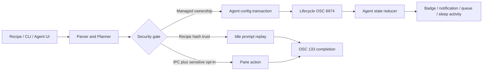

# Workflows 与 Agent 领域设计

## 业务背景

Aster 把 Otty 的工作区流程、CLI 与代码 Agent 能力放在同一安全边界内：用户可以恢复布局、重放 Recipe、从 Shell 控制 Pane，并在终端旁管理 Agent，但外部文件、历史记录和 lifecycle hook 均视为不可信输入。

> Ghostty 切换期间，公开嵌入接口无法观察原始 OSC 6974 和逐字节输入/输出；因此自动
> Prompt Queue 派发、精确 Agent 状态和 inline Autocomplete 暂停。手动发送、Composer、
> 历史、恢复/Fork 与安全 IPC 仍保留。下述 lifecycle 规则是恢复该能力时必须满足的契约。

## 领域概念

- `WorkflowRecipe`：可移植的 tab/window、Pane 树、内容级别和可选命令；不含 PID、FD 或运行对象。
- `WorkflowRecipeTrustStore`：按规范化内容 SHA-256 记录信任，不按路径授权。
- `WorkflowCLIAction`：已解析、有限大小的 CLI 意图；交付层再执行 IPC 和敏感会话门禁。
- `WorkflowSessionRecoveryPlanner`：根据正常退出、崩溃、更新和 crash loop 决定恢复行为。
- `AgentProvider` / `AgentSetupPlan`：八类 provider（含 Grok Build）的能力和最小增量安装步骤。
- `AgentTaskStateReducer`：按单调 lifecycle sequence 折叠 `processing / awaiting-input / idle`。
- `AgentComposerState` / `AgentPromptQueue`：Pane 级草稿、附件和由用户显式发送的临时 Prompt 列表。

## 核心规则

1. Recipe 导入拒绝符号链接、特殊文件、超限文本和越界资源；精确布局载荷受独立深度/字节预算约束，实例化时重建 Pane UUID。命令审查必须展示完整集合，逐条模式在每次写 PTY 前单独授权。
2. CLI 使用当前用户专属 `0600` token、私有目录和原子 request/response 文件；`send/run/exec` 还需用户开启 IPC，SSH/sudo Pane 需第二层授权。启动时及每次目录事件消费前都会鉴权回收崩溃遗留的 `.processing` 请求并返回确定失败；正常路径由 vnode 事件唤醒，只有监听建立失败时才回退到 100ms 轮询。
3. 工作区快照只保存描述符。主窗口和最多 16 个 UUID suite 附加窗口可恢复；用户主动关闭的附加窗口立即删除其 suite。退出先确认全部窗口，再统一写快照和终止 PTY，取消时不得部分提交。
4. Agent 安装/卸载只修改 Aster managed JSON 项、TOML marker 区块或独立 artifact；不得覆盖用户 hook。Codex hooks 默认启用；用户显式关闭时，安装操作只把 `[features].hooks` 改为 `true`。Aster 0.4.1 曾写入的非法顶层 `hooks` 布尔值会在下次安装时迁移，卸载不改 feature 设置。
5. lifecycle hook 只向所属 TTY 写有界 OSC 6974 状态，不记录 prompt、tool 参数或输出。
6. Send to Chat 可同时携带当前终端选区与可见 scrollback 尾部；面板只列出当前工作区中仍运行的 Claude Code/Codex Pane。每项先清除控制字符、遮盖常见 secret、按 UTF-8 字节限制，再包装为 `untrusted-context`；点击 Send 模拟键入目标输入框，不发送 Return。
7. 自定义 Agent 启动命令保存为 argv。恢复、Fork 和新建会话统一经 shell 参数编码器，不重新解释任意 shell 源码。
8. Prompt Queue 对活动终端 Pane 提供精简底部输入条，不依赖 Claude/Codex 的瞬时识别状态。普通 Return 或右下角上箭头只把草稿加入列表；写入 Agent 时按目标是否协商过 bracketed paste（DECSET 2004）选择编码，并在文本之后单独延时投递 Return。发送失败时保留该项，关闭输入条不会清空本次运行的列表或草稿。
9. 队列的常规发送路径是 lifecycle hook 驱动的自动派发：只有 hook 已成为该 Pane 的权威状态源（`hasAuthoritativeAgentLifecycle`）且报告 `idle` 时才写入队首。`processing` 期间只排队；`awaiting-input` 同样不派发 —— 它来自 PermissionRequest hook，屏幕上是权限确认选择器，回车等于替用户批准一次工具调用。未安装 hook 时，命令启动、用户输入和 PTY 输出只在 5 秒静默窗口内作为回退 processing 证据；输出探针推断出的 idle 只清除 UI 徽章，不参与派发，避免打断运行中的 TUI。
10. 写入 Agent 输入框的编码由目标决定，不由调用方强制：`AsterTerminalView.typePromptText` 读取 `terminal.bracketedPasteMode`，协商过就按粘贴块投递，未协商才发裸 UTF-8。Claude Code / Codex 的输入框协商 2004 后会把裸字节流按逐键解释，`/`、`@`、方向键和候选列表会吃掉内容，表现为“点了发送但输入框没变化”。Prompt Queue 的 Return 在文本之后延时 60ms 单独发送 —— 同批到达的 CR 会被算进粘贴内容变成换行，只换行不提交。
11. 自动派发严格单 in-flight：派发后必须观察到该轮从 `processing`/`awaiting-input` 回到 `idle` 才发下一条，防止多条 prompt 挤进同一轮对话。写入失败时 `restoreInFlight()` 把 prompt 放回队首并释放锁。每项左侧的发送图标是用户显式插队通道，不受 in-flight 锁与 hook 权威性限制。
12. Agent 会话标题投影：Pane 经 OSC 6974 精确绑定 provider + session ID 后，`AppModel.refreshAgentSessionTitles` 从已扫描历史匹配会话标题（清洗后仍等于文件名视为无标题），投影到标签行展示名与标题栏胶囊；用户固定标签名优先级更高。禁止目录/最近历史等松散匹配 —— 会把别的会话标题标到当前 Pane。标题是运行态，不进快照；未命中时按 5 秒节流触发一次历史重扫（transcript 在首条 prompt 后才出现）。更新走 `titleChanged` 局部通道，不进 `objectWillChange`。
13. 历史会话以标签承载（Otty 对齐）：Agent 历史浮层的 `↩`/「打开」调用 `AppModel.openAgentTranscriptTab`，经 `openResource(.view, .newTab)` 的安全校验开只读 transcript 预览标签，标签名写入清洗后的会话标题（`.name` 覆盖，随快照恢复）；同一 transcript 已有标签时只聚焦不重建。Resume / Fork 仍是显式动作，分别在浮层 footer 与 transcript 页头提供。transcript 正文由 `AgentTranscriptHTML` 在主线程外拼装、在与 Markdown 预览同源的加固 WKWebView（无 JS、CSP 锁死、无网络）中渲染：用户消息转义进卡片、assistant 消息走 swift-markdown HTMLFormatter、连续 toolCall/Reasoning/System 折叠为原生 `<details>` 摘要；单条 4,000 / 总量 400,000 字符双重上限，超限显式标注。禁止回到逐条 NSTextField 的实现——大会话会卡死主线程。
15. Pane 底部 Agent 用量条只展示、不做任何自动行为（不阻止发送、不通知、不参与派发）。数据由 `TerminalSession.agentUsage` 发布，**不进 `TerminalTabItem.objectWillChange`**（statusLine 每 ≥300ms 重发一次，走聚合会按该频率重建工作区）；`WorkspaceView` 按 Pane 订阅并对 `AgentUsageBarView` 原地 `apply`，`AgentUsageSnapshot` 的 `==` 刻意忽略 `updatedAt` 以抑制同值重发。条挂在 `ActivePaneHostView.setStatusStrip`（底部第二槽，Prompt Queue 的 `setBottomAccessory` 在其上，内容底边跟随最上面的槽，约束链整体重建），高度 20pt 显式常量。
14. Shell 菜单的 Agent 子菜单只读取当前窗口、当前标签、当前聚焦 Pane 的 `activeAgentProvider` 与 `activeAgentSessionID`，并在 `menuNeedsUpdate` 时重建。不得回退到同标签其它 Pane、窗口聚合状态或最近历史。provider 已识别但 session ID 尚未关联时保留身份与历史入口，复制和 Fork 明确禁用；支持 Fork 后可选择四向分屏、新标签或新窗口。子菜单的「查看会话历史」经 `AppModel.presentAgentHistory(scopedTo:)` 打开历史浮层并**过滤到当前项目**：项目目录优先取已绑定会话在历史里的归属（provider + session ID 精确匹配），尚未关联时退回该 Pane 工作目录；匹配用 `AgentSessionMetadata.belongsToProject`（两侧经 `normalizedAbsolutePath` 归一化后等值比较，归一化失败一律不匹配）。过滤范围随每次呈现重设——命令面板等无参入口（`presentAgentHistory()`）显示全部历史；浮层内搜索也只在过滤后的集合内进行。全局 Shell 菜单的「Agent 历史」条目已移除。

## 业务流程



## 关键实现

领域代码位于 `Sources/AsterCore/Workflow*.swift` 与 `Agent*.swift`。`WorkflowRuntimeService` 负责 Recipe 普通文件读取和 TOML 交付；`WorkflowRecipeWorkspaceMapper` 在完整 `PaneLayout` 上转换可移植路径，并为每次实例化重建运行身份。`AsterCLIRequestService` 负责鉴权传输和中断请求恢复；`AppModel.executeWorkflowCLI` 执行已验证意图，并等待 OSC 133 返回真实退出码。`AdditionalWorkspaceWindowRegistry` 限制附加窗口恢复域，跨窗口标签转移直接移动 `TerminalTabItem`，保留 PTY 与滚动历史。

`AgentSetupService` 对所有目标先做祖先 symlink、文件类型、大小、格式和竞争变化检查，再原子写入；失败按相反顺序回滚。`Resources/agent-integration/aster-agent-hook.sh` 与生成的 plugin/extension 只上报生命周期，以及 provider 明确提供时由 ASCII 白名单和 128 字节上限约束的 `SessionID`；Codex/Claude command hook 的 stdin JSON 最多读取 256 KiB，只通过系统 `plutil` 提取顶层 `session_id`，prompt、tool 参数和输出不会进入 OSC。Grok Build 与 Claude Code 共用 `~/.claude/settings.json`：hook 根据 `GROK_HOOK_EVENT` / `GROK_SESSION_ID` 判断调用方，对不上就排空 stdin 后退出；Grok 的 session id 优先取注入的 `GROK_SESSION_ID`。OSC 6974 现在承载三类载荷，接收点先试 `TerminalBadgeDirective`、再 `AgentTerminalDirective`、最后 `AgentUsageDirective`，三者键集合互斥、顺序无关，共用 256 字节上限。`AgentUsageDirective`（`Sources/AsterCore/AgentUsage.swift`）形如 `AgentUsage=1;Provider=claudeCode;FiveHour=42:1788748005;SevenDay=13:…;Session=57`：键白名单 `{AgentUsage, Provider, FiveHour, SevenDay, Session}`，值只接受 `^[0-9]{1,3}(:[0-9]{1,12})?$`，任一项不合法整条拒绝。Claude Code 的 5h/7d 配额只存在于 statusLine stdin JSON（`.rate_limits.five_hour|seven_day.{used_percentage,resets_at}`、`.context_window.used_percentage`），磁盘上没有副本，因此 `AgentSetupService` 提供受管 statusLine 步骤（`AgentSetupStep.manageStatusLine`，Planner 只对 `claudeCode` 且 `managedStatusLineInstalled == false` 追加，不要求重启）：把 `~/.claude/settings.json` 的 `statusLine` 换成 `/bin/sh '<hook>' statusline claudeCode`（保留用户 `padding`），原值（或 `null`）写到 side file `~/Library/Application Support/Aster/agent-integration/claude-statusline.json`；hook 脚本的 `statusline` 子命令一次性吞下 stdin，用 `plutil` 提取整数百分比/epoch 拼成同一格式的 `AgentUsage=…` 一行，再把原 JSON 喂给 side file 里的原命令并透传 stdout。**statusLine 不能走 OSC**：Claude 启动 statusLine 命令时脱离控制终端（进程 TTY 为 `??`，打开 `/dev/tty` 报 Device not configured），与 lifecycle hook 不同；因此包装器按 Aster 注入的 `ASTER_SESSION_ID`（pane UUID，校验 36 位十六进制/连字符）把那一行原子写到 `~/Library/Application Support/Aster/agent-usage/<pane-uuid>.usage`（临时文件 + mv；不在 Aster 里运行则不写）。`AgentUsageFileStore`（进程单例，测试可注入目录）用 vnode 监听该目录，200ms 去抖后后台读全部文件（≤256 个、≤512 字节、只认普通文件、内容必须能通过 `AgentUsageDirective` 解析）按 pane UUID 分发；`TerminalSession` 在创建终端视图时订阅，只接受 mtime 不早于订阅时刻的文件（Aster 崩溃遗留的旧文件不能把新 shell pane 标成 Claude），provider 结束或 Pane 关闭时删除自己的文件，超过 7 天的文件扫描时清理。hooks 与 statusLine 同在一个文件，`prepareEdits` 按 target 合并成一次写入（否则第二个 edit 的 `original` 过期会报 `configurationChanged`）；卸载只在 `statusLine` 仍等于生成值时恢复，side file 在 settings 写回成功后复验字节再删除；用户已自行改掉则不动；`uninstall(.grokBuild)` 不触碰 statusLine。`integrationInstalled` 仍只看 hooks，老用户通过设置页「Claude 用量上报」动作单独接管/恢复；关闭「用量条」开关只隐藏，不卸载。Codex 的配额随每次模型响应追加在 `~/.codex/sessions/**/rollout-*.jsonl` 的 `event_msg/token_count`（`rate_limits.primary/secondary{used_percent, window_minutes, resets_at}`，300=5h、10080=周，槽位与窗口无固定对应且可为 null，一律按 `window_minutes` 归类；会话占比 = `last_token_usage.total_tokens - reasoning_output_tokens` / `model_context_window`）。`CodexUsageFileMonitor` 在 session ID 绑定后经 `AgentTranscriptIngestion.locateTranscript` 后台定位（rollout 晚于 SessionStart 出现，按 1/2/4/8/8s 重试），用 `FileSystemDirectoryWatcher(file:)` 的 vnode 事件 300ms 去抖后读尾部 64 KiB 交给 `CodexRolloutUsageParser`；无 session ID 不猜文件。

`AgentHistoryDiscoveryService` 有界读取已知 provider 路径；Resume/Fork 由 `AgentSessionCommandPlanner` 保留 provider、model 和 system prompt 元数据。`FocusedAgentSessionContext` 冻结菜单动作所需的 provider、session ID 和 CWD，菜单载荷同时保留展开菜单时的工作区模型，防止菜单跟踪期间 key window 变化后把 Fork 路由到其它窗口；`AgentContinuationPlacement` 把 Fork 明确路由到当前新窗口 Pane、新标签或指定方向分屏，新 PTY 就绪后才发送 provider 原生命令。

设置页的 CLI 探测不假设 GUI 进程继承登录 shell 的 `PATH`。它先保留现有 PATH
顺序，再有界补查 `~/.local/bin`、Homebrew、nvm/fnm、asdf、mise、Volta、Bun 与
pnpm 的常见 bin 目录；不会启动登录 shell 或执行用户 rc 文件。快照下发探测到的
绝对入口路径，且 CLI 路径与 Aster managed lifecycle 集成状态分别呈现：切换 Node
版本造成 CLI 暂不可见时，已经存在的受管集成不会被误报为未安装。

内置 `AsterNerdSymbols-Regular.ttf` 以进程级 CoreText 注册，并作为终端基础字体 cascade fallback；来源和许可证见 `THIRD-PARTY-NOTICES.md`。

### Project Memory MCP

`aster-memory-mcp`（target `AsterMemoryMCP`）是独立可执行文件，通过 stdio JSON-RPC 2.0 把
Session Memory 暴露给任何支持 MCP 的 Agent，协议版本 `2025-06-18`。它以
`SQLITE_OPEN_READONLY` 打开数据库，**Aster 未运行时同样可查**；打开时用
`PRAGMA user_version` 与 `MemorySchema.currentVersion` 握手，不匹配返回结构化 `isError`
而不是崩溃。领域与存储契约见 [Session Memory 与 Context 领域](session-memory-domain.md)。

P0 工具：`search_memory`、`get_project_context`、`get_session`、`get_related_history`、
`get_task`、`get_recent_commands`。`project_path` 缺省取 MCP 进程的 `getcwd()`
（Claude Code / Codex 都在项目根目录 spawn server），传 `"*"` 表示跨全部项目。
参数经 `MCPArguments` 限长与 UUID 校验，输出经 `MCPRenderer` 清除控制字符并施加总长上限。

每次成功的 `tools/call` 由 `ContextReceiptWriter` 追加一条 `ContextReceipt`
（`trigger=agent_query`、`delivery=mcp`）。这是单写者约定的**唯一例外**：短生命周期读写
连接、只触碰 `context_receipts` 一张表、失败静默——留痕失败绝不能让 Agent 的查询失败。

`MCPInstallService` 负责注册：读-改-写项目的 `.mcp.json`，**只管理 `aster-memory` 一项并
保留用户已有的其它 server**，原子发布，拒绝符号链接与非普通文件（沿用
`AsterCLIRequestService` 的 `O_NOFOLLOW` + `fstat` 校验范式）。可执行文件优先取 app bundle
内路径，SwiftPM 调试环境回落 `.build`。Codex 侧只生成需要用户自己粘贴的配置文本，
**不自动修改 `~/.codex/config.toml`** —— 与 Agent 集成安装同样的所有权边界。

> 路径陷阱：`URL.resolvingSymlinksInPath()` 在解析符号链接之后还会去掉开头的 `/private`，
> 因此它与子进程 `getcwd()` 的结果不相等。跨进程比较路径必须用 `realpath()`。
> 生产路径本身一致（录制侧用 git toplevel、MCP 侧用 getcwd，都是物理路径），
> 只有测试构造临时目录时会踩到。

### Agent 控制 API

Aster 运行时在 `~/Library/Application Support/Aster/Control/aster.sock` 监听一个 Unix domain
socket（目录 `0700`、socket `0600`，`accept` 后用 `getpeereid` 校验对端 uid，不监听网络端口）。
线格式是 NDJSON：每行一个 JSON 对象，请求 `{"id": 1, "method": "agent.list", "params": {...},
"protocol": 1}`，响应 `{"id": 1, "result": {...}}` 或 `{"id": 1, "error": {"code": "...",
"message": "..."}}`；`id` 原样回传，单行上限 1 MiB（超限回 `request_too_large` 并断开）。
协议定义集中在 `Sources/AsterCore/AsterControlProtocol.swift`（信封、方法、params/result、
错误码、事件），服务端在 `Sources/Aster/Control/`，CLI 在 `Sources/AsterCLI/`。

| 方法 | 写 | 说明 |
| --- | --- | --- |
| `server.ping` | 否 | 协议版本、App 版本、pid |
| `session.snapshot` | 否 | 窗口 → 标签 → pane 三级树 + 当前事件序列号 |
| `agent.list` / `agent.get` / `agent.read` | 否 | 正在运行的 agent、单个详情、读其 pane 屏幕 |
| `agent.prompt` | 是 | 提交 prompt（bracketed paste + 回车）；可带 `wait` 挂起直到状态到达 |
| `agent.wait` | 否 | 等待 agent 到达 `until` 中任一状态（默认 idle/done/blocked） |
| `agent.send_keys` / `agent.focus` / `agent.start` | 是 | 按键、聚焦并标记「已看见」、在空闲 shell pane 启动 agent |
| `pane.read` / `pane.wait_for_output` | 否 | 读任意终端 pane（`visible`/`recent`，≤10 000 行）、轮询等待子串或正则命中 |
| `pane.send_text` / `pane.send_keys` / `pane.focus` | 是 | 向 pane 写可打印文本 / 逻辑按键、聚焦 |
| `events.subscribe` / `events.wait` | 否 | 长连接推送 / 阻塞等下一条事件（`after_sequence` 补漏） |
| `notification.show` | 是 | 系统通知（标题 256 字节、正文 1 KiB，剥离控制字符） |
| `workflow.execute` | 是 | 旧 `aster open/view/edit/watch/jump/learn/ignore/pane run|exec|capture` 语法桥接到 `WorkflowCLIParser`，返回 `{stdout, stderr, exit_code}` |

**ID 与 selector**：窗口 `w1`、标签 `w1:t2`、pane `w1:p5` 是稳定短 ID，由
`ControlIdentityRegistry` 分配、只增不复用，标签跨窗口转移后旧 ID 仍作为别名可用。`target`/`pane`
字段接受短 ID、`p_<UUID>`、UUID、agent 名（`[a-z][a-z0-9_-]{0,31}`）或 `current`（连接携带的
`ASTER_PANE_ID`，否则焦点 pane）。

**Agent 状态**：`idle` / `working` / `blocked`（等待用户输入）/ `done`（已完成且用户尚未看见，
对应 `agentTaskCompletionUnread`）/ `unknown`；`detection` 标明来源：`hook`（lifecycle hook，权威）、
`screen`（屏幕扫描）、`heuristic`（静默启发式，纯启发式的 idle 会降级为 unknown）。
事件 `pane.created` / `pane.updated` / `pane.closed` / `pane.focused` / `pane.exited` /
`pane.agent_status_changed` 以 `{"sequence": n, "event": "...", "data": {...}}` 推送，
`state_change_seq` 随每次状态变化递增。

**环境变量**：每个 pane 子进程注入 `ASTER_ENV=1`、`ASTER_SOCKET_PATH`、`ASTER_BIN_PATH`
（`aster-cli` 路径，开发构建可能缺省）、`ASTER_WINDOW_ID` / `ASTER_TAB_ID` / `ASTER_PANE_ID`（短 ID），
并保留 0.4.x 的 `ASTER_SESSION_ID` 别名（见 `TerminalControlContext`）。socket 被另一实例占用时
第二个实例不注入 `ASTER_ENV`。

**安全门禁**（`AsterControlWriteGate`，与旧 CLI 的 `permitsWorkflowCLIWrite` 同源）：写方法需
「设置 → 控制 → IPC 允许发送输入」，否则 `write_not_allowed`；SSH/sudo 等敏感会话还需
「允许敏感会话」，否则 `sensitive_session_not_allowed`；只读模式等阻断返回 `write_rejected`。
`agent.prompt` 对 `blocked` 的 agent 不写入（`agent_blocked`）；`agent.start` 要求 pane 没有前台
命令且没有 agent，否则 `pane_busy`；`name` 与某个存活 agent 重名则 `agent_name_taken`（换个名字重试，
不会启动第二份）。`events.wait` 的 `after_sequence` 早于 512 条回放环的最旧一条时返回 `replay_gap`：
中间的事件已经丢了，客户端应重新 `session.snapshot` 拿到当前 `sequence` 再继续等，而不是从旧序列号硬追。
其它错误码：`parse_error`、`invalid_request`、`method_not_found`、`invalid_params`、
`request_too_large`、`protocol_mismatch`、`not_found`、`pane_not_terminal`、`pane_not_running`、
`agent_not_found`、`agent_not_ready`、`agent_prompt_stalled`、`agent_not_running`、`timeout`、
`too_many_waits`（每连接最多 4 个待决等待）、`internal_error`。
所有 `timeout_ms` 上限 600 000 ms，超出即 clamp。

手测：

```bash
S="$HOME/Library/Application Support/Aster/Control/aster.sock"
printf '{"id":1,"method":"server.ping"}\n' | nc -U "$S"
printf '{"id":2,"method":"pane.read","params":{"pane":"current","lines":20}}\n' | nc -U "$S"
(printf '{"id":3,"method":"events.subscribe"}\n'; cat) | nc -U "$S"
```

**CLI 与安装**：`aster-cli`（target `AsterCLI`，只依赖 AsterCore）是阻塞 POSIX socket 客户端：
`--socket` > `ASTER_SOCKET_PATH` > 默认路径；连不上时 `open -gj <bundle>` 拉起 App 并等 5 s；
退出码 0 成功 / 1 服务端 error（stderr 打印 error JSON）/ 2 参数错 / 69 不可达。`agent.*`、
`events.*`、`notification.*` 在 `ASTER_ENV != 1` 时拒绝（`--allow-outside` 例外）；`watch` 与
`tab badge` 不经 socket，直接向 `/dev/tty` 写 OSC。`AsterCLIInstaller` 把 `/usr/local/bin/aster`
（不可写则 `~/.local/bin/aster`）做成指向 bundle 内 `aster-cli` 的 symlink（临时链接 + rename），
识别并覆盖旧版 sh 启动器，拒绝覆盖来历不明的文件。`AgentSkillInstallService` 把
`Resources/skills/aster/` 复制到 `~/.claude/skills/aster` 或 `~/.codex/skills/aster`，
写 `.aster-skill-version`（App 版本 + SKILL.md sha256）；只接管带标记的目录，符号链接一律拒绝。

## 失败语义

- 无法验证 Recipe、CLI token、Agent 配置所有权或文件身份：拒绝操作，不做部分写入。
- CLI 目标 Pane 不存在、未空闲、输出超限或无权限：返回非零退出码和 stderr；不隐式选择其它 Pane，也不把读取失败伪装成空成功。
- Agent hook 缺失：退化为进程/提示检测，不伪造精确状态；Shell 菜单可以显示已识别的 provider，但在没有可信 session ID 时禁用复制与 Fork。
- Agent 历史损坏或超限：跳过该记录，其它 provider 仍可使用。
- 用量条：rollout 找不到、被删除或改名时条消失而不报错；side file 缺失或原 statusLine 为 null 时 Claude 状态行显示为空，用量仍上报；statusLine 不是对象时拒绝接管且不写任何文件。
- Agent 历史的列表标题由 `AgentSessionTitleCleaner` 从用户消息序列推导：caveat/系统提醒等
  模板包装段整段丢弃，内容型标签只剥壳保留内文，全部为噪音时回落 transcript 文件名——
  provider 注入的 XML 风格包装串不得泄漏到历史列表。浮层 chrome（圆角/描边/layer 投影）
  与命令面板、Open Quickly 保持同一套。
- 窗口创建失败：CLI 返回失败；跨窗口标签移动会把原 Tab 放回源模型。

## 测试与验收

纯领域测试覆盖 Recipe TOML/信任、CLI 解析、恢复策略、Agent provider/状态/Composer/队列/上下文与窗口 suite 规范化；AppKit 目标测试覆盖文件传输、Agent 安装卸载、lifecycle、跨标签聊天目标、Shell 菜单随 Pane 焦点切换、Fork 落点与跨窗口路由、预填边界和 AppModel 路由。发布前运行 `swift test --no-parallel`、warnings-as-errors 构建、App 打包与签名验证。按项目要求不执行 UI 自动化，视觉清单见 `docs/developer/design-qa.md`。
