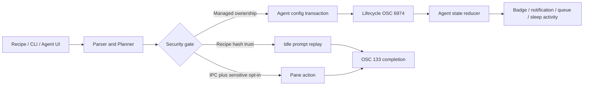

# Workflows 与 Agent 领域设计

## 业务背景

Aster 把 Otty 的工作区流程、CLI 与代码 Agent 能力放在同一安全边界内：用户可以恢复布局、重放 Recipe、从 Shell 控制 Pane，并在终端旁管理 Agent，但外部文件、历史记录和 lifecycle hook 均视为不可信输入。

## 领域概念

- `WorkflowRecipe`：可移植的 tab/window、Pane 树、内容级别和可选命令；不含 PID、FD 或运行对象。
- `WorkflowRecipeTrustStore`：按规范化内容 SHA-256 记录信任，不按路径授权。
- `WorkflowCLIAction`：已解析、有限大小的 CLI 意图；交付层再执行 IPC 和敏感会话门禁。
- `WorkflowSessionRecoveryPlanner`：根据正常退出、崩溃、更新和 crash loop 决定恢复行为。
- `AgentProvider` / `AgentSetupPlan`：七类 provider 的能力和最小增量安装步骤。
- `AgentTaskStateReducer`：按单调 lifecycle sequence 折叠 `processing / awaiting-input / idle`。
- `AgentComposerState` / `AgentPromptQueue`：Pane 级草稿、附件和仅在空闲 Prompt 派发的队列。

## 核心规则

1. Recipe 导入拒绝符号链接、特殊文件、超限文本和越界资源；精确布局载荷受独立深度/字节预算约束，实例化时重建 Pane UUID。命令审查必须展示完整集合，逐条模式在每次写 PTY 前单独授权。
2. CLI 使用当前用户专属 `0600` token、私有目录和原子 request/response 文件；`send/run/exec` 还需用户开启 IPC，SSH/sudo Pane 需第二层授权。启动和轮询会鉴权回收崩溃遗留的 `.processing` 请求并返回确定失败。
3. 工作区快照只保存描述符。主窗口和最多 16 个 UUID suite 附加窗口可恢复；用户主动关闭的附加窗口立即删除其 suite。退出先确认全部窗口，再统一写快照和终止 PTY，取消时不得部分提交。
4. Agent 安装/卸载只修改 Aster managed JSON 项、TOML marker 区块或独立 artifact；不得覆盖用户 hook。Codex `hooks = true` 在卸载时保留，因为无法证明该值由 Aster 独占。
5. lifecycle hook 只向所属 TTY 写有界 OSC 6974 状态，不记录 prompt、tool 参数或输出。
6. Send to Chat 先清除控制字符、遮盖常见 secret、按 UTF-8 字节限制，再包装为 `untrusted-context`；最终发送仍由用户确认。
7. 自定义 Agent 启动命令保存为 argv。恢复、Fork 和新建会话统一经 shell 参数编码器，不重新解释任意 shell 源码。
8. Prompt Queue 的 in-flight 项只有在观察到非 idle 生命周期后再次回到 idle 才完成；发送后残留的旧 idle 不能释放队列锁。

## 业务流程

## 关键实现

领域代码位于 `Sources/AsterCore/Workflow*.swift` 与 `Agent*.swift`。`WorkflowRuntimeService` 负责 Recipe 普通文件读取和 TOML 交付；`WorkflowRecipeWorkspaceMapper` 在完整 `PaneLayout` 上转换可移植路径，并为每次实例化重建运行身份。`AsterCLIRequestService` 负责鉴权传输和中断请求恢复；`AppModel.executeWorkflowCLI` 执行已验证意图，并等待 OSC 133 返回真实退出码。`AdditionalWorkspaceWindowRegistry` 限制附加窗口恢复域，跨窗口标签转移直接移动 `TerminalTabItem`，保留 PTY 与滚动历史。

`AgentSetupService` 对所有目标先做祖先 symlink、文件类型、大小、格式和竞争变化检查，再原子写入；失败按相反顺序回滚。`Resources/agent-integration/aster-agent-hook.sh` 与生成的 plugin/extension 只上报生命周期，以及 provider 明确提供时由 ASCII 白名单和 128 字节上限约束的 `SessionID`；prompt、tool 参数和输出不会进入 OSC。`AgentHistoryDiscoveryService` 有界读取已知 provider 路径；Resume/Fork 由 `AgentSessionCommandPlanner` 保留 provider、model 和 system prompt 元数据。

内置 `AsterNerdSymbols-Regular.ttf` 以进程级 CoreText 注册，并作为终端基础字体 cascade fallback；来源和许可证见 `THIRD-PARTY-NOTICES.md`。

## 失败语义

- 无法验证 Recipe、CLI token、Agent 配置所有权或文件身份：拒绝操作，不做部分写入。
- CLI 目标 Pane 不存在、未空闲、输出超限或无权限：返回非零退出码和 stderr；不隐式选择其它 Pane，也不把读取失败伪装成空成功。
- Agent hook 缺失：退化为进程/提示检测，不伪造精确状态。
- Agent 历史损坏或超限：跳过该记录，其它 provider 仍可使用。
- 窗口创建失败：CLI 返回失败；跨窗口标签移动会把原 Tab 放回源模型。

## 测试与验收

纯领域测试覆盖 Recipe TOML/信任、CLI 解析、恢复策略、Agent provider/状态/Composer/队列/上下文与窗口 suite 规范化；AppKit 目标测试覆盖文件传输、Agent 安装卸载、lifecycle、字体注册和 AppModel 路由。发布前运行 `swift test --no-parallel`、warnings-as-errors 构建、App 打包与签名验证。按项目要求不执行 UI 自动化，视觉清单见 `docs/developer/design-qa.md`。
