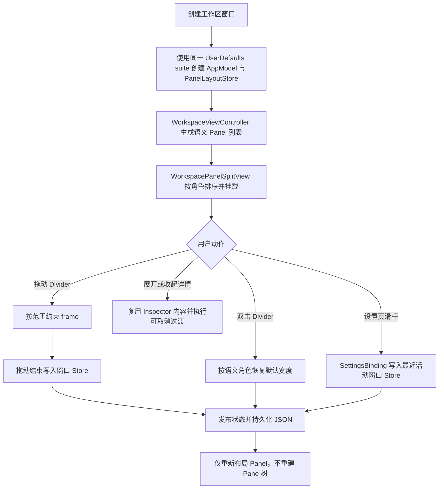

# 工作区 Panel 布局

## 业务背景

主窗口原先分别用侧栏约束、内容容器和固定宽度详情约束拼接三列。左右区域的尺寸、显隐动画和持久化分散在不同入口，右栏无法拖动，后续增加窗口级区域时还需要继续复制专用逻辑。

本模块把主窗口第一层统一为语义化 `Panel`，并保留中央内容内部已有的递归 `Pane` 模型。目标是让窗口区域可组合、左右宽度可调、每个窗口状态独立，同时确保调整布局不会重建终端或其它 Pane 运行态。

## 领域概念

| 概念 | 层级 | 尺寸真值 | 生命周期 |
| --- | --- | --- | --- |
| `WorkspacePanel` | Window 第一层 | 边缘 Panel 使用 point 宽度，Content 使用剩余空间 | Sidebar / Inspector 可选，Content 必选 |
| `WorkspacePanelRole` | Panel 语义 | `sidebar`、`content`、`inspector` | 不依赖当前可见数组索引 |
| `WorkspacePanelSplitView` | Panel 布局边界 | `WorkspacePanelLayoutStore` | 随工作区窗口存在 |
| `WorkspaceEdgePanelHostView` | 边缘 Panel 裁剪边界 | Host frame；内容保持稳定宽度 | 仅 Sidebar / Inspector 使用 |
| `PaneLayout` / `PersistedSplitView` | Content 内递归树 | `0.05...0.95` 比例 | 随标签及 Pane 运行态存在 |
| `WorkspacePanelSettingsBinding` | 设置桥接 | 最近活动窗口的 store | 设置窗口成为 key window 后仍保留绑定 |

`Panel` 与 `Pane` 不可互换：Panel 表示窗口级区域，Pane 表示 Content 内的工作内容叶节点。

## 核心规则

1. 主窗口只创建一个顶层横向 `WorkspacePanelSplitView`；所有可见区域按 `sidebar → content → inspector` 的语义顺序挂载。
2. Content 始终存在，最小目标宽度为 320pt。Sidebar 范围为 180...360pt，默认 220pt；Inspector 范围为 240...480pt，默认 278pt。
3. Divider 保持 1pt 可见和 1pt 命中宽度。悬停时使用强调色并显示左右调整光标；双击按 divider 外侧的语义角色恢复默认宽度。
4. 拖动不能折叠 Panel。Sidebar 的显隐仍由标签布局/折叠入口控制，Inspector 的显隐仍由详情入口控制。
5. 用户拖动结束、双击复位或设置页滑杆修改时才写首选宽度。普通窗口缩放只计算当前 frame，不反写首选值。
6. Sidebar 和 Inspector 的宽度按工作区窗口的 `UserDefaults` suite 独立持久化到 `aster.workspace.panel-layout.v1`。旧配置中的 `appearance.sidebarWidth` 只作为首次建库的迁移种子。
7. 设置页的两个滑杆绑定最近成为 key 的工作区窗口。设置窗口本身成为 key window 时不清空绑定；另一个工作区激活时立即切换目标。
8. Inspector 显隐复用同一个详情内容视图。展开与收起期间，边缘 Host 都暂时脱离 `arrangedSubviews`，作为同一 split 的动画覆盖层；动画完成后才接入或解除 arranged 布局。Content 在 `NSAnimationContext` 外一次进入终态 frame 并同步完成终端子树布局，每次切换只产生一次网格 resize；动画上下文只改变边缘 Host，并从内侧裁剪保持稳定宽度的内容。剩余 Panel 直接使用终态 divider 数量，解除挂载时不再触发 1pt 末帧 resize。Inspector trailing edge 和右上角按钮因此固定不动。快速反向切换通过 transition token 取消过期完成回调；若工作区刷新把内容迁移到新 split，旧 split 不再拥有移除权。
9. 系统开启“减弱动态效果”时直接落到终态。
10. 工作区根视图只创建一颗 `workspace-inspector-toggle`，固定覆盖在右上角，不参与 Content / Inspector 的宽度求解；Panel header 只预留命中空间，不创建第二颗按钮。Inspector 展开时该按钮常显；关闭后仍是同一实例和坐标，并从解除挂载完成时重新起算 650ms 停留时间。鼠标不在标题栏时随后淡出，位于标题栏时持续显示。

## 业务流程图

## 关键实现

- `Sources/AsterCore/WorkspacePanelLayout.swift`：纯值状态、范围策略和窄窗口宽度求解，不依赖 AppKit。
- `Sources/Aster/Workspace/Panels/WorkspacePanelLayoutStore.swift`：窗口级持久化，以及设置窗口与活动工作区的绑定桥。
- `Sources/Aster/Workspace/Panels/WorkspacePanel.swift`：Panel 描述、顶层 split、语义排序、动态挂载与实际 frame 编排。
- `Sources/Aster/Workspace/Panels/WorkspacePanelHostView.swift`：边缘 Panel 的稳定内容布局、trailing 固定与裁剪视口。
- `Sources/Aster/Workspace/Panels/WorkspacePanelSplitView+Constraints.swift`：divider 原生命中区、拖动上下限与禁止折叠规则。
- `Sources/Aster/Workspace/Panels/WorkspacePanelSplitView+Transitions.swift`：显隐动画和跨 split 迁移时的视图所有权复位。
- `Sources/Aster/WorkspaceView.swift`：只负责将 Sidebar、Content、Inspector 的实际内容编排为 Panel。
- `Sources/Aster/Workspace/{Components,Sidebar,Panes,FileBrowser,Overlays}`：按功能语义拆分原主窗口辅助组件，避免把所有控件堆入组合根文件。

宽度求解是无副作用纯函数。窗口足够宽时采用两个首选宽度；空间不足时先压缩 Inspector，再压缩 Sidebar，尽量保住 320pt Content。若窗口小到连三者最小值都无法满足，则只计算临时 frame，不覆盖用户已保存的首选值，窗口恢复后自动回到原宽度。

## 失败语义

- 持久化 JSON 缺失、损坏或越界时，使用迁移种子/默认值并统一 clamp，不传播解码异常到窗口创建流程。
- 对 Content 写首选宽度属于无效操作，store 明确忽略，不制造无意义状态。
- 重复角色只保留调用方提供的第一项，避免两个同角色 Panel 争用同一份宽度状态。
- 找不到 divider 对应角色、Panel 已经移除、动画 token 已过期，或内容视图已迁移到新 split 时，操作安全结束，不拆除新挂载的视图。
- 窗口过窄只降级当前布局，不折叠 Panel、不修改显隐偏好，也不污染持久化宽度。

## 测试与验收

自动测试覆盖：

- 默认值、越界 clamp、宽窗口与窄窗口求解、可选 Panel 组合。
- 多窗口 suite 的宽度隔离、损坏 JSON 回退、最近活动窗口设置绑定。
- 三个 Panel 的语义顺序、实际 frame、视图身份复用、divider 角色映射与双击复位。
- Inspector 非动画/动画显隐、整块裁剪、每次切换仅一次终端网格 resize、重复开关不复制缓冲区内容、按钮固定位置、延迟隐藏、快速反向显隐、跨 split 迁移所有权和禁止折叠。
- 垂直标签布局与顶部标签布局的真实 `WorkspaceViewController` 组合。
- 设置页同时提供左右 Panel 宽度滑杆。

真实窗口发布前还需手动验证：拖动左右 divider、双击复位、极窄窗口往返、多个工作区切换后设置页绑定，以及开启“减弱动态效果”后的详情显隐。
